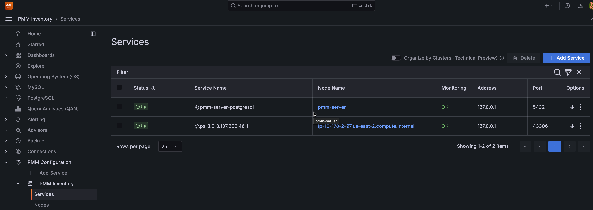
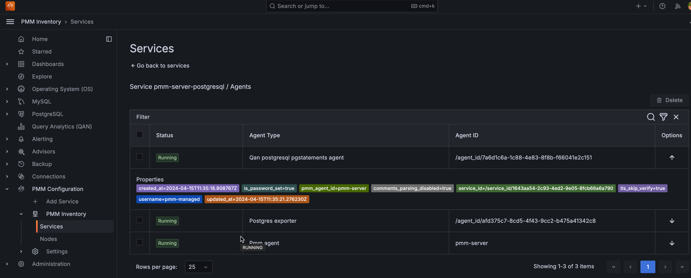
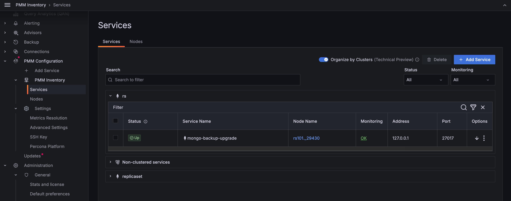
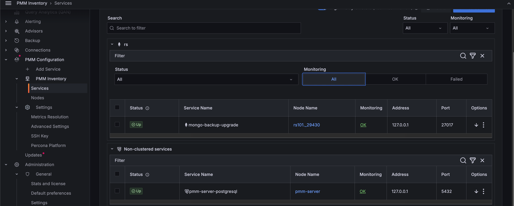
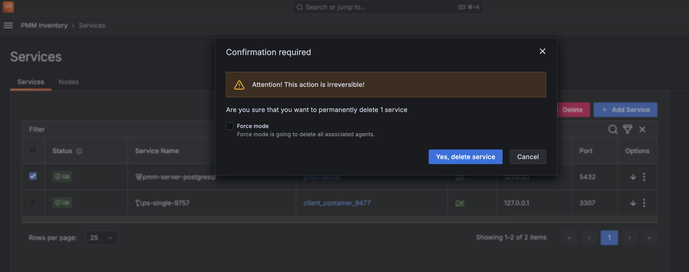

# PMM Inventory

The **Inventory** dashboard is a high-level overview of all objects registered in PMM.

To check your inventory list, go to {{icon.configuration}} **Configuration** → **Inventory**.

Inventory objects form a hierarchy with Node at the top, then Service and Agents assigned to a Node. This information is detailed in the two tabs available on this page.

### Services tab

The **Services** tab displays the individual services, the nodes on which they run, and the Agents that help collect the service metrics along with the following information:

You can check Query Analytics information and the Service Overview Dashboard for each service by clicking on the {{icon.ellipsisv}} icon in the **Options** column.

From here you can also check additional information about the service, by clicking on the {{icon.arrowdown}} icon. This expands the service entry to show reference information like service labels and IDs.

| **Column Name**| **Description**|
|--------------|--------------------------------|
| Service name|The name or identifier associated with the service being monitored.|                                        
| Node name | Name or identifier associated with a specific node.| 
| Monitoring status| The **Monitoring** column summarizes the status of all the Agents assigned to the service.             | 
|  Address         | The IP address or DNS where the service is currently running. |
|  Port         | The port number on which the service is running. ||
|  Options |* You can check **QAN** information and the **Dashboard** for each service by clicking on the **<image src="../../images/dots-three-vertical.ico" width="15px" aria-label="triple dots"/>** icon     * You can also check additional information about the service, by clicking on the **<image src="../../images/arrow-downward.ico" width="15px" aria-label="downward arrow"/>** icon. This expands the service entry to show reference information like service labels and IDs.|

#### Attributes

These are some of the atributes for a service:

- Each instance of a service gets a `service_type` attribute so one can clearly tell what type of database it is, for instance: `mysql`, `postgresql`, `mongodb`, etc. 

- Every service is related to a certain node via its `node_id` attribute. This feature allows to support monitoring of multiple instances on a single node, with different service names, e.g. `mysql1-3306`, and `mysql1-3307`.

- Starting with PMM 2.41.0, each instance of a service gets a `version` attribute to the response of the endpoint that provides a list of services being monitored by PMM. This makes it easy to visualize the database server version.

    However, following are the imitations:
    
    - The version is not captured for the internal PostgreSQL database.
    - The version is only captured when a new service is being added to PMM and the agent installed on the client side is equal to or greater than v2.41.0.
    - When a database is upgraded, you will not see the database version updated automatically. It will be updated if you remove and then re-add the service.

#### Agents

Each binary (exporter, agent) running on a client will get an `agent_type` value. 

Example

- `pmm-agent` is at the top of the tree, assigned to PMM Agent itself
- `node_exporter` is assigned to an agent that extracts the node metrics
- `mysqld_exporter` and `qan-mysql-perfschema-agent` are assigned to agents that extract metrics from mysql and its performance schema respectively.

To view the agents running on a service and their health status, click **OK** or **Failed** under the **Monitoring** column. Furthermore, you can also check the properties of a particular agent by clicking the <image src="../../images/arrow-downward.ico" width="15px" aria-label="downward arrow"/> icon under the **Options** column.

#### Node-service relationship

Starting with PMM 2.40.0, you can click on the link in the **Node Name** column to view the node on which a specific service is running and analyze how node-level resource utilization impacts the performance of those services.

Understanding the relationship between nodes and services is key to gaining insights into the distribution and performance of individual services across nodes.

- **Deployment**: Services within PMM are deployed on nodes and rely on them for resources, such as CPU, memory, and storage, to execute tasks.

- **Resource allocation**: It is essential to know which nodes host which services to allocate resources appropriately to avoid underuse or overload.

- **Performance optimization**: By analyzing node and service-level metrics, you can pinpoint and resolve issues that impede service performance, such as resource limitations and performance bottlenecks.

- **Incident response**: When an issue or incident occurs, understanding the node-service relationship helps in troubleshooting. You can quickly identify which nodes and services are affected and focus your efforts on resolving the problem.

### Editing labels for a service

You can edit the labels as follows:

1. From the **Main** menu, navigate to <i class="uil uil-cog"></i> **Configuration → Inventory**.

2. Click on the three dots next to the service you want to edit labels for.

3. Click **Edit**. The **Edit Service** page opens.

4. Edit the labels as per your requirement and click **Save Changes**. The editing service dialogue box opens.

    

5. Click **Confirm and save changes**. You will be taken back to the **Inventory/Services** page.

#### Effect of editing labels for a service

Editing existing labels can impact the following PMM functions:

- **Alerting** 

    Editing labels without updating alerting rules can lead to missed alerts. If an alert rule is based on specific labels that are changed or no longer apply, the alert may not trigger when it should.

    Update the alert rules promptly after editing the labels for a smooth alerting experience.

- **Scheduled backup**s: Editing the cluster label will remove all scheduled backups for the imapcted service or cluster.

    To prevent any issues, make sure to recreate your backups once you've configured the cluster.

- **Dashboard data**: Edited labels do not affect the existing time-series(metrics). It will only affect the new time-series(metrics).

#### Cluster view

!!! caution alert alert-warning "Disclaimer"
     This feature is still [technical preview](../details/glossary.md#technical-preview) and is subject to change. We recommend that early adopters use this feature for testing purposes only.

Starting with PMM 2.40.0, you can choose to view a group of services as a single cluster  with the **Organize by Clusters** toggle. PMM uses the `cluster` label to display services under the same cluster.

Click the downward arrow to view cluster details, including the services running on that cluster, agents, and labels.

Furthermore, you can filter the clusters by criteria such as Cluster name, Status, Service name, Node name, Monitoring, Address, and Port. 

### Nodes tab

Shows where the service and agents run.

Each `node_id` is associated with a `machine_id` (from `/etc/machine-id`). Nodes also have `node_type` attributes, which give an idea about their nature. Some examples are: generic, container, remote, remote_rds, etc.

By expanding the entry from the options column, you can check the node labels and attributes.

Starting with PMM 2.38.0, you can see the number of agents running on any particular node. When you click on any node, the UI navigates to the view of agents, which is filtered to display only agents related to that specific node.

Furthermore, starting with PMM 2.40.0, you can see the service running on that specific node when you click on the link in the **Services** column.

To see the details of the agents running, do the following:

1. On the **Nodes** tab, under the **Monitoring** column, click **OK** or **Failed** depending on the status of the node that you have selected. A page that provides the user with crucial information regarding the total number of agents deployed on that node is displayed.
   

2. Click on the {{icon.arrowdown}} icon under the **Options** column to view the properties of a specific agent.

3. On the **Nodes** tab, under the **Options** column, click on the {{icon.arrowdown}} icon for the selected node to check the properties and the current health status of an agent.  
   

## Removing items from the inventory

To remove items from the inventory:

1. Go to {{icon.configuration}} **Configuration** → {{icon.inventory}} **Inventory**.

2. In the first column, select the items to be removed.
   
3. Click **Delete** and confirm the removal.
