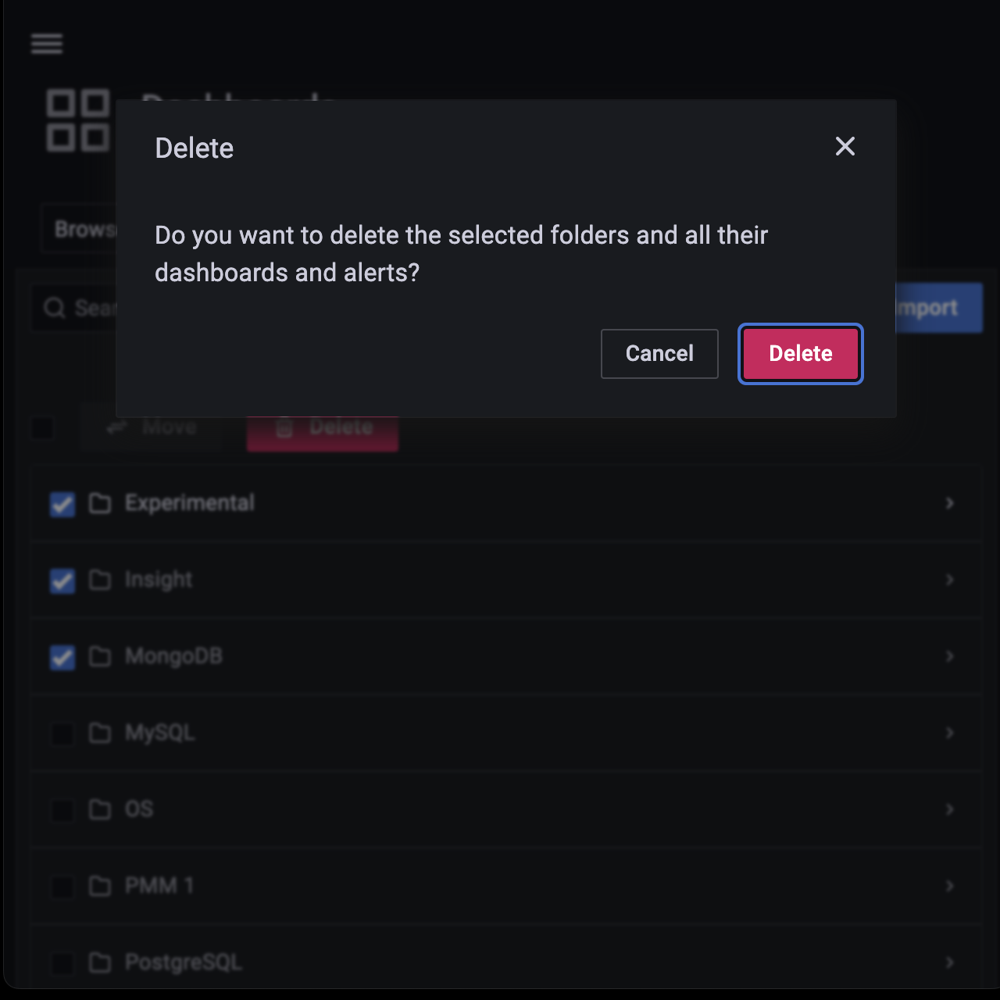
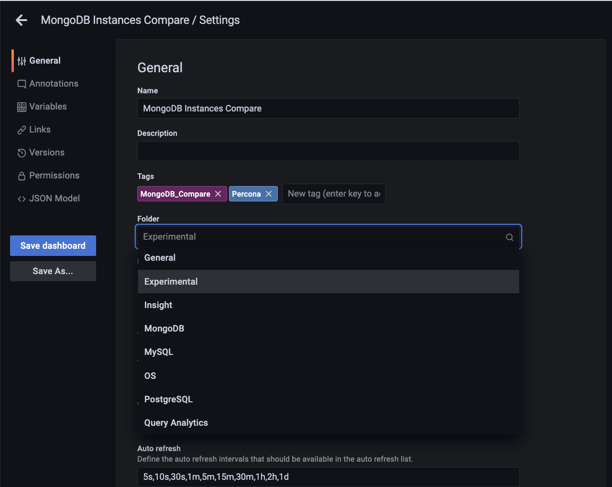

# Manage dashboards

This section describes how to manage your PMM dashboards and the widgets on those dashboards, including:

- Creating dashboard folders

- Managing dashboard folders

- Setting custom Home dashboard

## Create dashboard folders

Folders help you organize and group PMM dashboards, which is crucial when you have multiple dashboards or teams using the same PMM instance.

!!! note alert alert-primary "Note"
    To create a dashboard folder, you must have PMM's *Admin* privileges.

To create a dashboard folder:

1. On the PMM dashboards page, from the side menu, go to <i class="uil uil-plus"></i> *Dashboards > New folder*.

2. Enter a unique name for your folder and click *Create*.

## Managing dashboard folders

This section describes how to delete multiple dashboards, move dashboards from one folder to another and navigate to a folder page where you can assign folder and dashboard permissions.

### Delete multiple dashboards

To delete multiple dashboards at once:

From the side menu, go to <i class="uil uil-apps"></i> *Dashboards > Browse* and check the dashboards that you want to delete, and click *Delete*.

### Move dashboards from one folder to another

You can move dashboards from one folder to another in the following two ways:

1. From the side menu, go to <i class="uil uil-apps"></i> *Dashboards > Browse* and check the dashboards that you want to move. Click *Move*.

    

2. On the *Choose Dashboard Folder* dialog box select the dashboards that you want to move from the drop-down. Click *Move*.

The other way of moving dashboards from one folder to another is:

1. Open the dashboard that you want to move to another folder.
2. Click on {{icon.configuration}} icon to open *Dashboard Settings*.
3. On the *General* page, under *Folder* select the folder name that you want to move from the dropdown.

    

4. Click *Save Dashboard* on the the left to save the change.

!!! note alert alert-primary "Note"
    You should have atleast an *Editor* role to move a dashboard.

### Navigate to a dashboard folder page to assign permissions

1. From the side menu, go to <i class="uil uil-apps"></i> *Dashboards > Browse* and hover over the dashboard folder whose permissions you want to set. Click *Go to Folder*.
2. Go to the *Permissions* tab and select the requisite permission from the drop-down for the various roles.

    

## Setting custom Home Dashboard

The home dashboard you set is the dashboard all the users will see after logging in to PMM UI. You can set the home dashboard for a server, an organization, a team, or your user account. 

### Set home dashboard for your organization

Organization Admins can set the home dashboard for their organization. For information on managing users in an organization, see [Manage Users](../../how-to/manage-users.md)

1. Navigate to the dashboard that you want to set as the home dashboard.
2. Click the <i class="uil uil-star"></i> star next to the dashboard title to mark the dashboard as a favorite.
3. Hover your cursor over {{icon.configuration}} *Configuration*
4. Click *Preferences*.
5. In the Home Dashboard field, select the dashboard that you want to set as your home dashboard.
6. Click *Save*.

### Set home dashboard for your team

Organization and team Admins can set the home dashboard for their team as follows:

1. Navigate to the dashboard that you want to set as your home dashboard.
2. Click <i class="uil uil-star"></i> star next to the dashboard to mark the dashboard as a favorite.
3. On the main menu, hover your cursor over {{icon.configuration}} *Configuration*. 
4. Click *Teams*. Grafana displays the team list.
5. Click on the team for whom you want to set the home dashboard and then navigate to the *Settings* tab.
6. In the Home Dashboard field, select the dashboard that you want to use for your home dashboard.
7. Click *Save*.

### Set your Personal Home Dashboard

1. From the main menu, go to <i class="uil uil-apps"></i> *Dashboards > Browse* and select the dashboard you want to set as your home dashboard.
2. Click the <i class="uil uil-star"></i> star next to the dashboard title to mark it as a favorite.

    

3. From the side menu go to {{icon.configuration}} *Configuration > Preferences*. In the *Home Dashboard* field, select the dashboard that you want to set as your home dashboard. 

    

4. Click *Save*.

