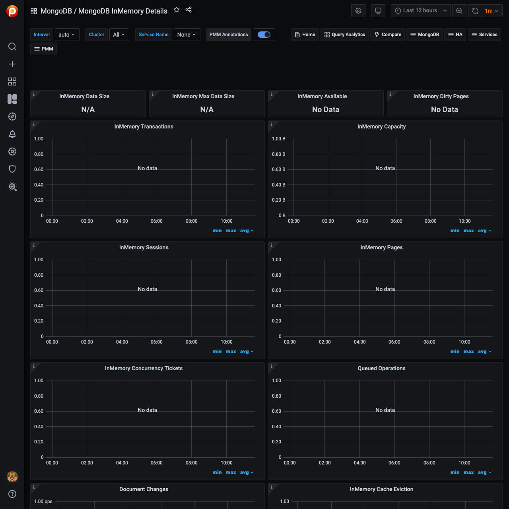

# MongoDB InMemory Details

## InMemory Transactions

WiredTiger internal transactions

## InMemory Capacity

Configured max and current size of the WiredTiger cache.

## InMemory Sessions

Internal WiredTiger storage engine cursors and sessions currently open.

## InMemory Pages

Pages in the WiredTiger cache

## InMemory Concurrency Tickets

A WT 'ticket' is assigned out for every operation running simultaneously in the WT storage engine. "Tickets available" = hard coded high value - "Tickets Out".

## Queued Operations

Operations queued due to a lock

## Document Changes

Mixed metrics: Docs per second inserted, updated, deleted or returned on any type of node (primary or secondary); + replicated write Ops/sec; + TTL deletes per second.

## InMemory Cache Eviction

This panel shows the number of pages that have been evicted from the WiredTiger cache for the given time period. The InMemory storage engine only evicts modified pages which signals a compaction of the data and removal of the dirty pages.

## Scanned and Moved Objects

This panel shows the number of objects (both data (`scanned_objects`) and index (`scanned`)) as well as the number of documents that were moved to a new location due to the size of the document growing. Moved documents only apply to the MMAPv1 storage engine.

## Page Faults

Unix or Window memory page faults. Not necessarily from MongoDB.
