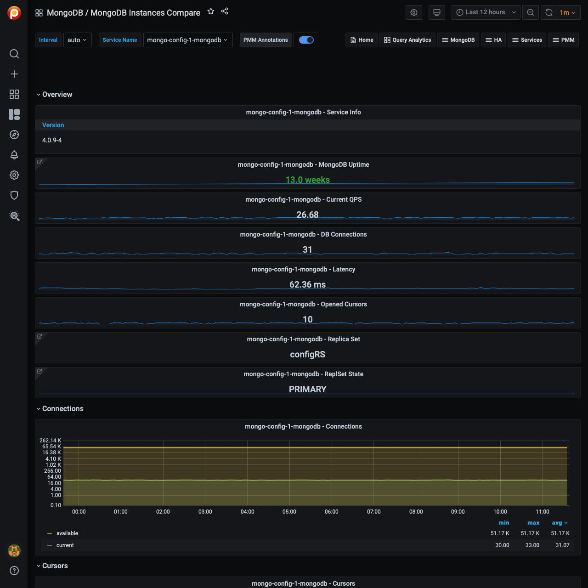

# MongoDB Instances Compare

## Connections

No description

## Cursors

No description

## Latency

Average latency of operations (classified by read, write, or (other) command)

## Scan Ratios

Ratio of index entries scanned or whole docs scanned / number of documents returned

## Index Filtering Effectiveness

No description

## Requests

Ops/sec (classified by (legacy) wire protocol request type)

## Document Operations

Documents inserted/updated/deleted or returned per sec

## Queued Operations

The number of operations that are currently queued and waiting for a lock

## Used Memory

No description
