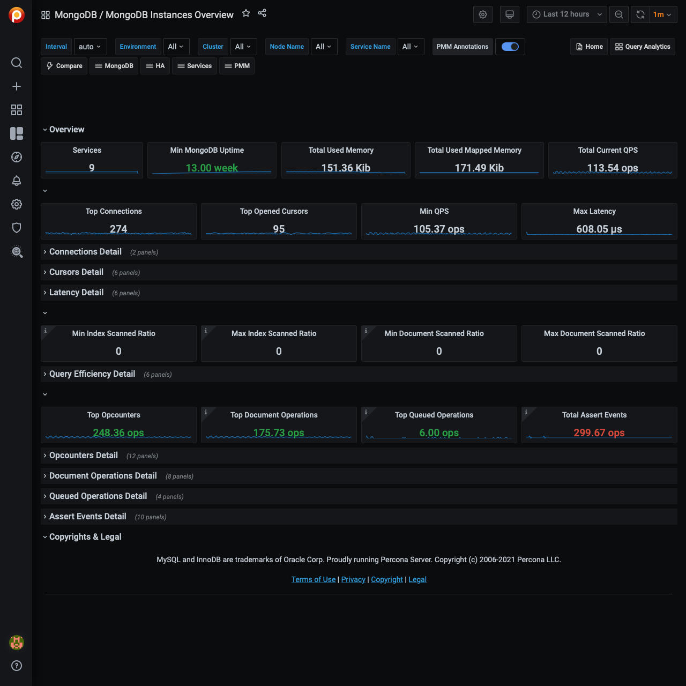

# MongoDB Instances Overview

This dashboard provides basic information about MongoDB instances.

## Command Operations

Shows how many times a command is executed per second on average during the selected interval.

Look for peaks and drops and correlate them with other graphs.

## Connections

Keep in mind the hard limit on the maximum number of connections set by your distribution.

Anything over 5,000 should be a concern, because the application may not close connections correctly.

## Cursors

Helps identify why connections are increasing.  Shows active cursors compared to cursors being automatically killed after 10 minutes due to an application not closing the connection.

## Document Operations

When used in combination with *Command Operations*, this graph can help identify *write amplification*.  For example, when one `insert` or `update` command actually inserts or updates hundreds, thousands, or even millions of documents.

## Queued Operations

Any number of queued operations for long periods of time is an indication of possible issues.  Find the cause and fix it before requests get stuck in the queue.

## `getLastError` Write Time, `getLastError` Write Operations

This is useful for write-heavy workloads to understand how long it takes to verify writes and how many concurrent writes are occurring.

## Asserts

Asserts are not important by themselves, but you can correlate spikes with other graphs.

## Memory Faults

Memory faults indicate that requests are processed from disk either because an index is missing or there is not enough memory for the data set.  Consider increasing memory or sharding out.
