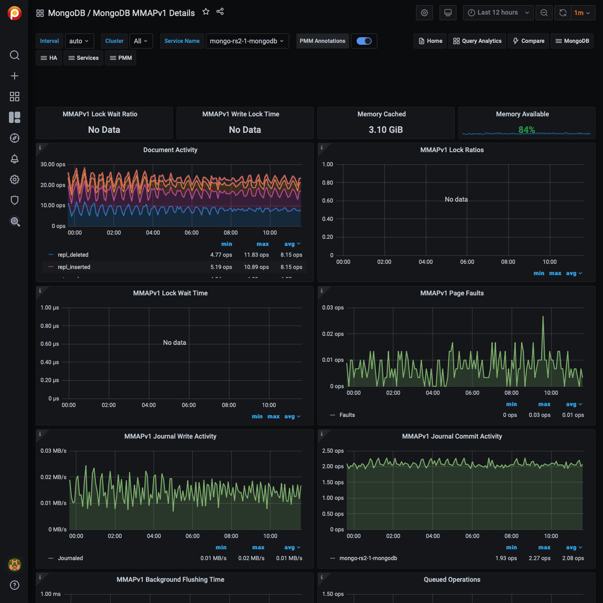

# MongoDB MMAPv1 Details

## Document Activity

Docs per second inserted, updated, deleted or returned. Also showing replicated write ops and internal TTL index deletes.

## MMAPv1 Lock Wait Time

Time spent per second waiting to acquire locks.

## MMAPv1 Page Faults

Unix or Window memory page faults. Not necessarily from MongoDB.

## MMAPv1 Journal Write Activity

MB processed through the journal in memory.

## MMAPv1 Journal Commit Activity

MB committed to disk for the journal.

## MMAPv1 Background Flushing Time

Average time in ms, over full uptime of `mongod` process, the MMAP background flushes have taken.

## Queued Operations

Queue size of ops waiting to be submitted to storage engine layer. (see WiredTiger concurrency tickets for number of ops being processed simultaneously in storage engine layer.)

## Client Operations

Ops and Replicated Ops/sec, classified by legacy wire protocol type (`query`, `insert`, `update`, `delete`, `getmore`).

## Scanned and Moved Objects

This panel shows the number of objects (both data (`scanned_objects`) and index (`scanned`)) as well as the number of documents that were moved to a new location due to the size of the document growing. Moved documents only apply to the MMAPv1 storage engine.
