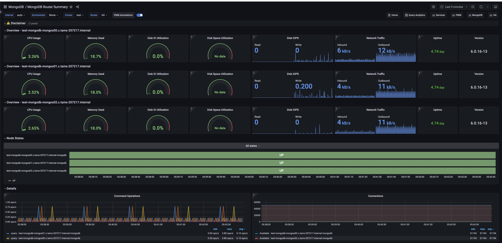

# Experimental MongoDB Router Summary

This dashboard is available starting from PMM 2.43 and is specifically designed for monitoring MongoS (router) nodes in sharded MongoDB clusters.

## Overview
For each MongoS in the cluster, this section includes main monitoring metrics like CPU, memory and disk usage. Uptime and MongoS version are reported as well.

### CPU Usage
Shows CPU usage as a percentage from 0% to 100%. It updates every minute, turning from green to red when usage exceeds 80%. This helps quickly spot high CPU load, which could affect system performance, and monitor how hard the CPU is working at a glance.

### Memory Used
Displays the percentage of total system memory currently in use. It updates regularly, showing green up to 80% of usage and red beyond that threshold.

Use this for a quick visual indicator of memory consumption to monitor available memory without swapping as it's an easy way to assess how close the system is to its memory limits.

### Disk IO Utilization
Shows how busy the disk is handling read/write requests. The meter turns red above 80%, warning of potential slowdowns. It updates regularly, giving administrators a quick way to check if the disk is keeping up with demand or if it's becoming a bottleneck in system performance.

### Disk Space Utilization
Shows how much of the total disk space is currently in use. The meter turns red when usage exceeds 80%, warning of low free space. It updates regularly, giving you a quick way to check if the disk is nearing capacity. This helps prevent "disk full" errors that could disrupt services or system operation.

### Disk IOPS
Shows how many read and write operations the disk performs each second. The blue color helps spot spikes in disk activity. These spikes could mean the disk is struggling to keep up, which might slow down the system. It's a quick way for you to check if the disk is working too hard.

### Network Traffic
Combines both incoming (received) and outgoing (transmitted) data, excluding local traffic. It gives you a quick view of overall network activity, helping spot unusual spikes or drops in data flow that might affect system performance.

### Uptime
Shows how long the system has been running without a restart. As uptime increases, the color changes from red to orange to green, giving a quick visual indicator of system stability. Red indicates very recent restarts (less than 5 minutes), orange shows short uptimes (5 minutes to 1 hour), and green represents longer uptimes (over 1 hour). This helps you easily spot recent system restarts or confirm continuous operation.

### Version
Displays the current version of MongoDB running on the system. This information is crucial for ensuring the system is running the intended version and for quickly identifying any nodes that might need updates.

## Node States
Shows the status of all MongoDB Shard (MongoS) nodes in the selected cluster over time. It uses a color-coded timeline: green bars mean a node is "UP" and working, while red bars show it's "DOWN" or unreachable. This simple view helps you quickly spot which nodes are active, see any recent status changes, and identify patterns in node availability.

## Details
This section includes additional information like "Command Operations", "Connections", "Query execution times" and "Query efficiency".

### Command Operations
Shows MongoDB command operations over time, displaying rates for inserts, updates, deletes, queries, and TTL deletions per second.

Use this to monitor overall database workload, compare operation types, spot peak usage and unusual patterns, assess replication activity, and track automatic data cleanup.

### Connections
Displays MongoDB connection metrics over time, showing both current and available connections. Use this to monitor connection usage trends, identify periods of high demand, and ensure the database isn't reaching its connection limits.

By comparing current to available connections, it's easy to spot potential bottlenecks or capacity issues before they impact performance.

### Query execution times
Shows the average execution times for MongoDB queries over time, categorized into read, write, and other command operations.

Use this to identify slow queries, performance bottlenecks, and unusual spikes in execution times. Comparing latencies across operation types can also guide decisions on indexing strategies and query optimizations.

### Query Efficiency
Visualizes MongoDB query efficiency over time, displaying the ratio of scanned documents or index entries to returned documents, along with operation latencies.

A ratio near 1 indicates highly efficient queries, while higher values (e.g., 100) suggest inefficiency.

Compare document scans, index scans, and operation latencies to quickly identify poorly performing queries, and ensure that queries execute as efficiently as possible.
