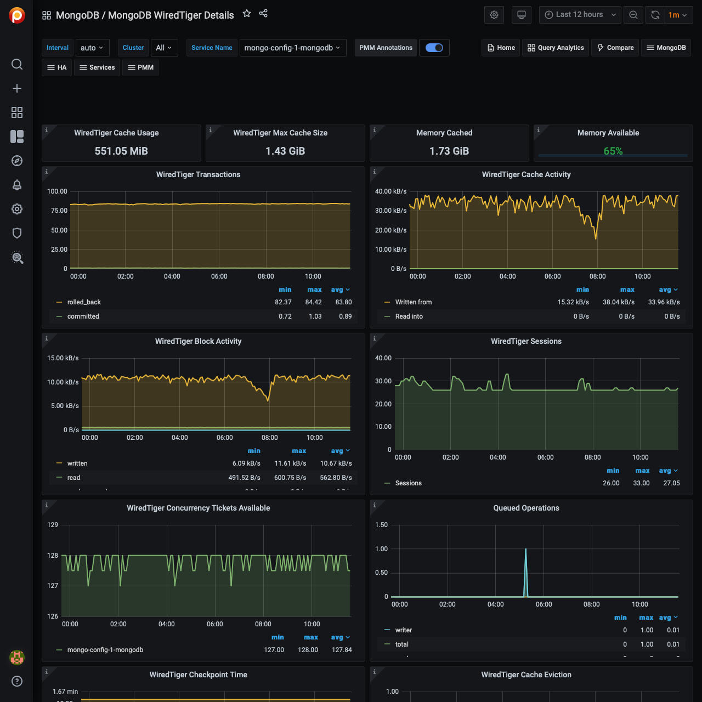

# MongoDB WiredTiger Details

## WiredTiger Transactions

WiredTiger internal transactions

## WiredTiger Cache Activity

Data volume transferred per second between the WT cache and data files. Writes out always imply disk; Reads are often from OS file buffer cache already in RAM, but disk if not.

## WiredTiger Block Activity

Data volume handled by the WT block manager per second

## WiredTiger Sessions

Internal WT storage engine cursors and sessions currently open

## WiredTiger Concurrency Tickets Available

A WT 'ticket' is assigned out for every operation running simultaneously in the WT storage engine. "Available" = hard-coded high value - "Out".

## Queued Operations

Operations queued due to a lock.

## WiredTiger Checkpoint Time

The time spent in WT checkpoint phase. Warning: This calculation averages the cyclical event (default: 1 min) execution to a per-second value.

## WiredTiger Cache Eviction

Least-recently used pages being evicted due to WT cache becoming full.

## WiredTiger Cache Capacity

Configured max and current size of the WT cache.

## WiredTiger Cache Pages

## WiredTiger Log Operations

WT internal write-ahead log operations.

## WiredTiger Log Activity

Data volume moved per second in WT internal write-ahead log.

## WiredTiger Log Records

Number of records appended per second in WT internal log.

## Document Changes

Mixed metrics: Docs per second inserted, updated, deleted or returned on any type of node (primary or secondary); + replicated write Ops/sec; + TTL deletes per second.

## Scanned and Moved Objects

This panel shows the number of objects (both data (`scanned_objects`) and index (`scanned`)) as well as the number of documents that were moved to a new location due to the size of the document growing. Moved documents only apply to the MMAPv1 storage engine.

## Page Faults

Unix or Window memory page faults. Not necessarily from MongoDB.
