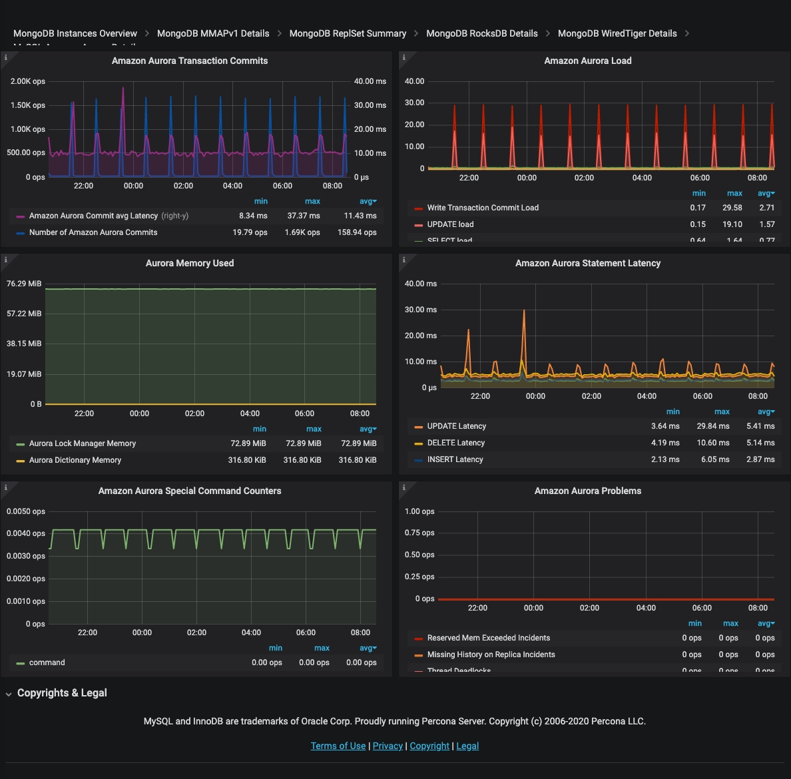

# MySQL Amazon Aurora Details

## Amazon Aurora Transaction Commits

This graph shows the number of Commits which Amazon Aurora engine performed as well as average commit latency. Graph Latency does not always correlate with the number of performed commits and can be quite high in certain situations.

* **Number of Amazon Aurora Commits**: The average number of commit operations per second.

* **Amazon Aurora Commit avg Latency**: The average amount of latency for commit operations

## Amazon Aurora Load

This graph shows us what statements contribute most load on the system as well as what load corresponds to Amazon Aurora transaction commit.

* **Write Transaction Commit Load**: Load in Average Active Sessions per second for COMMIT operations

* **UPDATE load**: Load in Average Active Sessions per second for UPDATE queries

* **SELECT load**: Load in Average Active Sessions per second for SELECT queries

* **DELETE load**: Load in Average Active Sessions per second for DELETE queries

* **INSERT load**: Load in Average Active Sessions per second for INSERT queries

An *active session* is a connection that has submitted work to the database engine and is waiting for a response from it. For example, if you submit an SQL query to the database engine, the database session is active while the database engine is processing that query.

## Aurora Memory Used

This graph shows how much memory is used by Amazon Aurora lock manager as well as amount of memory used by Amazon Aurora to store Data Dictionary.

* **Aurora Lock Manager Memory**: the amount of memory used by the Lock Manager, the module responsible for handling row lock requests for concurrent transactions.

* **Aurora Dictionary Memory**: the amount of memory used by the Dictionary, the space that contains metadata used to keep track of database objects, such as tables and indexes.

## Amazon Aurora Statement Latency

This graph shows average latency for the most important types of statements. Latency spikes are often indicative of the instance overload.

* **DDL Latency:** Average time to execute DDL queries

* **DELETE Latency**: Average time to execute DELETE queries

* **UPDATE Latency**: Average time to execute UPDATE queries

* **SELECT Latency**: Average time to execute SELECT queries

* **INSERT Latency**: Average time to execute INSERT queries

## Amazon Aurora Special Command Counters

Amazon Aurora MySQL allows a number of commands which are not available in standard MySQL. This graph shows usage of such commands.  Regular `unit_test` calls can be seen in default Amazon Aurora install, the rest will depend on your workload.

* `show_volume_status`: The number of executions per second of the command SHOW VOLUME STATUS. The SHOW VOLUME STATUS query returns two server status variables, Disks and Nodes. These variables represent the total number of logical blocks of data and storage nodes, respectively, for the DB cluster volume.

* `awslambda`: The number of AWS Lambda calls per second. AWS Lambda is an event-drive, server-less computing platform provided by AWS. It is a compute service that run codes in response to an event. You can run any kind of code from Aurora invoking Lambda from a stored procedure or a trigger.

* `alter_system`: The number of executions per second of the special query ALTER SYSTEM, that is a special query to simulate an instance crash, a disk failure, a disk congestion or a replica failure. It’s a useful query for testing the system.

## Amazon Aurora Problems

This graph shows different kinds of Internal Amazon Aurora MySQL Problems which general should be zero in normal operation.

Anything non-zero is worth examining in greater depth.
