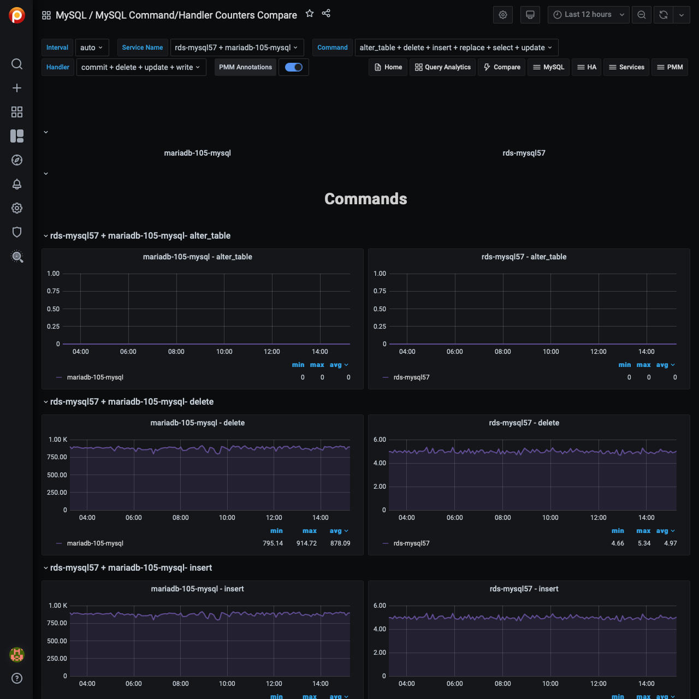

# MySQL Command/Handler Counters Compare

This dashboard shows server status variables. On this dashboard, you may select multiple servers and compare their counters simultaneously.

Server status variables appear in two sections: *Commands* and *Handlers*. Choose one or more variables in the *Command* and *Handler* fields in the top menu to select the variables which will appear in the *COMMANDS* or *HANDLERS* section for each host. Your comparison may include from one up to three hosts.

By default or if no item is selected in the menu, PMM displays each command or handler respectively.
