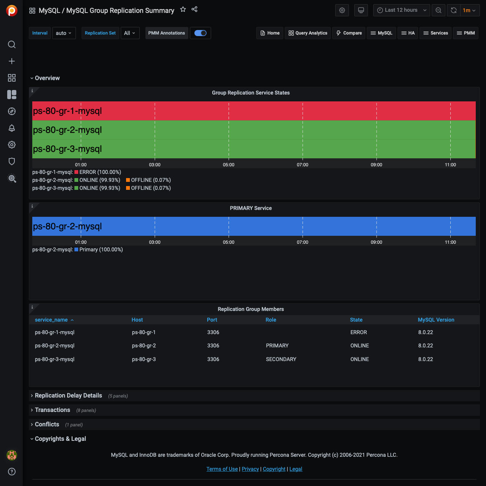

# MySQL Group Replication Summary

## Overview

- PRIMARY Service
- Group Replication Service States
- Replication Group Members
- Replication Lag
- Replication Delay
- Transport Time

## Transactions

- Transaction Details
- Applied Transactions
- Sent Transactions
- Checked Transactions
- Rolled Back Transactions
- Transactions Row Validating
- Transactions in the Queue for Checking
- Received Transactions Queue

## Conflicts

- Detected Conflicts
