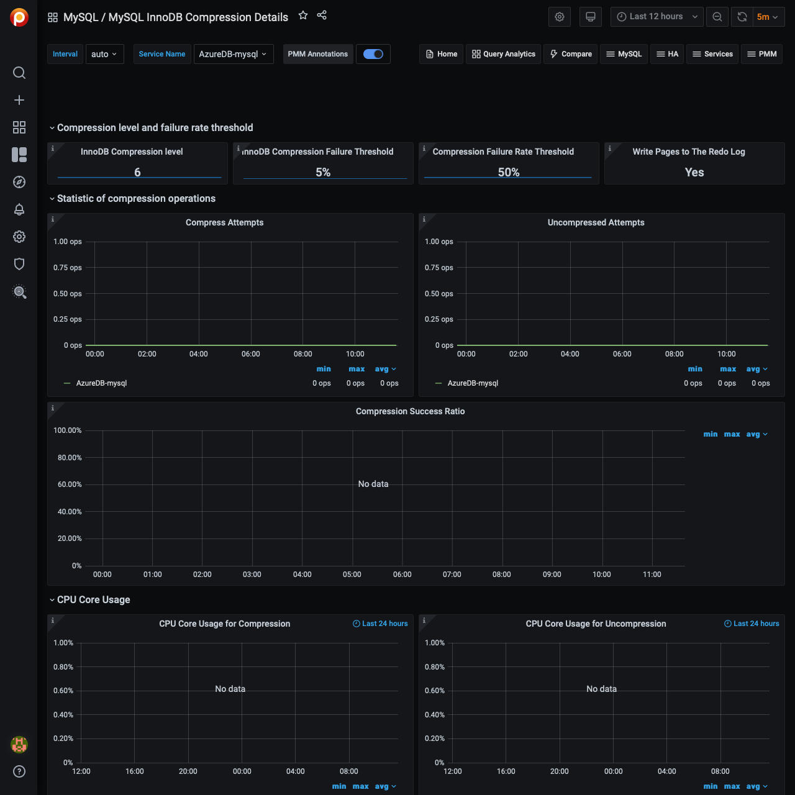

# MySQL InnoDB Compression Details

This dashboard helps you analyze the efficiency of InnoDB compression.

## Compression level and failure rate threshold

InnoDB Compression Level
:   The level of zlib compression to use for InnoDB compressed tables and indexes.

InnoDB Compression Failure Threshold
:   The compression failure rate threshold for a table.

Compression Failure Rate Threshold
:   The maximum percentage that can be reserved as free space within each compressed page, allowing room to reorganize the data and modification log within the page when a compressed table or index is updated and the data might be recompressed.

Write Pages to the Redo Log
:   Specifies whether images of re-compressed pages are written to the redo log. Re-compression may occur when changes are made to compressed data.

## Statistic of compression operations

Compress Attempts
:   Number of compression operations attempted. Pages are compressed whenever an empty page is created or the space for the uncompressed modification log runs out.

Uncompressed Attempts
:   Number of uncompression operations performed. Compressed InnoDB pages are uncompressed whenever compression fails, or the first time a compressed page is accessed in the buffer pool and the uncompressed page does not exist.

## CPU Core Usage

CPU Core Usage for Compression
:   Shows the time in seconds spent by InnoDB Compression operations.

CPU Core Usage for Uncompression
:   Shows the time in seconds spent by InnoDB Uncompression operations.

## Buffer Pool Total

Total Used Pages
:   Shows the total amount of used compressed pages into the InnoDB Buffer Pool split by page size.

Total Free Pages
:   Shows the total amount of free compressed pages into the InnoDB Buffer Pool split by page size.
