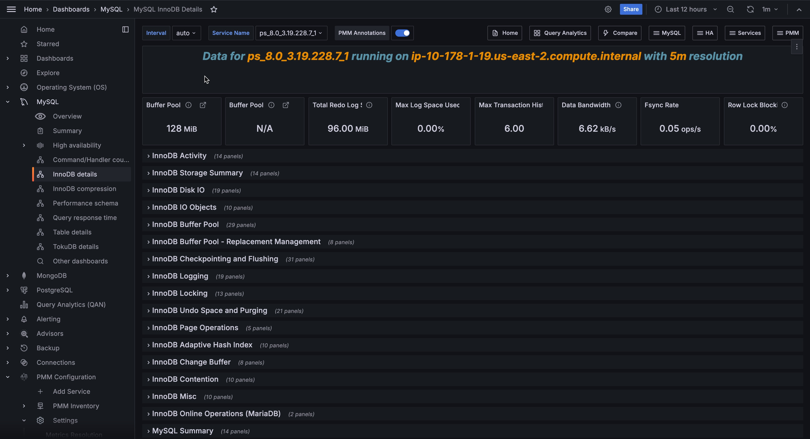

# MySQL InnoDB Details

!!! hint alert alert-success "Tip"
    If metrics are missing, try running: `SET GLOBAL innodb_monitor_enable=all;` in the MySQL client.

## InnoDB Activity

### Writes (Rows)

### Writes (Transactions)

### Row Writes per Trx

Rows Written Per Transactions which modify rows. This is better indicator of transaction write size than looking at all transactions which did not do any writes as well.

### Rows Read Per Trx

### Log Space per Trx

### Rollbacks

Percent of Transaction Rollbacks (as portion of read-write transactions).

### BP Reqs Per Row

Number of Buffer Pool requests per Row Access. High numbers here indicate going through long undo chains, deep trees and other inefficient data access.  It can be less than zero due to several rows being read from single page.

### Log Fsync Per Trx

Log Fsync Per Transaction.

### InnoDB Row Reads

### InnoDB Row Operations

This graph allows you to see which operations occur and the number of rows affected per operation. A graph like Queries Per Second will give you an idea of queries, but one query could effect millions of rows.

### InnoDB Row Writes

### InnoDB Row Operations

This graph allows you to see which operations occur and the number of rows affected per operation. A graph like Queries Per Second will give you an idea of queries, but one query could effect millions of rows.

### InnoDB Read-Only Transactions

### InnoDB Read-Write Transactions

### InnoDB Transactions Information (RW)

The InnoDB Transactions Information graph shows details about the recent transactions.  Transaction IDs Assigned represents the total number of transactions initiated by InnoDB.  RW Transaction Commits are the number of transactions not read-only. Insert-Update Transactions Commits are transactions on the Undo entries.  Non Locking RO Transaction Commits are transactions commit from select statement in auto-commit mode or transactions explicitly started with "start transaction read only".

### Misc InnoDB Transactions Information

Additional InnoDB Transaction Information

## InnoDB Storage Summary

### InnoDB Tables

Current Number of InnoDB Tables in database

### Data Buffer Pool Fit

Buffer Pool Size as Portion of the Data

### Avg Row Size

Amount of Data Per Row

### Index Size Per Row

Index Size Per Row shows how much space we're using for indexes on per row basics

### InnoDB Data Summary

### Space Allocated

Total Amount of Space Allocated. May not exactly match amount of space used on file system but provided great guidance.

### Space Used

Space used in All InnoDB Tables. Reported Allocated Space Less Free Space.

### Data Length

Space Used by Data (Including Primary Key).

### Index Length

Space Used by Secondary Indexes.

### Estimated Rows

Estimated number of Rows in InnoDB Storage Engine. It is not exact value and it can change abruptly as information is updated.

### Indexing Overhead

How Much Indexes Take Compared to Data.

### Free Space Percent

How Much Space is Free. Too high value wastes space on disk.

### Free

Allocated Space not currently used by Data or Indexes.

### InnoDB File Per Table

If Enabled, By Default every Table will have its own Tablespace represented as its own `.idb` file  rather than all tables stored in single system tablespace.

## InnoDB Disk IO

### InnoDB Page Size

### Avg Data Read Rq Size

### Avg Data Write Rq Size

### Avg Log Write Rq Size

### Data Written Per Fsync

### Log Written Per Fsync

### Data Read Per Row Read

### Data Written Per Row Written

!!! note alert alert-primary ""
    Due to difference in timing of Row Write and Data Write the value may be misleading on short intervals.

### InnoDB Data I/O

**InnoDB I/O**

- Data Writes - The total number of InnoDB data writes.
- Data Reads - The total number of InnoDB data reads (OS file reads).
- Log Writes - The number of physical writes to the InnoDB redo log file.
- Data Fsyncs - The number of fsync() operations. The frequency of `fsync()` calls is influenced by the setting of the `innodb_flush_method` configuration option.

### InnoDB Data Bandwidth

### InnoDB Log IO

**InnoDB I/O**

- Data Writes - The total number of InnoDB data writes.
- Data Reads - The total number of InnoDB data reads (OS file reads).
- Log Writes - The number of physical writes to the InnoDB redo log file.
- Data Fsyncs - The number of `fsync()` operations. The frequency of `fsync()` calls is influenced by the setting of the `innodb_flush_method` configuration option.

### InnoDB FSyncs

### InnoDB Pending IO

### InnoDB Pending Fsyncs

### InnoDB Auto Extend Increment

When Growing InnoDB System Tablespace extend it by this size at the time.

### InnoDB Double Write

Whether InnoDB Double Write Buffer is enabled. Doing so doubles amount of writes InnoDB has to do to storage but is required to avoid potential data corruption during the crash on most storage subsystems.

### InnoDB Fast Shutdown

Fast Shutdown means InnoDB will not perform complete Undo Space and Change Buffer cleanup on shutdown, which is faster but may interfere with certain major upgrade operations.

### InnoDB Open Files

Maximum Number of Files InnoDB is Allowed to use.

### InnoDB File Use

Portion of Allowed InnoDB Open Files Use.

## InnoDB IO Objects

### InnoDB IO Targets Write Load

Write Load Includes both Write and fsync (referred as misc).

## InnoDB Buffer Pool

### Buffer Pool Size

**InnoDB Buffer Pool Size**

InnoDB maintains a storage area called the buffer pool for caching data and indexes in memory.  Knowing how the InnoDB buffer pool works, and taking advantage of it to keep frequently accessed data in memory, is one of the most important aspects of MySQL tuning. The goal is to keep the working set in memory. In most cases, this should be between 60%-90% of available memory on a dedicated database host, but depends on many factors.

### Buffer Pool Size of Total RAM

**InnoDB Buffer Pool Size % of Total RAM**

InnoDB maintains a storage area called the buffer pool for caching data and indexes in memory.  Knowing how the InnoDB buffer pool works, and taking advantage of it to keep frequently accessed data in memory, is one of the most important aspects of MySQL tuning. The goal is to keep the working set in memory. In most cases, this should be between 60%-90% of available memory on a dedicated database host, but depends on many factors.

### NUMA Interleave

Interleave Buffer Pool between NUMA zones to better support NUMA systems.

### Buffer Pool Activity

Combined value of Buffer Pool Read and Write requests.

### BP Data

Percent of Buffer Pool Occupied by Cached Data.

### BP Data Dirty

Percent of Data which is Dirty.

### BP Miss Ratio

How often buffer pool read requests have to do read from the disk. Keep this percent low for good performance.

### BP Write Buffering

Number of Logical Writes to Buffer Pool Per logical Write.

### InnoDB Buffer Pool LRU Sub-Chain Churn

### Buffer Pool Chunk Size

Size of the "Chunk" for buffer pool allocation.  Allocation of buffer pool will be rounded by this number. It also affects the performance impact of online buffer pool resize.

### Buffer Pool Instances

Number of Buffer Pool Instances. Higher values allow to reduce contention but also increase overhead.

### Read Ahead IO Percent

Percent of Reads Caused by InnoDB Read Ahead.

### Read Ahead Wasted

Percent of Pages Fetched by Read Ahead Evicted Without Access.

### Dump Buffer Pool on Shutdown

### Load Buffer Pool at Startup

### Portion of Buffer Pool To Dump/Load

Larger Portion increases dump/load time but get more of original buffer pool content and hence may reduce warmup time.

### Include Buffer Pool in Core Dump

Whenever to Include Buffer Pool in Crash Core Dumps.  Doing so may dramatically increase core dump file slow down restart.  Only makes a difference if core dumping on crash is enabled.

### InnoDB Old Blocks

Percent of The Buffer Pool To be Reserved for "Old Blocks" - which has been touched repeatedly over period of time.

### InnoDB Old Blocks Time

The Time which has to pass between multiple touches for the block for it to qualify as old block.

### InnoDB Random Read Ahead

Is InnoDB Random ReadAhead Enabled.

### InnoDB Random Read Ahead

The Threshold (in Pages) to trigger Linear Read Ahead.

### InnoDB Read IO Threads

Number of Threads used to Schedule Reads.

### InnoDB Write IO Threads

Number of Threads used to Schedule Writes.

### InnoDB Native AIO Enabled

Whether Native Asynchronous IO is enabled.  Strongly recommended for optimal performance.

## InnoDB Buffer Pool - Replacement Management

### LRU Scan Depth

**InnoDB LRU Scan Depth**

This variable defines InnoDB Free Page Target per buffer pool. When number of free pages falls below this number this number page cleaner will make required amount of pages free, flushing or evicting pages from the tail of LRU as needed.

### LRU Clean Page Searches

When Page is being read (or created)  the Page need to be allocated in Buffer Pool.

### Free List Miss Rate

The most efficient way to get a clean page is to grab one from free list.  However if no pages are available in Free List the LRU scan needs to be performed.

### LRU Get Free Loops

If Free List was empty LRU Get Free Loop will be performed.  It may perform LRU scan or may use some other heuristics and shortcuts to get free page.

### LRU Scans

If Page could not be find any Free list and other shortcuts did not work, free page will be searched by scanning LRU chain which is not efficient.

### Pages Scanned in LRU Scans

Pages Scanned Per Second while doing LRU scans.  If this value is large (thousands) it means a lot of resources are wasted.

### Pages scanned per LRU Scan

Number of pages scanned per LRU scan in Average. Large number of scans can consume a lot of resources and also introduce significant addition latency to queries.

### LRU Get Free Waits

If InnoDB could not find a free page in LRU list and had to sleep. Should be zero.

## InnoDB Checkpointing and Flushing

### Pages Flushed from Flush List

Number of Pages Flushed from "Flush List"  This combines Pages Flushed through Adaptive Flush and Background Flush.

### Page Flush Batches Executed

InnoDB Flush Cycle typically Runs on 1 second intervals.  If too far off from this number it can indicate an issue.

### Pages Flushed Per Batch

How many pages are flushed per Batch.  Large Batches can "choke" IO subsystem and starve other IO which needs to happen.

### Neighbor Flushing Enabled

Neighbor Flushing is Optimized for Rotational Media  and unless you're Running spinning disks you should disable it.

### InnoDB Checkpoint Age

**InnoDB Checkpoint Age**

The maximum checkpoint age is determined by the total length of all transaction log files (`innodb_log_file_size`).

When the checkpoint age reaches the maximum checkpoint age, blocks are flushed synchronously. The rules of the thumb is to keep one hour of traffic in those logs and let the check-pointing perform its work as smooth as possible. If you don't do this, InnoDB will do synchronous flushing at the worst possible time, i.e., when you are busiest.

### Pages Flushed (Adaptive)

Adaptive Flush  Flushes pages from Flush List based on the need to advance Checkpoint (driven by Redo Generation Rate) and by maintaining number of dirty pages within set limit.

### Adaptive Flush Batches Executed

### Pages Per Batch (Adaptive)

Pages Flushed Per Adaptive Batch.

### Neighbor Flushing

To optimize IO for rotational Media InnoDB may flush neighbor pages. It can cause significant wasted IO for flash storage.    Generally for flash you should run with `innodb_flush_neighbors=0` but otherwise this shows how much IO you're wasting.

### Pages Flushed (LRU)

Flushing from the tail of the LRU list is needed to keep readily-available free pages for new data to be read when data does not fit in the buffer pool.

### LRU Flush Batches Executed

### Pages Per Batch (LRU)

Pages Flushed Per Neighbor.

### LSN Age Flush Batch Target

Target for Pages to Flush due to LSN Age.

### Pages Flushed (Neighbor)

Number of Neighbor pages flushed (If neighbor flushing is enabled)  from Flush List and LRU List Combined.

### Neighbor Flush Batches Executed

### Pages Per Batch (Neighbor)

Pages Flushed Per Neighbor.

### Sync Flush Waits

If InnoDB could not keep up with Checkpoint Flushing and had to trigger Sync flush.  This should never happen.

### Pages Flushed (Background)

Pages Flushed by Background Flush which is activated when server is considered to be idle.

### Background Flush Batches Executed

### Pages Per Batch (Background)

Pages Flushed Per Background Batch.

### Redo Generation Rate

Rate at which LSN (Redo) is Created. It may not match how much data is written to log files due to block size rounding.

### InnoDB Flushing by Type

### Pages Evicted (LRU)

This correspond to number of clean pages which were evicted (made free) from the tail of LRU buffer.

### Page Eviction Batches

### Pages Evicted per Batch

### Max Log Space Used

### Single Page Flushes

Single Page flushes happen in rare case, then clean page could not be found in LRU list. It should be zero for most workloads.

### Single Page Flush Pages Scanned

### Pages Scanned Per Single Page Flush

### InnoDB IO Capacity

Estimated number of IOPS storage system can provide.  Is used to scale background activities.
Do not set it to actual storage capacity.

### InnoDB IO Capacity Max

InnoDB IO Capacity to use when falling behind and need to catch up with Flushing.

## InnoDB Logging

### Total Log Space

Number of InnoDB Log Files Multiplied by Their Size.

### Log Buffer Size

**InnoDB Log Buffer Size**

The size of buffer InnoDB uses for buffering writes to log files.

### At Transaction Commit

What to do with Log file At Transaction Commit. Do nothing and wait for timeout to  flush the data from Log Buffer,  Flush it to OS Cache but not FSYNC or Flush only.

### Flush Transaction Log Every

Every Specified Number of Seconds Flush Transaction Log.

### InnoDB Write Ahead Block Size

This variable can be seen as minimum IO alignment InnoDB will use for Redo log file.  High Values cause waste, low values can make IO less efficient.

### Log Write Amplification

How much Writes to Log Are Amplified compared to how much Redo is Generated.

### Log Fsync Rate

### Redo Generated per Trx

Amount of Redo Generated Per Write Transaction.  This is a good indicator of transaction size.

### InnoDB Log File Usage Hourly

**InnoDB Log File Usage Hourly**

Along with the buffer pool size, `innodb_log_file_size` is the most important setting when we are working with InnoDB. This graph shows how much data was written to InnoDB's redo logs over each hour. When the InnoDB log files are full, InnoDB needs to flush the modified pages from memory to disk.

The rules of the thumb is to keep one hour of traffic in those logs and let the checkpointing perform its work as smooth as possible. If you don't do this, InnoDB will do synchronous flushing at the worst possible time, i.e., when you are busiest.

This graph can help guide you in setting the correct `innodb_log_file_size`.

### Log Padding Written

Amount of Log Padding Written.

### InnoDB Log File Size

### InnoDB Log Files

Number of InnoDB Redo Log Files.

### Log Bandwidth

### Redo Generation Rate

Rate at which LSN (Redo)  is Created. It may not match how much data is written to log files due to block size rounding.

### InnoDB Group Commit Batch Size

The InnoDB Group Commit Batch Size graph shows how many bytes were written to the InnoDB log files per attempt to write. If many threads are committing at the same time, one of them will write the log entries of all the waiting threads and flush the file. Such process reduces the number of disk operations needed and enlarge the batch size.

## InnoDB Locking

### Lock Wait Timeout

**InnoDB Lock Wait Timeout**

How long to wait for row lock before timing out.

### InnoDB Deadlock Detection

If Disabled InnoDB Will not detect deadlocks but rely on timeouts.

### InnoDB Auto Increment Lock Mode

Will Define How much locking will come from working with Auto Increment Columns.

### Rollback on Timeout

Whenever to rollback all transaction on timeout or just last statement.

### Row Lock Blocking

Percent of Active Sections which are blocked due to waiting on InnoDB Row Locks.

### Row Writes per Trx

Rows Written Per Transactions which modify rows. This is better indicator of transaction write size than looking at all transactions which did not do any writes as well.

### Rollbacks

Percent of Transaction Rollbacks (as portion of read-write transactions).

### InnoDB Row Lock Wait Activity

### InnoDB Row Lock Wait Time

### InnoDB Row Lock Wait Load

Average Number of Sessions blocked from proceeding due to waiting on row level lock.

### InnoDB Row Locks Activity

### InnoDB Table Lock Activity

### Current Locks

## InnoDB Undo Space and Purging

### Undo Tablespaces

### Max Undo Log Size

### InnoDB Undo Log Truncate

### Purge Threads

### Max Purge Lag

Maximum number of  Unpurged Transactions, if this number exceeded delay will be introduced to incoming DDL statements.

### Max Purge Lag Delay

### Current Purge Delay

The Delay Injected due to Purge Thread(s) unable to keep up with purge progress.

### Rollback Segments

### InnoDB Purge Activity

The InnoDB Purge Performance graph shows metrics about the page purging process.  The purge process removed the undo entries from the history list and cleanup the pages of the old versions of modified rows and effectively remove deleted rows.

### Transactions and Undo Records

### InnoDB Undo Space Usage

The InnoDB Undo Space Usage graph shows the amount of space used by the Undo segment.  If the amount of space grows too much, look for long running transactions holding read views opened in the InnoDB status.

### Transaction History

### InnoDB Purge Throttling

### Records Per Undo Log Page

How Many Undo Operations Are Handled Per Each Undo Log Page.

### Purge Invoked

How Frequently Purge Operation is Invoked.

### Ops Per Purge

Home Many Purge Actions are done Per invocation.

### Undo Slots Used

Number of Undo Slots Used.

### Max Transaction History Length

### Purge Batch Size

### Rseg Truncate Frequency

## InnoDB Page Operations

### InnoDB Page Splits and Merges

The InnoDB Page Splits graph shows the InnoDB page maintenance activity related to splitting and merging pages.  When an InnoDB page, other than the top most leaf page, has too much data to accept a row update or a row insert, it has to be split in two.  Similarly, if an InnoDB page, after a row update or delete operation, ends up being less than half full, an attempt is made to merge the page with a neighbor page. If the resulting page size is larger than the InnoDB page size, the operation fails.  If your workload causes a large number of page splits, try lowering the `innodb_fill_factor` variable (5.7+).

### Page Merge Success Ratio

### InnoDB Page Reorg Attempts

The InnoDB Page Reorgs graph shows information about the page reorganization operations.  When a page receives an  update or an insert that affect the offset of other rows in the page, a reorganization is needed.  If the reorganization process finds out there is not enough room in the page, the page will be split. Page reorganization can only fail for compressed pages.

### InnoDB Page Reorgs Failures

The InnoDB Page Reorgs graph shows information about the page reorganization operations.  When a page receives an  update or an insert that affect the offset of other rows in the page, a reorganization is needed.  If the reorganization process finds out there is not enough room in the page, the page will be split. Page reorganization can only fail for compressed pages.

### InnoDB Fill Factor

The portion of the page to fill then doing sorted Index Build.   Lowering this value will worsen space utilization but will reduce need to split pages when new data is inserted in the index.

## InnoDB Adaptive Hash Index

### Adaptive Hash Index Enabled

Adaptive Hash Index helps to optimize index Look-ups but can be severe hotspot for some workloads.

### Adaptive Hash Index Partitions

How many Partitions Used for Adaptive Hash Index (to reduce contention).

### Percent of Pages Hashed

Number of Pages Added to AHI vs Number of Pages Added to Buffer Pool.

### AHI Miss Ratio

Percent of Searches which could not be resolved through AHI.

### Rows Added Per Page

Number of Rows "Hashed"  Per Each Page which needs to be added to AHI.

### AHI ROI

How Many Successful Searches using AHI are performed per each row maintenance operation.

### InnoDB AHI Usage

The InnoDB AHI Usage graph shows the search operations on the InnoDB adaptive hash index and its efficiency.  The adaptive hash index is a search hash designed to speed access to InnoDB pages in memory.  If the Hit Ratio is small, the working data set is larger than the buffer pool, the AHI should likely be disabled.

### InnoDB AHI Miss Ratio

### InnoDB AHI Churn - Rows

### InnoDB AHI Churn - Pages

## InnoDB Change Buffer

### Change Buffer Max Size

The Maximum Size of Change Buffer (as Percent of Buffer Pool Size).

### Change Buffer Max Size

The Maximum Size of Change Buffer (Bytes).

### InnoDB Change Buffer Merge Load

Number of Average of Active Merge Buffer Operations in Process.

## InnoDB Contention

### InnoDB Thread Concurrency

If Enabled limits number of Threads allowed inside InnoDB Kernel at the same time.

### InnoDB Commit Concurrency

If Enabled limits number of Threads allowed inside InnoDB Kernel at the same time during Commit Stage.

### InnoDB Thread Sleep Delay

The Time the thread will Sleep before Re-Entering InnoDB Kernel if high contention.

### InnoDB Adaptive Max Sleep Delay

If Set to Non-Zero Value InnoDB Thread Sleep Delay will be adjusted automatically depending on the load up to the value specified by this variable.

### InnoDB Concurrency Tickets

Number of low level operations InnoDB can do after it entered InnoDB kernel before it is forced to exit and yield to another thread waiting.

### InnoDB Spin Wait Delay

### InnoDB Spin Wait Pause Multiplier

### InnoDB Sync Spin Loops

### InnoDB Contention - OS Waits

The InnoDB Contention - OS Waits graph shows the number of time an OS wait operation was required while waiting to get the lock.  This happens once the spin rounds are exhausted.

### InnoDB Contention - Spin Rounds

The InnoDB Contention - Spin Rounds graph shows the number of spin rounds executed to get a lock.  A spin round is a fast retry to get the lock in a loop.

## InnoDB Misc

### InnoDB Main Thread Utilization

The InnoDB Main Thread Utilization graph shows the portion of time the InnoDB main thread spent at various task.

### InnoDB Activity

The InnoDB Activity graph shows a measure of the activity of the InnoDB threads.

### InnoDB Dedicated Server

InnoDB automatically optimized for Dedicated Server Environment (auto scaling cache and some other variables).

### InnoDB Sort Buffer Size

This Buffer is used for Building InnoDB Indexes using Sort algorithm.

### InnoDB Stats Auto Recalc

### Update Stats when Metadata Queried

Refresh InnoDB Statistics when meta-data queries by `SHOW TABLE STATUS` or `INFORMATION_SCHEMA` queries.  If Enabled can cause severe performance issues.

### Index Condition Pushdown (ICP)

Index Condition Pushdown (ICP) is an optimization for the case where MySQL retrieves rows from a table using an index. Without ICP, the storage engine traverses the index to locate rows in the base table and returns them to the MySQL server which evaluates the WHERE condition for the rows. With ICP enabled, and if parts of the WHERE condition can be evaluated by using only columns from the index, the MySQL server pushes this part of the WHERE condition down to the storage engine. The storage engine then evaluates the pushed index condition by using the index entry and only if this is satisfied is the row read from the table. ICP can reduce the number of times the storage engine must access the base table and the number of times the MySQL server must access the storage engine.

### InnoDB Persistent Statistics

### InnoDB Persistent Sample Pages

Number of Pages To Sample if Persistent Statistics are Enabled.

### InnoDB Transient Sample Pages

Number of Pages To Sample if Persistent Statistics are Disabled.

## InnoDB Online Operations (MariaDB)

### InnoDB Defragmentation

The InnoDB Defragmentation graph shows the status information related to the InnoDB online defragmentation feature of MariaDB for the optimize table command.  To enable this feature, the variable `innodb-defragment` must be set to 1 in the configuration file.

!!! note alert alert-primary ""
    Currently available only on a MariaDB server.

### InnoDB Online DDL

The InnoDB Online DDL graph shows the state of the online DDL (alter table) operations in InnoDB.  The progress metric is estimate of the percentage of the rows processed by the online DDL.

!!! note alert alert-primary ""
    Currently available only on a MariaDB server.

## MySQL Summary

### MySQL Uptime

**MySQL Uptime**

The amount of time since the last restart of the MySQL server process.

### Current QPS

**Current QPS**

Based on the queries reported by MySQL's `SHOW STATUS` command, it is the number of statements executed by the server within the last second. This variable includes statements executed within stored programs, unlike the Questions variable. It does not count `COM_PING` or `COM_STATISTICS` commands.

### File Handlers Used

### Table Open Cache Miss Ratio

### Table Open Cache Size

### Table Definition Cache Size

### MySQL Connections

**Max Connections**

Max Connections is the maximum permitted number of simultaneous client connections. By default, this is 151. Increasing this value increases the number of file descriptors that mysqld requires. If the required number of descriptors are not available, the server reduces the value of Max Connections.

mysqld actually permits Max Connections + 1 clients to connect. The extra connection is reserved for use by accounts that have the SUPER privilege, such as root.

Max Used Connections is the maximum number of connections that have been in use simultaneously since the server started.

Connections is the number of connection attempts (successful or not) to the MySQL server.

### MySQL Client Thread Activity

**MySQL Active Threads**

Threads Connected is the number of open connections, while Threads Running is the number of threads not sleeping.

### MySQL Handlers

**MySQL Handlers**

Handler statistics are internal statistics on how MySQL is selecting, updating, inserting, and modifying rows, tables, and indexes.

This is in fact the layer between the Storage Engine and MySQL.

* `read_rnd_next` is incremented when the server performs a full table scan and this is a counter you don't really want to see with a high value.
* `read_key` is incremented when a read is done with an index.
* `read_next` is incremented when the storage engine is asked to 'read the next index entry'. A high value means a lot of index scans are being done.

### Top Command Counters

**Top Command Counters**

The `Com_{{xxx}}` statement counter variables indicate the number of times each `xxx` statement has been executed. There is one status variable for each type of statement. For example, `Com_delete` and `Com_update` count [`DELETE`](https://dev.mysql.com/doc/refman/5.7/en/delete.html) and [`UPDATE`](https://dev.mysql.com/doc/refman/5.7/en/update.html) statements, respectively. `Com_delete_multi` and `Com_update_multi` are similar but apply to [`DELETE`](https://dev.mysql.com/doc/refman/5.7/en/delete.html) and [`UPDATE`](https://dev.mysql.com/doc/refman/5.7/en/update.html) statements that use multiple-table syntax.

### MySQL Network Traffic

**MySQL Network Traffic**

Here we can see how much network traffic is generated by MySQL. Outbound is network traffic sent from MySQL and Inbound is network traffic MySQL has received.

## Node Summary

### System Uptime

The parameter shows how long a system has been up and running without a shut down or restart.

### Load Average

The system load is a measurement of the computational work the system is performing. Each running process either using or waiting for CPU resources adds 1 to the load.

### RAM

RAM (Random Access Memory) is the hardware in a computing device where the operating system, application programs and data in current use are kept so they can be quickly reached by the device's processor.

### Memory Available

Percent of Memory Available

!!! note alert alert-primary ""
    On Modern Linux Kernels amount of Memory Available for application is not the same as Free+Cached+Buffers.

### Virtual Memory

RAM + SWAP

### Disk Space

Sum of disk space on all partitions.

!!! note alert alert-primary ""
    It can be significantly over-reported in some installations.

### Min Space Available

Lowest percent of the disk space available.

### CPU Usage

The CPU time is measured in clock ticks or seconds. It is useful to measure CPU time as a percentage of the CPU's capacity, which is called the CPU usage.

### CPU Saturation and Max Core Usage

When a system is running with maximum CPU utilization, the transmitting and receiving threads must all share the available CPU. This will cause data to be queued more frequently to cope with the lack of CPU. CPU Saturation may be measured as the length of a wait queue, or the time spent waiting on the queue.

### Disk I/O and Swap Activity

Disk I/O includes read or write or input/output operations involving a physical disk. It is the speed with which the data transfer takes place between the hard disk drive and RAM.

Swap Activity is memory management that involves swapping sections of memory to and from physical storage.

### Network Traffic

Network traffic refers to the amount of data moving across a network at a given point in time.
