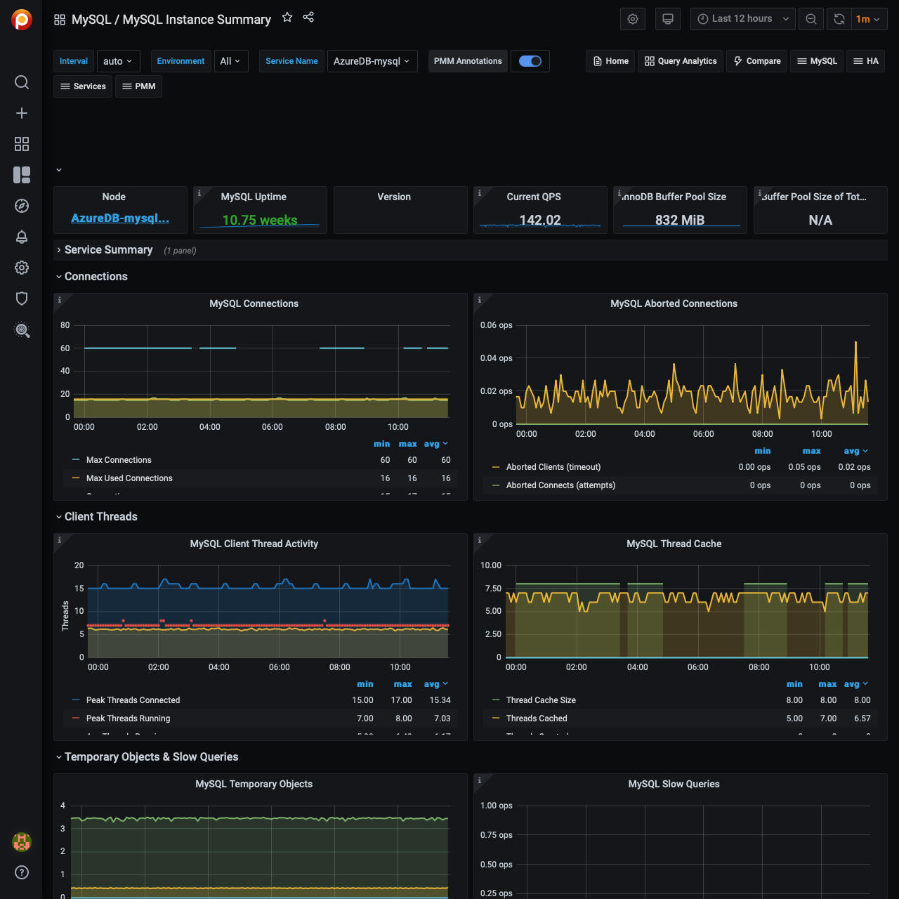

# MySQL Instance Summary

## MySQL Connections

### Max Connections

Max Connections is the maximum permitted number of simultaneous client connections. By default, this is 151. Increasing this value increases the number of file descriptors that `mysqld` requires. If the required number of descriptors are not available, the server reduces the value of Max Connections.

`mysqld` actually permits Max Connections + 1 clients to connect. The extra connection is reserved for use by accounts that have the SUPER privilege, such as root.

Max Used Connections is the maximum number of connections that have been in use simultaneously since the server started.

Connections is the number of connection attempts (successful or not) to the MySQL server.

## MySQL Aborted Connections

### Aborted Connections

When a given host connects to MySQL and the connection is interrupted in the middle (for example due to bad credentials), MySQL keeps that info in a system table (since 5.6 this table is exposed in `performance_schema`).

If the amount of failed requests without a successful connection reaches the value of `max_connect_errors`, `mysqld` assumes that something is wrong and blocks the host from further connection.

To allow connections from that host again, you need to issue the `FLUSH HOSTS` statement.

## MySQL Client Thread Activity

### MySQL Active Threads

Threads Connected is the number of open connections, while Threads Running is the number of threads not sleeping.

## MySQL Thread Cache

### MySQL Thread Cache

The `thread_cache_size` variable sets how many threads the server should cache to reuse. When a client disconnects, the client's threads are put in the cache if the cache is not full. It is auto-sized in MySQL 5.6.8 and above (capped to 100). Requests for threads are satisfied by reusing threads taken from the cache if possible, and only when the cache is empty is a new thread created.

- `threads_created`: The number of threads created to handle connections.
- `threads_cached`: The number of threads in the thread cache.

## MySQL Slow Queries

### MySQL Slow Queries

Slow queries are defined as queries being slower than the `long_query_time` setting. For example, if you have `long_query_time` set to 3, all queries that take longer than 3 seconds to complete will show on this graph.

## MySQL Select Types

### MySQL Select Types

As with most relational databases, selecting based on indexes is more efficient than scanning an entire table's data. Here we see the counters for selects not done with indexes.

- ***Select Scan*** is how many queries caused full table scans, in which all the data in the table had to be read and either discarded or returned.
- ***Select Range*** is how many queries used a range scan, which means MySQL scanned all rows in a given range.
- ***Select Full Join*** is the number of joins that are not joined on an index, this is usually a huge performance hit.

## MySQL Sorts

### MySQL Sorts

Due to a query's structure, order, or other requirements, MySQL sorts the rows before returning them. For example, if a table is ordered 1 to 10 but you want the results reversed, MySQL then has to sort the rows to return 10 to 1.

This graph also shows when sorts had to scan a whole table or a given range of a table to return the results and which could not have been sorted via an index.

## MySQL Table Locks

### Table Locks

MySQL takes a number of different locks for varying reasons. In this graph we see how many Table level locks MySQL has requested from the storage engine. In the case of InnoDB, many times the locks could actually be row locks as it only takes table level locks in a few specific cases.

It is most useful to compare Locks Immediate and Locks Waited. If Locks waited is rising, it means you have lock contention. Otherwise, Locks Immediate rising and falling is normal activity.

## MySQL Questions

### MySQL Questions

The number of statements executed by the server. This includes only statements sent to the server by clients and not statements executed within stored programs, unlike the Queries used in the QPS calculation.

This variable does not count the following commands:

- `COM_PING`
- `COM_STATISTICS`
- `COM_STMT_PREPARE`
- `COM_STMT_CLOSE`
- `COM_STMT_RESET`

## MySQL Network Traffic

### MySQL Network Traffic

Here we can see how much network traffic is generated by MySQL. Outbound is network traffic sent from MySQL and Inbound is network traffic MySQL has received.

## MySQL Network Usage Hourly

### MySQL Network Usage Hourly

Here we can see how much network traffic is generated by MySQL per hour. You can use the bar graph to compare data sent by MySQL and data received by MySQL.

## MySQL Internal Memory Overview

**System Memory**: Total Memory for the system.

**InnoDB Buffer Pool Data**: InnoDB maintains a storage area called the buffer pool for caching data and indexes in memory.

**TokuDB Cache Size**: Similar in function to the InnoDB Buffer Pool, TokuDB will allocate 50% of the installed RAM for its own cache.

**Key Buffer Size**: Index blocks for MyISAM tables are buffered and are shared by all threads. `key_buffer_size` is the size of the buffer used for index blocks.

**Adaptive Hash Index Size**: When InnoDB notices that some index values are being accessed very frequently, it builds a hash index for them in memory on top of B-Tree indexes.

**Query Cache Size**: The query cache stores the text of a SELECT statement together with the corresponding result that was sent to the client. The query cache has huge scalability problems in that only one thread can do an operation in the query cache at the same time.

**InnoDB Dictionary Size**: The data dictionary is InnoDB's internal catalog of tables. InnoDB stores the data dictionary on disk, and loads entries into memory while the server is running.

**InnoDB Log Buffer Size**: The MySQL InnoDB log buffer allows transactions to run without having to write the log to disk before the transactions commit.

## Top Command Counters

### Top Command Counters

The `Com_xxx` statement counter variables indicate the number of times each `xxx` statement has been executed. There is one status variable for each type of statement. For example, `Com_delete` and `Com_update` count [DELETE](https://dev.mysql.com/doc/refman/5.7/en/delete.html) and [UPDATE](https://dev.mysql.com/doc/refman/5.7/en/update.html) statements, respectively. `Com_delete_multi` and `Com_update_multi` are similar but apply to [DELETE](https://dev.mysql.com/doc/refman/5.7/en/delete.html) and [UPDATE](https://dev.mysql.com/doc/refman/5.7/en/update.html) statements that use multiple-table syntax.

## Top Command Counters Hourly

### Top Command Counters Hourly

The `Com_xxx` statement counter variables indicate the number of times each `xxx` statement has been executed. There is one status variable for each type of statement. For example, `Com_delete` and `Com_update` count [DELETE](https://dev.mysql.com/doc/refman/5.7/en/delete.html) and [UPDATE](https://dev.mysql.com/doc/refman/5.7/en/update.html) statements, respectively. `Com_delete_multi` and `Com_update_multi` are similar but apply to [DELETE](https://dev.mysql.com/doc/refman/5.7/en/delete.html) and [UPDATE](https://dev.mysql.com/doc/refman/5.7/en/update.html) statements that use multiple-table syntax.

## MySQL Handlers

### MySQL Handlers

Handler statistics are internal statistics on how MySQL is selecting, updating, inserting, and modifying rows, tables, and indexes.

This is in fact the layer between the Storage Engine and MySQL.

- `read_rnd_next` is incremented when the server performs a full table scan and this is a counter you don't really want to see with a high value.
- `read_key` is incremented when a read is done with an index.
- `read_next` is incremented when the storage engine is asked to 'read the next index entry'. A high value means a lot of index scans are being done.

## MySQL Query Cache Memory

### MySQL Query Cache Memory

The query cache has huge scalability problems in that only one thread can do an operation in the query cache at the same time. This serialization is true not only for SELECTs, but also for INSERT/UPDATE/DELETE.

This also means that the larger the `query_cache_size` is set to, the slower those operations become. In concurrent environments, the MySQL Query Cache quickly becomes a contention point, decreasing performance. MariaDB and AWS Aurora have done work to try and eliminate the query cache contention in their flavors of MySQL, while MySQL 8.0 has eliminated the query cache feature.

The recommended settings for most environments is to set:

- `query_cache_type=0`
- `query_cache_size=0`

!!! hint alert alert-success "Tip"
    While you can dynamically change these values, to completely remove the contention point you have to restart the database.

## MySQL Query Cache Activity

### MySQL Query Cache Activity

The query cache has huge scalability problems in that only one thread can do an operation in the query cache at the same time. This serialization is true not only for SELECTs, but also for INSERT/UPDATE/DELETE.

This also means that the larger the `query_cache_size` is set to, the slower those operations become. In concurrent environments, the MySQL Query Cache quickly becomes a contention point, decreasing performance. MariaDB and AWS Aurora have done work to try and eliminate the query cache contention in their flavors of MySQL, while MySQL 8.0 has eliminated the query cache feature.

The recommended settings for most environments is to set:

- `query_cache_type=0`
- `query_cache_size=0`

!!! hint alert alert-success "Tip"
    While you can dynamically change these values, to completely remove the contention point you have to restart the database.

## MySQL Table Open Cache Status

### MySQL Table Open Cache Status

The recommendation is to set the `table_open_cache_instances` to a loose correlation to virtual CPUs, keeping in mind that more instances means the cache is split more times. If you have a cache set to 500 but it has 10 instances, each cache will only have 50 cached.

The `table_definition_cache` and `table_open_cache` can be left as default as they are auto-sized MySQL 5.6 and above (i.e., do not set them to any value).

## MySQL Open Tables

### MySQL Open Tables

The recommendation is to set the `table_open_cache_instances` to a loose correlation to virtual CPUs, keeping in mind that more instances means the cache is split more times. If you have a cache set to 500 but it has 10 instances, each cache will only have 50 cached.

The `table_definition_cache` and `table_open_cache` can be left as default as they are auto-sized MySQL 5.6 and above (i.e., do not set them to any value).

## MySQL Table Definition Cache

### MySQL Table Definition Cache

The recommendation is to set the `table_open_cache_instances` to a loose correlation to virtual CPUs, keeping in mind that more instances means the cache is split more times. If you have a cache set to 500 but it has 10 instances, each cache will only have 50 cached.

The `table_definition_cache` and `table_open_cache` can be left as default as they are auto-sized MySQL 5.6 and above (i.e., do not set them to any value).
