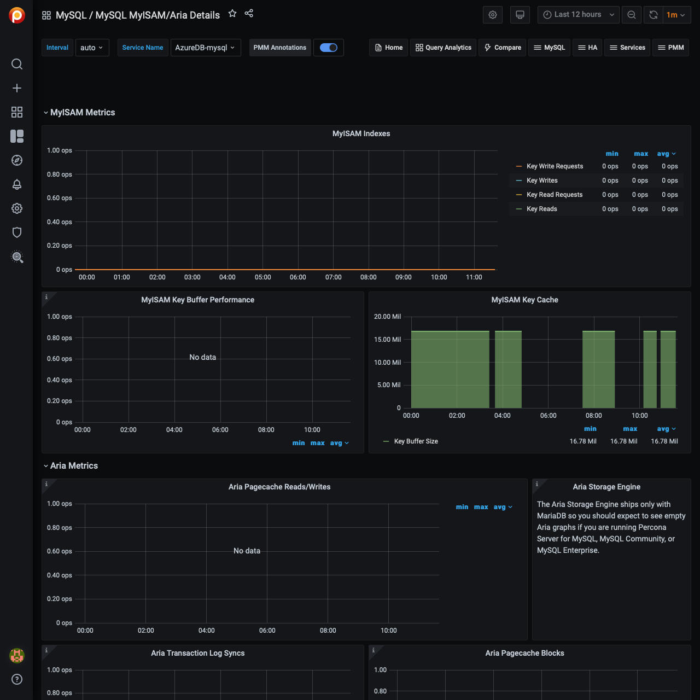

# MySQL MyISAM/Aria Details

## MyISAM Key Buffer Performance

The `Key Read Ratio`  (`Key_reads` / `Key_read_requests`) ratio should normally be less than 0.01.

The  `Key Write Ratio` (`Key_writes` / `Key_write_requests`) ratio is usually near 1 if you are using mostly updates and deletes, but might be much smaller if you tend to do updates that affect many rows at the same time or if you are using the `DELAY_KEY_WRITE` table option.

## Aria Pagecache Reads/Writes

This graph is similar to InnoDB buffer pool reads/writes. `aria-pagecache-buffer-size` is the main cache for the Aria storage engine. If you see high reads/writes (physical IO), i.e. reads are close to read requests and/or writes are close to write requests you may need to increase the `aria-pagecache-buffer-size` (may need to decrease other buffers: `key_buffer_size`, `innodb_buffer_pool_size`, etc.)

## Aria Transaction Log Syncs

This is similar to InnoDB log file syncs. If you see lots of log syncs and want to relax the durability settings you can change `aria_checkpoint_interval` (in seconds) from 30 (default) to a higher number. It is good to look at the disk IO dashboard as well.

## Aria Pagecache Blocks

This graph shows the utilization for the Aria pagecache. This is similar to InnoDB buffer pool graph. If you see all blocks are used you may consider increasing `aria-pagecache-buffer-size` (may need to decrease other buffers: `key_buffer_size`, `innodb_buffer_pool_size`, etc.)
