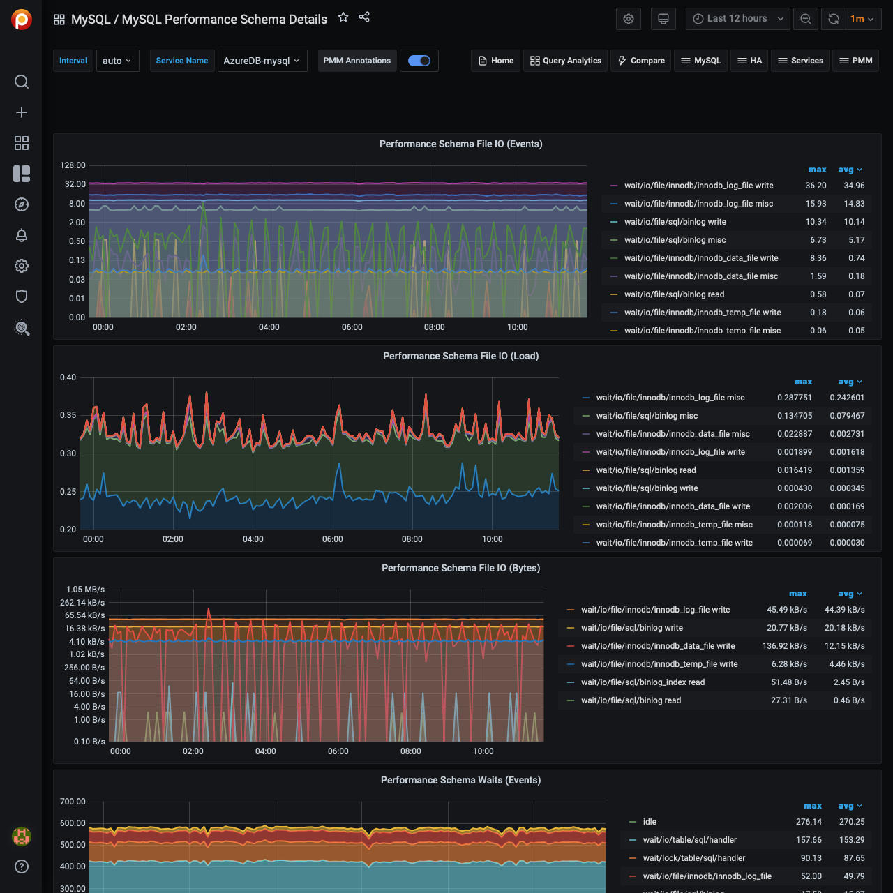

# MySQL Performance Schema Details

The MySQL Performance Schema dashboard helps determine the efficiency of communicating with Performance Schema. This dashboard contains the following metrics:

- Performance Schema file IO (events)
- Performance Schema file IO (load)
- Performance Schema file IO (Bytes)
- Performance Schema waits (events)
- Performance Schema waits (load)
- Index access operations (load)
- Table access operations (load)
- Performance Schema SQL and external locks (events)
- Performance Schema SQL and external locks (seconds)
