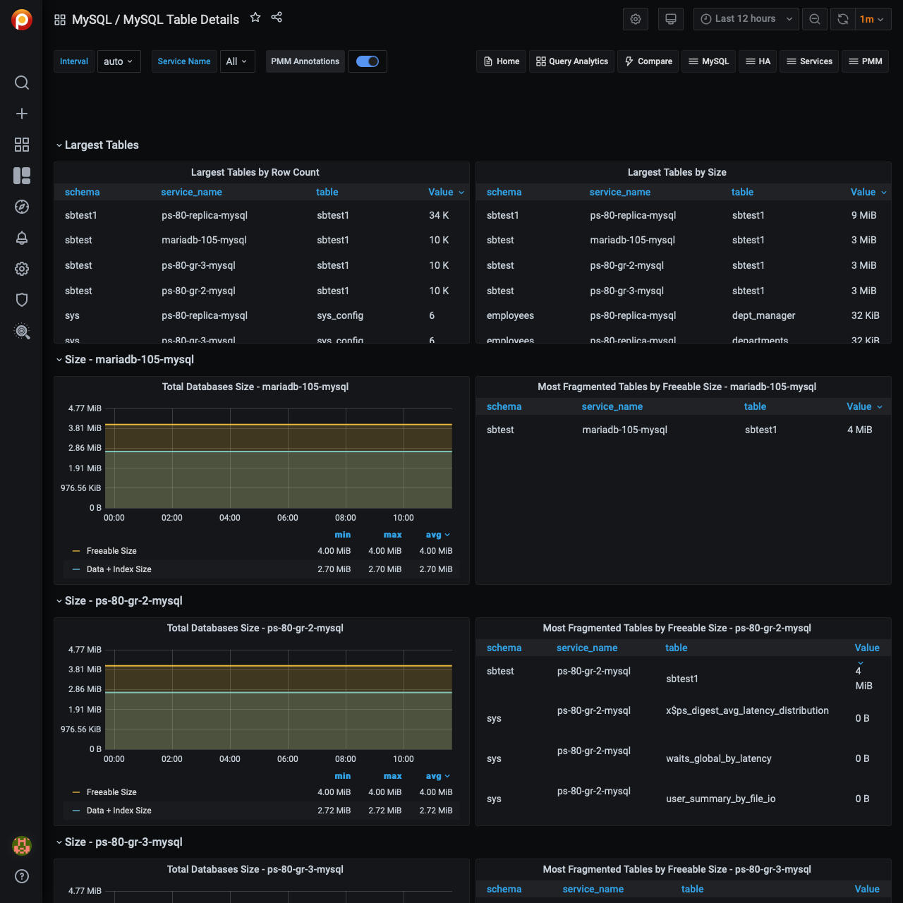

# MySQL Table Details

## Largest Tables

Largest Tables by Row Count
: The estimated number of rows in the table from `information_schema.tables`.

Largest Tables by Size
: The size of the table components from `information_schema.tables`.

## Pie

Total Database Size
: The total size of the database: as data + index size, so freeable one.

Most Fragmented Tables by Freeable Size
: The list of 5 most fragmented tables ordered by their freeable size

## Table Activity

The next two graphs are available only for [Percona Server](https://www.percona.com/doc/percona-server/5.6/diagnostics/user_stats.html) and [MariaDB](https://mariadb.com/kb/en/mariadb/user-statistics/) and require `userstat` variable turned on.

## Rows read

The number of rows read from the table, shown for the top 5 tables.

## Rows Changed

The number of rows changed in the table, shown for the top 5 tables.

## Auto Increment Usage

The current value of an `auto_increment` column from `information_schema`, shown for the top 10 tables.
