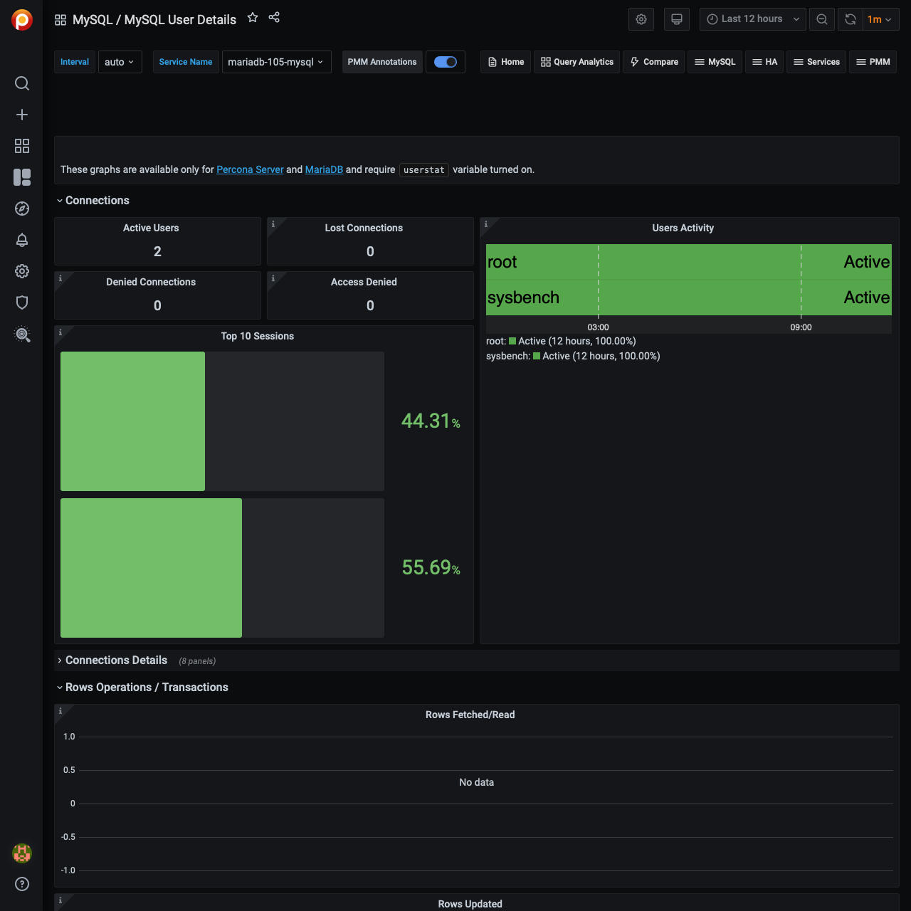

# MySQL User Details

!!! note alert alert-primary ""
    This dashboard requires Percona Server for MySQL 5.1+ or MariaDB 10.1/10.2 with XtraDB. Also `userstat` should be enabled, for example with the `SET GLOBAL userstat=1` statement. See [Setting up MySQL](../../setting-up/client/mysql.md).

Data is displayed for the 5 top users.

Top Users by Connections Created
:    The number of times user’s connections connected using SSL to the server.

Top Users by Traffic
:    The number of bytes sent to the user’s connections.

Top Users by Rows Fetched/Read
:    The number of rows fetched by the user’s connections.

Top Users by Rows Updated
:    The number of rows updated by the user’s connections.

Top Users by Busy Time
:    The cumulative number of seconds there was activity on connections from the user.

Top Users by CPU Time
:    The cumulative CPU time elapsed, in seconds, while servicing connections of the user.
