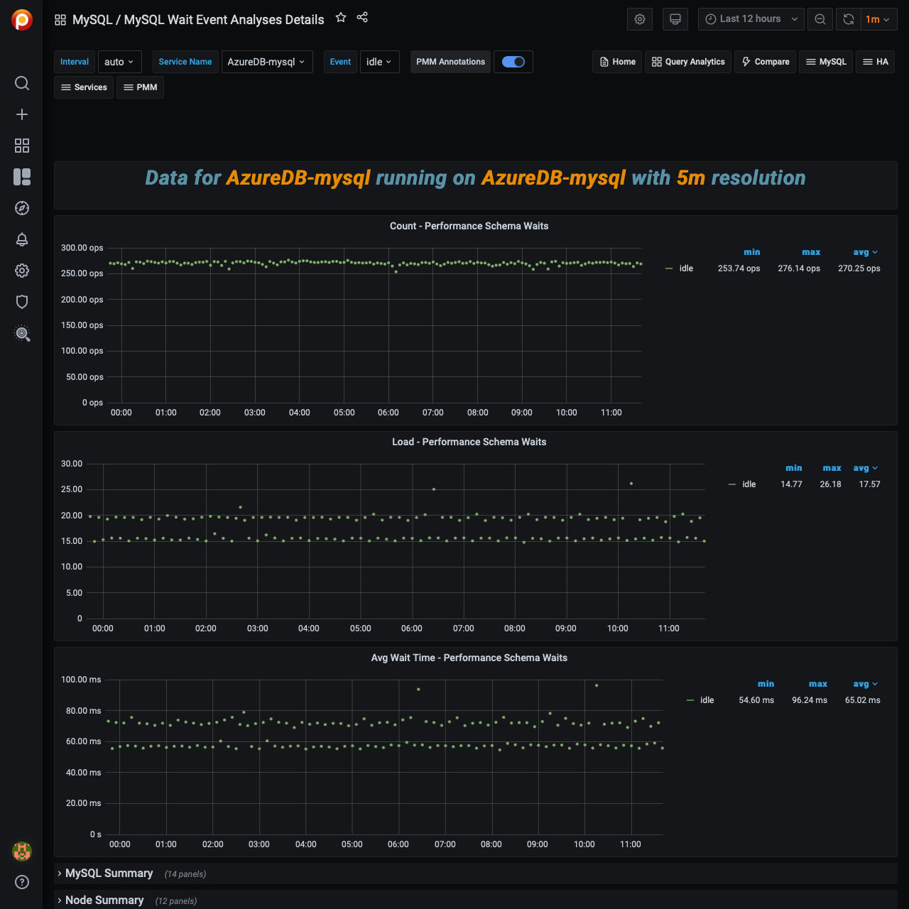

# MySQL Wait Event Analyses Details

This dashboard helps to analyze *Performance Schema* wait events. It plots the following metrics for the chosen (one or more) wait events:

- Count - Performance Schema Waits
- Load - Performance Schema Waits
- Avg Wait Time - Performance Schema Waits
