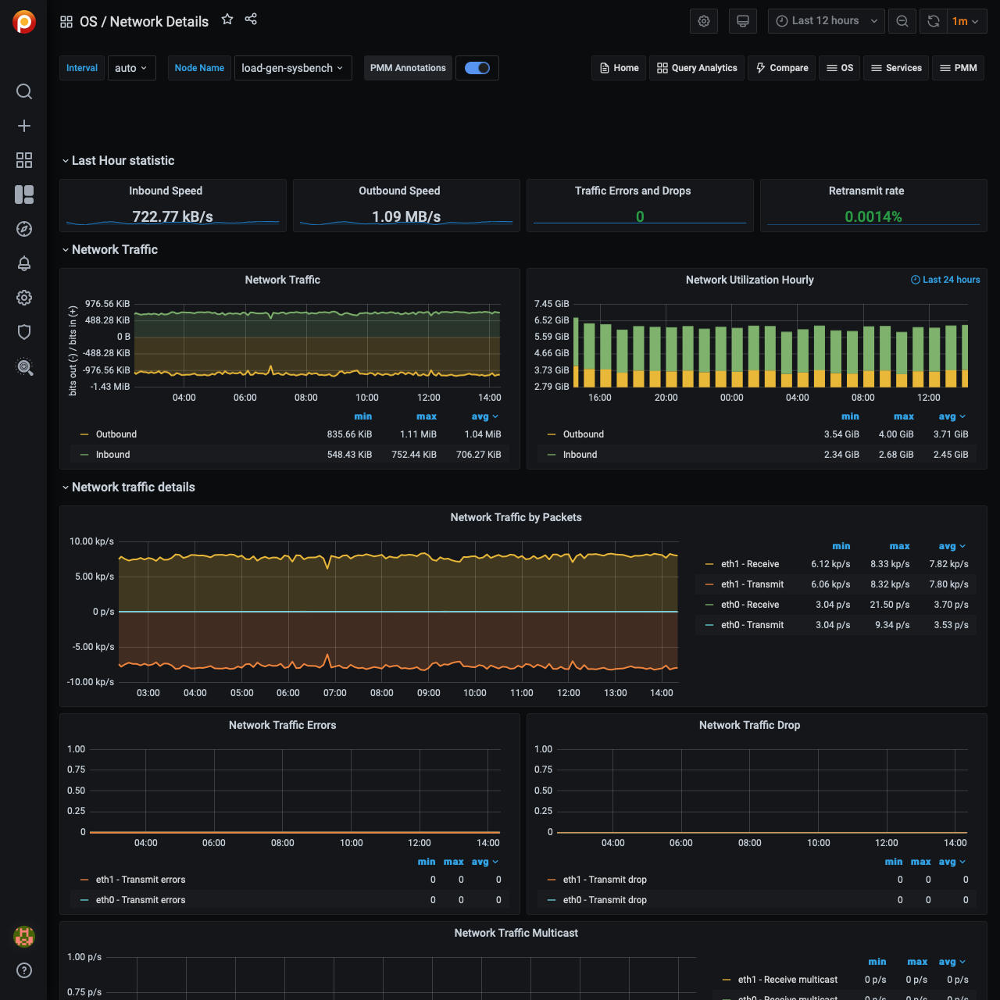

# Network Details

## Last Hour Statistic

This section reports the *inbound speed*, *outbound speed*, *traffic errors and drops*, and *retransmit rate*.

## Network Traffic

This section contains the *Network traffic* and *network utilization hourly* metrics.

## Network Traffic Details

This section offers the following metrics:

- Network traffic by packets
- Network traffic errors
- Network traffic drop
- Network traffic multicast

## Network Netstat TCP

This section offers the following metrics:

- Timeout value used for retransmitting
- Min TCP retransmission timeout
- Max TCP retransmission timeout
- Netstat: TCP
- TCP segments

## Network Netstat UDP

In this section, you can find the following metrics:

- Netstat: UDP
- UDP Lite

The graphs in the *UDP Lite* metric give statistics about:

`InDatagrams`
: Packets received

`OutDatagrams`
: Packets sent

`InCsumErrors`
: Datagrams with checksum errors

`InErrors`
: Datagrams that could not be delivered to an application

`RcvbufErrors`
: Datagrams for which not enough socket buffer memory to receive

`SndbufErrors`
: Datagrams for which not enough socket buffer memory to transmit

`NoPorts`
: Datagrams received on a port with no listener

## ICMP

This section has the following metrics:

- ICMP Errors
- Messages/Redirects
- Echos
- Timestamps/Mask Requests

### ICMP Errors

`InErrors`
:   Messages which the entity received but determined as having ICMP-specific errors (bad ICMP checksums, bad length, etc.)

`OutErrors`
:   Messages which this entity did not send due to problems discovered within ICMP, such as a lack of buffers

`InDestUnreachs`
:   Destination Unreachable messages received

`OutDestUnreachs`
:   Destination Unreachable messages sent

`InType3`
:   Destination unreachable

`OutType3`
:   Destination unreachable

`InCsumErrors`
:   Messages with ICMP checksum errors

`InTimeExcds`
:   Time Exceeded messages received

### Messages/Redirects

`InMsgs`
:   Messages which the entity received. Note that this counter includes all those counted by `icmpInErrors`

`InRedirects`
:   Redirect messages received

`OutMsgs`
:   Messages which this entity attempted to send. Note that this counter includes all those counted by `icmpOutErrors`

`OutRedirects`
:   Redirect messages sent. For a host, this object will always be zero, since hosts do not send redirects

### Echos

`InEchoReps`
: Echo Reply messages received

`InEchos`
: Echo (request) messages received

`OutEchoReps`
: Echo Reply messages sent

`OutEchos`
: Echo (request) messages sent

### Timestamps/Mask Requests

`InAddrMaskReps`
: Address Mask Reply messages received

`InAddrMasks`
: Address Mask Request messages received

`OutAddrMaskReps`
: Address Mask Reply messages sent

`OutAddrMasks`
: Address Mask Request messages sent

`InTimestampReps`
: Timestamp Reply messages received

`InTimestamps`
: Timestamp Request messages received

`OutTimestampReps`
: Timestamp Reply messages sent

`OutTimestamps`
: Timestamp Request messages sent
