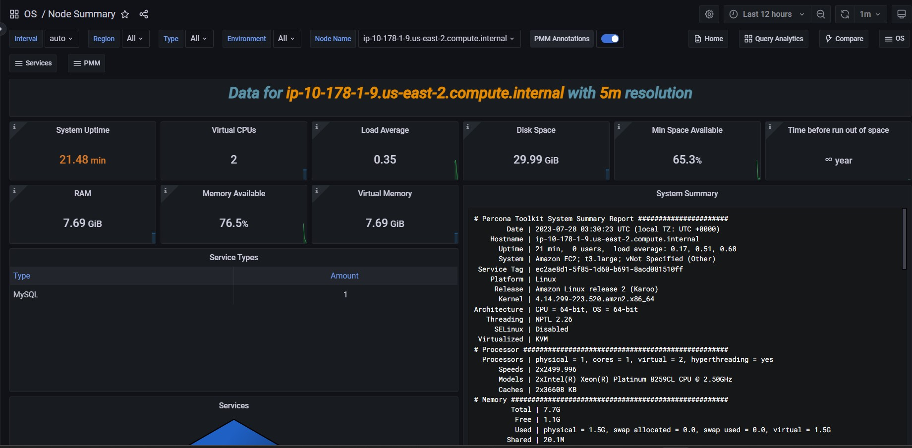

# Node Summary

## System Summary

The output from ``pt-summary``, one of the [Percona Toolkit utilities](https://www.percona.com/doc/percona-toolkit/LATEST/pt-summary.html).

## CPU Usage

The CPU time is measured in clock ticks or seconds. It is useful to measure CPU time as a percentage of the CPU's capacity, which is called the CPU usage.

## CPU Saturation and Max Core Usage

When a system is running with maximum CPU utilization, the transmitting and receiving threads must all share the available CPU. This will cause data to be queued more frequently to cope with the lack of CPU. CPU Saturation may be measured as the length of a wait queue, or the time spent waiting on the queue.

## Interrupts and Context Switches

Interrupt is an input signal to the processor indicating an event that needs immediate attention. An interrupt signal alerts the processor and serves as a request for the processor to interrupt the currently executing code, so that the event can be processed in a timely manner.

Context switch is the process of storing the state of a process or thread, so that it can be restored and resume execution at a later point. This allows multiple processes to share a single CPU, and is an essential feature of a multitasking operating system.

## Processes

No description

## Memory Utilization

No description

## Virtual Memory Utilization

No description

## Swap Space

No description

## Swap Activity

Swap Activity is memory management that involves swapping sections of memory to and from physical storage.

## I/O Activity

Disk I/O includes read or write or input/output operations involving a physical disk. It is the speed with which the data transfer takes place between the hard disk drive and RAM.

## Global File Descriptors Usage

No description

## Disk IO Latency

Shows average latency for Reads and Writes IO Devices.  Higher than typical latency for highly loaded storage indicates saturation (overload) and is frequent cause of performance problems.  Higher than normal latency also can indicate internal storage problems.

## Disk IO Load

Shows how much disk was loaded for reads or writes as average number of outstanding requests at different period of time.  High disk load is a good measure of actual storage utilization. Different storage types handle load differently - some will show latency increases on low loads others can handle higher load with no problems.

## Network Traffic

Network traffic refers to the amount of data moving across a network at a given point in time.

## Network Utilization Hourly

No description

## Local Network Errors

Total Number of Local Network Interface Transmit Errors, Receive Errors and Drops.  Should be  Zero

## TCP Retransmission

Retransmission, essentially identical with Automatic repeat request (ARQ), is the resending of packets which have been either damaged or lost. Retransmission is one of the basic mechanisms used by protocols operating over a packet switched computer network to provide reliable communication (such as that provided by a reliable byte stream, for example TCP).
