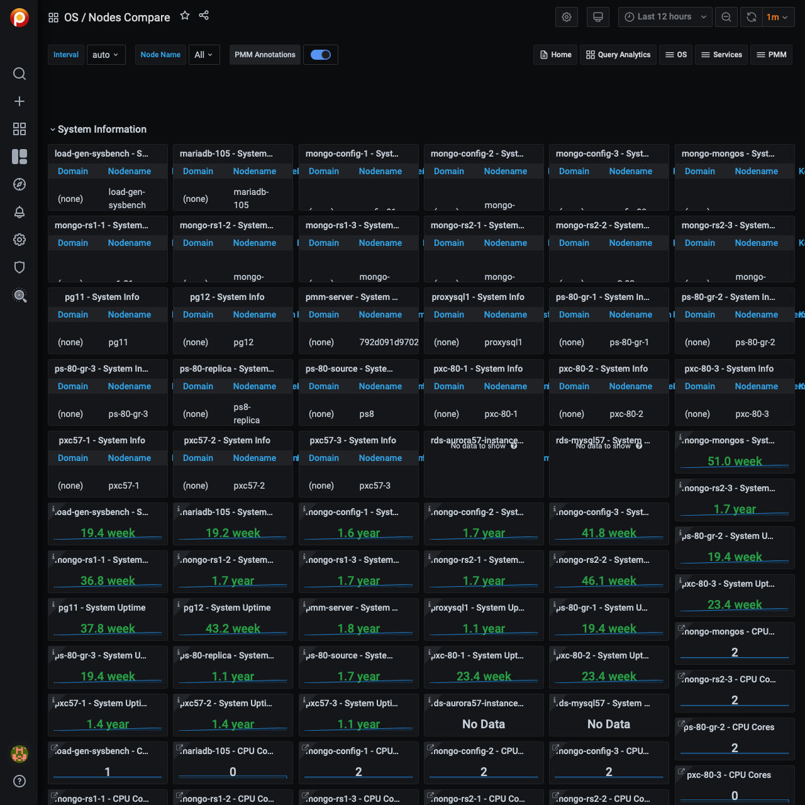

# Nodes Compare

This dashboard lets you compare a wide range of parameters. Parameters of the same type are shown side by side for all servers, grouped into the following sections:

- System Information
- CPU
- Memory
- Disk Partitions
- Disk Performance
- Network

The *System Information* section shows the *System Info* summary of each server, as well as *System Uptime*, *CPU Cores*, *RAM*, *Saturation Metrics*, and *Load Average* gauges.

The *CPU* section offers the *CPU Usage*, *Interrupts*, and *Context Switches* metrics.

In the *Memory* section, you can find the *Memory Usage*, *Swap Usage*, and *Swap Activity* metrics.

The *Disk Partitions* section encapsulates two metrics, *Mountpoint Usage* and *Free Space*.

The *Disk Performance* section contains the *I/O Activity*, *Disk Operations*, *Disk Bandwidth*, *Disk IO Utilization*, *Disk Latency*, and *Disk Load* metrics.

Finally, *Network* section shows *Network Traffic*, and *Network Utilization Hourly* metrics.
