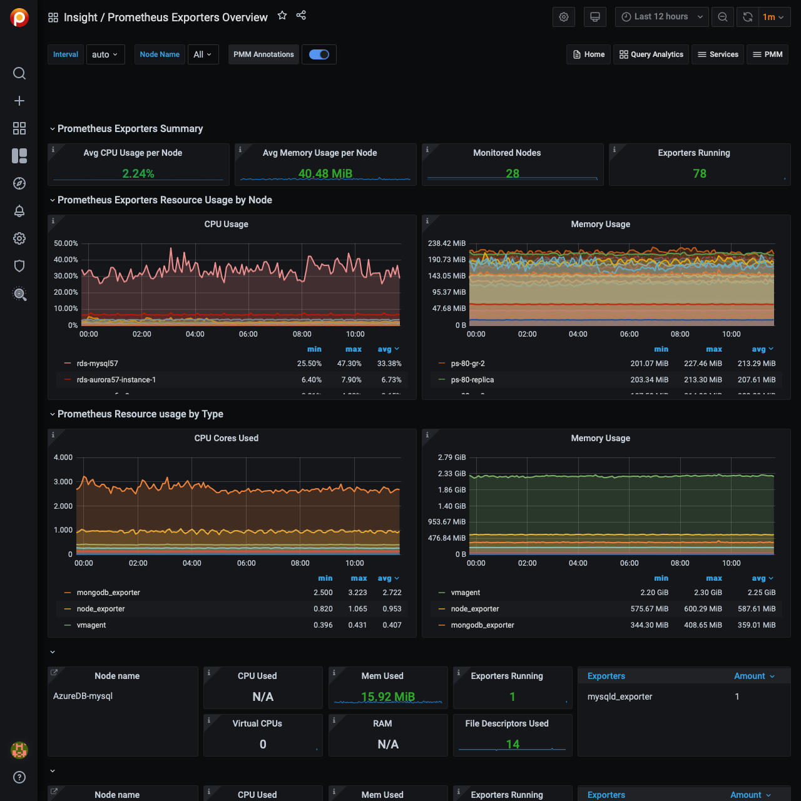

# Prometheus Exporters Overview

## Prometheus Exporters Summary

This section provides a summary of how exporters are used across the selected hosts. It includes the average usage of CPU and memory as well as the number of hosts being monitored and the total number of running exporters.

Avg CPU Usage per Host
:   Shows the average CPU usage in percent per host for all exporters.

Avg Memory Usage per Host
:   Shows the Exporters average Memory usage per host.

Monitored Hosts
:   Shows the number of monitored hosts that are running Exporters.

Exporters Running
:  Shows the total number of Exporters running with this PMM Server instance.

!!! note alert alert-primary ""
    The CPU usage and memory usage do not include the additional CPU and memory usage required to produce metrics by the application or operating system.

## Prometheus Exporters Resource Usage by Node

This section shows how resources, such as CPU and memory, are being used by the
exporters for the selected hosts.

CPU Usage
:   Plots the Exporters' CPU usage across each monitored host (by default, All hosts).

Memory Usage
:   Plots the Exporters' Memory usage across each monitored host (by default, All hosts).

## Prometheus Exporters Resource Usage by Type

This section shows how resources, such as CPU and memory, are being used by the exporters for host types: MySQL, MongoDB, ProxySQL, and the system.

CPU Cores Used
:   Shows the Exporters' CPU Cores used for each type of Exporter.

Memory Usage
:   Shows the Exporters' memory used for each type of Exporter.

## List of Hosts

At the bottom, this dashboard shows details for each running host.

CPU Used
:   Show the CPU usage as a percentage for all Exporters.

Mem Used
:   Shows total Memory Used by Exporters.

Exporters Running
:   Shows the number of Exporters running.

RAM
:   Shows the total amount of RAM of the host.

Virtual CPUs
:   Shows the total number of virtual CPUs on the host.

You can click the value of the *CPU Used*, *Memory Used*, or *Exporters Running* columns to open the [Prometheus Exporter Status](dashboard-prometheus-exporter-status.md) dashboard for further analysis.

!!! seealso alert alert-info "See also"
    [Percona blog: Understand Your Prometheus Exporters with Percona Monitoring and Management (PMM)](https://www.percona.com/blog/2018/02/20/understand-prometheus-exporters-percona-monitoring-management-pmm/)
