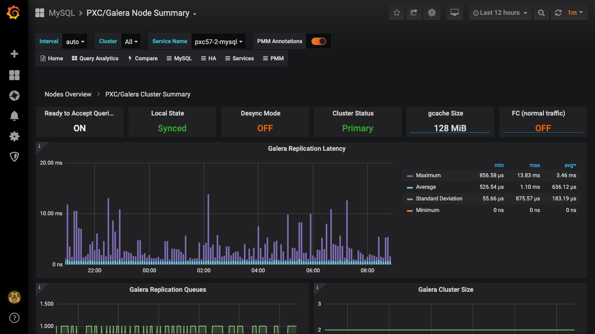

# PXC/Galera Node Summary

## Galera Replication Latency

Shows figures for the replication latency on group communication. It measures latency from the time point when a message is sent out to the time point when a message is received. As replication is a group operation, this essentially gives you the slowest ACK and longest RTT in the cluster.

## Galera Replication Queues

Shows the length of receive and send queues.

## Galera Cluster Size

Shows the number of members currently connected to the cluster.

## Galera Flow Control

Shows the number of `FC_PAUSE` events sent/received. They are sent by a node when its replication queue gets too full. If a node is sending out FC messages it indicates a problem.

## Galera Parallelization Efficiency

Shows the average distances between highest and lowest seqno that are concurrently applied, committed and can be possibly applied in parallel (potential degree of parallelization).

## Galera Writing Conflicts

Shows the number of local transactions being committed on this node that failed certification (some other node had a commit that conflicted with ours) – client received deadlock error on commit and also the number of local transactions in flight on this node that were aborted because they locked something an applier thread needed – deadlock error anywhere in an open transaction. Spikes in the graph may indicate writing to the same table potentially the same rows from 2 nodes.

## Available Downtime before SST Required

Shows for how long the node can be taken out of the cluster before SST is required. SST is a full state transfer method.

## Galera Writeset Count

Shows the count of transactions received from the cluster (any other node) and replicated to the cluster (from this node).

## Galera Writeset Size

Shows the average transaction size received/replicated.

## Galera Writeset Traffic

Shows the bytes of data received from the cluster (any other node) and replicated to the cluster (from this node).

## Galera Network Usage Hourly

Shows the bytes of data received from the cluster (any other node) and replicated to the cluster (from this node).
