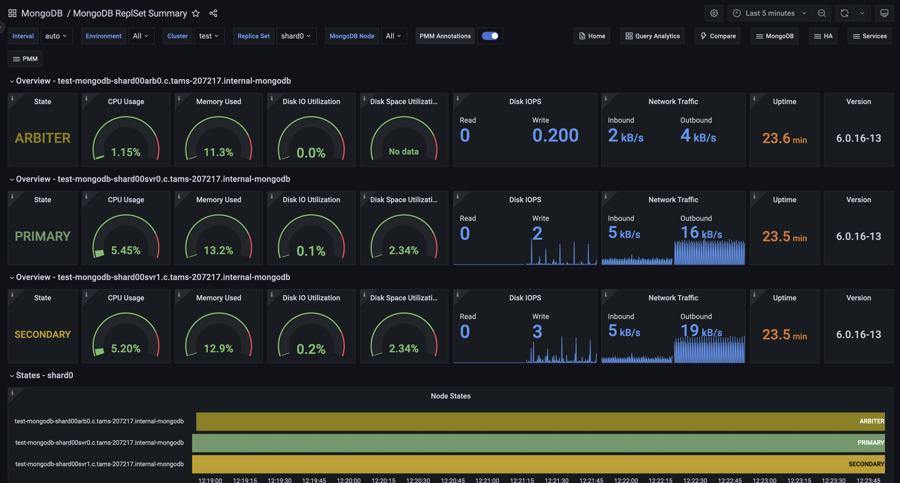

# MongoDB ReplSet Summary

The MongoDB ReplSet Summary dashboard offers a comprehensive view of your MongoDB replica set's health and performance. It provides clear insights for both simple and complex, multi-environment setups.

The dashboard displays key metrics for individual nodes and the entire replica set, allowing you to quickly spot issues and maintain optimal database performance. With focused information and effective visualizations, it helps you identify and resolve potential problems efficiently, making it easier to manage MongoDB deployments of any size.

## Overview

The overview section displays essential data for individual nodes, such as their role, CPU usage, memory consumption, disk space, network traffic, uptime, and the current MongoDB version.

## State

Displays the current state of a MongoDB replica set member. It shows a single value representing the node's role, such as PRIMARY, SECONDARY, or ARBITER. The state is color-coded for quick visual identification. This information is crucial for understanding the current role and health of each node in your MongoDB replica set.

### CPU Usage

Displays the current CPU usage percentage for the selected MongoDB service. It shows how much of the CPU's capacity is being used, with a range from 0% to 100%. 

The gauge is color-coded, turning red when usage exceeds 80%, helping you quickly identify high CPU load situations. This metric is crucial for monitoring the performance and resource utilization of your MongoDB instance, allowing you to spot potential bottlenecks or overloaded servers at a glance.

### Memory Used

Shows an estimate of how much memory can be used without causing swapping on the MongoDB server. It displays the percentage of memory currently in use, with 100% indicating that all available memory is used and swapping may occur. The gauge turns red above 80% usage, signaling that free memory is running low. This metric is crucial for predicting potential performance issues due to memory constraints, helping you proactively manage your MongoDB instance's memory resources to avoid swapping and maintain optimal performance.

### Disk I/O Utilization

Displays disk utilization as a percentage, showing how often there was at least one I/O request active for the MongoDB server. Ranging from 0% to 100%, it helps determine if disk load is evenly distributed or if I/O is bottlenecked. Higher values suggest more intense, potentially queued disk activity. The gauge turns red above 80%, indicating possible I/O constraints. Use this metric alongside I/O latency and queue depth to assess overall storage performance and identify potential disk-related issues affecting your MongoDB instance's responsiveness

### Disk Space Utilization

Shows the percentage of used disk space for the MongoDB server's data storage. It ranges from 0% to 100%, with higher values indicating less free space. The gauge turns red above 80% usage, warning of potential disk space issues. This metric is crucial for preventing *Disk full* errors that could disrupt services or crash the system. When free space approaches zero, consider removing unused files or expanding storage capacity to ensure smooth MongoDB operation and prevent data-related incidents.

### Disk IOPS

This stat panel displays the current rate of disk Input/Output Operations Per Second (IOPS) for the MongoDB server, showing separate values for read and write operations. It provides a real-time view of the physical I/O load on the storage system. The panel uses an area graph to visualize recent trends. High IOPS values or sudden spikes can indicate potential performance issues due to I/O subsystem overload. Monitor this metric to identify periods of intense disk activity and potential storage bottlenecks that could affect MongoDB's performance.

### Network Traffic

Displays the current network traffic for the MongoDB server, showing separate values for inbound and outbound data transfer rates in bytes per second. It uses an area graph to visualize recent trends in network activity. The panel provides a real-time view of data movement across the network, helping you monitor the MongoDB server's network load.

High values or sudden spikes can indicate increased database activity, potential performance bottlenecks, or unusual network patterns. Use this metric to assess network utilization and identify periods of intense data transfer that might affect MongoDB's performance or user experience.

### Uptime

Displays the current uptime of the MongoDB server, showing how long it has been running without a shutdown or restart. The value is presented in seconds and uses color-coding for quick status assessment: red for very recent starts, orange for short uptimes, and green for longer periods.

This metric is useful for tracking system stability, identifying recent restarts, and monitoring continuous operation time. Long uptimes generally indicate stable operation, while short uptimes might suggest recent maintenance or unexpected restarts that could warrant investigation.

### Version

Shows the current version of MongoDB running on the selected node in the replica set.

This information is crucial for ensuring consistency across your MongoDB deployment, tracking upgrade status, and identifying potential version-related issues or compatibility concerns. Regular checks of this panel can help maintain a uniform MongoDB version across your infrastructure and assist in planning future upgrades or troubleshooting version-specific problems.

## States

### Node States

Visualizes the status changes of each node in the MongoDB replica set over the selected time range. 

The timeline format allows you to easily track state transitions, identify periods of instability, and understand the roles of different nodes throughout the monitored period. This visualization is crucial for monitoring replica set health, detecting failovers or reconfigurations, and ensuring the overall stability of your MongoDB cluster. Use this panel to quickly spot any unusual patterns or frequent state changes that might require further investigation.

For more details on replica set states, see to the [MongoDB documentation](https://www.mongodb.com/docs/manual/reference/replica-states/).

## Details

### Command Operations

Shows the rates of different MongoDB operations per second, including primary operations (like queries, inserts, updates, and deletes), replicated operations on secondary nodes, and automatic deletions by TTL indexes.

It helps you visualize your database's workload, showing how different types of operations contribute to overall activity. Use this to spot unusual patterns, balance between read and write operations, and understand your MongoDB instance's performance at a glance.

You can filter the chart to focus on specific command types by clicking on their names in the legend. This will display only the selected metric. To view multiple speci
metrics, use *Ctrl + click*  to select multiple items.

### Top Hottest Collections by Read

Lists the five collections with the highest read activity. Use this panel to quickly identify which collections are under the most demand, allowing you to monitor read-heavy workloads and optimize performance accordingly.

### Query Execution Times

Displays the average latency of operations, categorized by read, write, or command. It visualizes how long each type of operation takes to execute over time, helping you identify trends or potential performance bottlenecks in your database operations. Use this panel to you to monitor and optimize the responsiveness of your MongoDB cluster.

### Top Hottest Collections by Write

Lists the five collections with the most write operations.

### Query Efficiency

Measures the efficiency of queries in your MongoDB cluster by showing the ratio of documents or index entries scanned versus documents returned. A ratio of 1 indicates that every document returned matched the query criteria exactly, while a higher value, such as 100, suggests that on average, 100 documents were scanned to return a single document.

Use this panel to assess query performance, identify inefficient queries, and optimize indexing strategies. 

### Queued Operations

Displays the number of operations that are queued due to locks within your MongoDB cluster. It helps identify performance bottlenecks by showing how many operations are waiting because of locking issues. 

Use this panel to track these queued operations and monitor the impact of locking on system performance over time and take action if necessary.

### Reads & Writes

Tracks the number of read and write operations over time in your MongoDB environment. Reads represent data queries, while writes represent data modifications.

Use this panel to get insights into the workload distribution and monitor the performance of database operations, ensuring that the system is handling read and write operations efficiently.

### Connections

Monitors the average number of active and available MongoDB connections over time.

Use this panel to track connection usage and ensure the database has sufficient capacity to handle incoming requests without reaching its limit.

## Collection Details

### Size of Collections

Displays the storage size of MongoDB collections, which are analogous to tables in relational databases, offering insights into the storage footprint of each collection across different nodes.

Use it to effectively monitor and manage data distribution and storage consumption. The data is organized by database name, collection, and node, and can be easily filtered and sorted for detailed analysis.

### Number of Collections

Provides a count of collections across different databases and nodes, helping you understand the structure and scale of your MongoDB deployments. The data is organized by database name and node, and you can filter and sort it for detailed insights. 

Use this table to monitor the distribution of collections and manage your database schema effectively.

## Replication

### Replication Lag

Monitors replication lag, which occurs when a secondary node cannot replicate data as fast as it is written to the primary node. Causes of lag can include network latency, packet loss, or routing issues.

### OpLog Recovery Window

Indicates the timespan (window) between the newest and oldest operations in the Oplog collection.

## Performance

### Flow Control

Monitors and displays the performance metrics related to flow control in a MongoDB cluster. It provides insights into the frequency and duration of lagged operations, which can help you identify potential bottlenecks or performance issues.

### WiredTiger Concurrency Tickets Available

Shows the number of available WiredTiger concurrency tickets, which control the number of operations that can run simultaneously in the storage engine.

## Nodes Summary

Provides a quick overview of the health and resource utilization of your nodes, making it easy to spot any potential issues or resource constraints.

## CPU Usage

Measures CPU time as a percentage of the CPU's total capacity, providing insights into CPU utilization.

## CPU Saturation

Indicates when a system is running at maximum CPU capacity, leading to increased data queuing and potential performance degradation.

## Disk I/O and Swap Activity

Tracks disk I/O operations and swap activity, which involve transferring data between the hard disk drive and RAM.

## Network Traffic

Monitors network traffic, showing the amount of data moving across the network at any given time.
