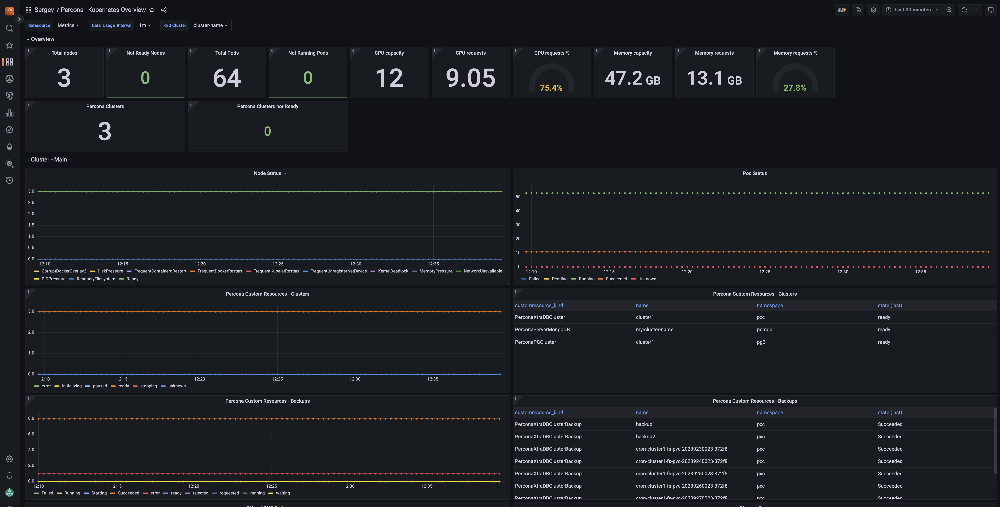

# Kubernetes monitoring for Percona Operators 

!!! caution alert alert-warning "Important"
    This feature is still in [Technical Preview](https://docs.percona.com/percona-monitoring-and-management/details/glossary.html#technical-preview) and is subject to change. We recommend that early adopters use this feature for testing purposes only.

Monitoring the state of the database is crucial to timely identify and react to performance issues. Percona Monitoring and Management (PMM) solution enables you to do just that.

However, the database state also depends on the state of the Kubernetes cluster itself. Hence it’s important to have metrics that can depict the state of the Kubernetes cluster.

For inforamtion on setting up monitoring for the Kubernetes cluster health, see [documentation](https://docs.percona.com/percona-operator-for-mysql/pxc/monitor-kubernetes.html). 

This setup has been tested with the PMM server as the centralized data storage and the Victoria Metrics Kubernetes monitoring stack as the metrics collector. These steps may also apply if you use another Prometheus-compatible storage.

## Kubernetes overview

The Kubernetes Cluster overview dashboard gives you an overview of Kubernetes health and its objects, including Percona custom resources.

