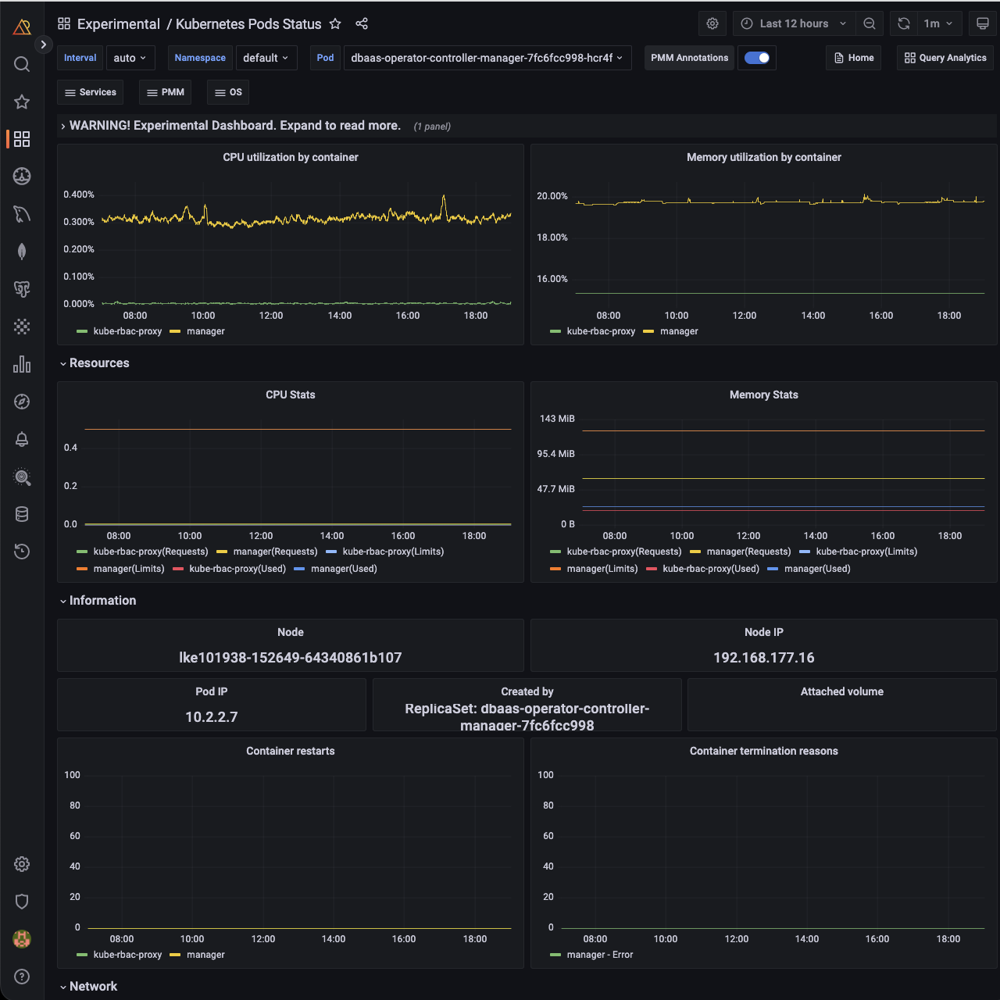

# Kubernetes Pods Status

!!! caution alert alert-warning "Disclaimer"
    This is an Experimental Dashboard that is not part of the official Percona Monitoring and Management (PMM) deployment and might be updated. We ship this Dashboard to obtain feedback from our users.

!!! note alert alert-primary "Availability"
    This experimental dashboard is available starting with PMM 2.37.0.

Kubernetes Pods Status dashboard provides detailed information about the state and performance of your pods, including CPU, Memory, and Network metrics. 

This dashboard can help you quickly pinpoint any issues affecting your pods and ensure they continue to operate smoothly.

