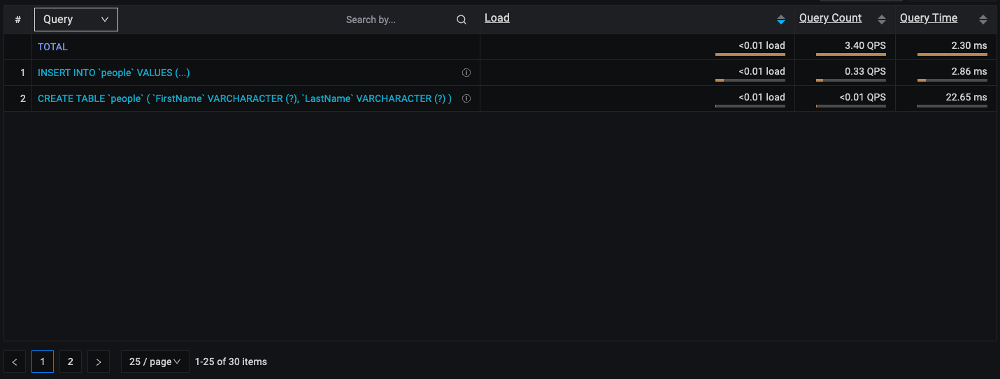
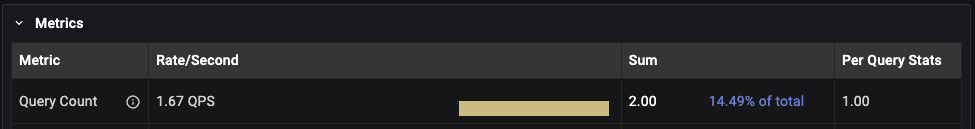

# Query Analytics under the hood

## Components
QAN consists of three main components:

1. [Filters Panel](../get-started/./query-analytics.md#filters-panel)
2. [Overview Panel](../get-started/./query-analytics.md#overview-panel)
3. [Details Panel](../get-started/./query-analytics.md#details-panel)

## How QAN collects data?
- QAN collects data every minute, on the minute (e.g. 8:15:00 and next at 8:16:00, etc.).

- The collected data is represented by "buckets."

## Understanding buckets
- A bucket contains all the data captured during a one-minute interval.

- Once a bucket is created, it is sent to the PMM Server, where it is parsed and saved in the ClickHouse database. All QAN-related data is stored in ClickHouse, which can be either part of the PMM Server or an external instance.

- Queries in buckets are aggregated by query ID, which means that all queries with the same query ID are represented by a single row in the Overview panel.
- Query IDs are calculated differently depending on the database technology and query source.

### **MySQL**   
- For MySQL, the query ID is based on the DIGEST value (for Performance Schema) or the MD5 checksum of the fingerprint (for slow log).

- DIGEST (Performance Schema) and fingerprint (Slow Log) are both methods of representing a query without its sensitive data. In the case below, both queries will have the **same query ID** because the DIGEST value is generated from the query text after removing the sensitive data.
    ```sh
    INSERT INTO people VALUES ('Joe', 'Doe'); 
    INSERT INTO people VALUES ('John', 'Smith'); 
    ``` 
#### Perfschema

- The query ID is based on the DIGEST (fingerprint) value from the `events_statements_summary_by_digest` table in the mysql database.

- The DIGEST value for the same query may differ across MySQL versions. 
- The DIGEST is generated from the query text without sensitive data (DIGEST_TEXT).
- In MySQL 8.0 and higher, you can use the STATEMENT_DIGEST("your query") function to obtain the DIGEST (query ID) for a given query. See the [MySQL official documentation](https://dev.mysql.com/doc/refman/8.0/en/encryption-functions.html#function_statement-digest) for more details.
#### Slowlog

- The query ID is the MD5 checksum of the query fingerprint.

## Sources for data

- MySQL Performance Schema: The `events_statements_summary_by_digest` and `events_statements_history` tables in the `mysql` database.
- MySQL Slow Log: The slow log file specified during MySQL configuration.
- PostgreSQL pg_stat_statements (PGSS): The `pg_stat_statements` view in the required database.
- PostgreSQL pg_stat_monitor (PGSM): The `pg_stat_monitor` view in the required database.

## Examples
### Example 1: MySQL with Performance Schema or Slow Log

**Timeline**   
**8:05:05:** You start the pmm-agent.

**8:05:20:** You execute the following queries:
```sh 
CREATE TABLE people (FirstName varchar(255), LastName varchar(255));
INSERT INTO people VALUES ('Joe', 'Doe');
INSERT INTO people VALUES ('John', 'Smith');
```
**8:05:25:** The queries finish executing.

**8:06:00:** The buckets are collected and sent to the PMM Server. 
**8:06:10:** Head back to QAN. Here, you should see two rows in the QAN Overview Panel (depending on the filter settings and time range):
 

Let's answer some questions about the image above.   
**Question:** Why does the query look slightly different in the Overview list?  
**Answer:** The query is the same, but sensitive data (e.g., 'Joe', 'John') is replaced by placeholders like "?", "?+", or "..." in the Overview list.

**Question:** We triggered two INSERT queries, but there is only one row in the list overview. Why?  
**Answer:** For the executed queries below, query ID will be the same which is why they are aggregated into a single row in the Overview list. However, in the Details panel, you should still see the actual count of how many times the query was executed. As you can see in the image below, the count for the INSERT query is 2 in the Details panel, which matches the number of times we executed the INSERT query.

```sh 
INSERT INTO people VALUES ('Joe', 'Doe');
INSERT INTO people VALUES ('John', 'Smith');
``` 
  
### Example 2: MySQL with Performance Schema or Slow Log, Query Execution Split Across Two Buckets
**Timeline**   
**8:05:55:** You start pmm-agent. 

**8:05:59:** You execute the following queries: 
```sh
CREATE TABLE people (FirstName varchar(255), LastName varchar(255));
INSERT INTO people VALUES ('Joe', 'Doe');
INSERT INTO people VALUES ('John', 'Smith'); 
``` 
**8:06:00:** The first bucket is collected and sent to the PMM Server. The queries executed so far are included in this bucket and can be found in QAN for the time range 8:05:00-8:06:00.

**8:06:01:** The queries finish executing.

**8:07:00:** The second bucket is collected and sent to the PMM Server. The remaining executed queries are included in this bucket and are now visible in QAN.

**8:07:10:** You should see two rows in the QAN Overview Panel (depending on the filter settings and time range):
Now let's take a look at results with different time range filters.

1. QAN with default time range filter (Last 12 hours) - two rows in overview (one for CREATE query, another for INSERT). In the Details panel, the count for the INSERT query is 2.
2. Range 8:05:00 - 8:06:00 - one row in the Overview list for the CREATE query, because none of the INSERT queries were executed by that time
3. Range 8:06:00 - 8:07:00 - One row in the Overview panel for the INSERT query because the CREATE query was sent in the previous bucket.
In the Details Panel, the count for the INSERT query is 2 since both queries were executed in this range.
ß
Remember that it may take up to 2 minutes for all the data to be visible in QAN after the queries have finished executing.

In the future, we will include examples covering more technologies (e.g., PostgreSQL, MongoDB) in this topic.