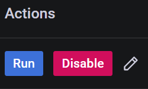
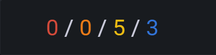

# Working with Advisors

Percona Advisors provide automated insights and recommendations within Percona Monitoring and Management. These proactive insights help you uncover problems before they become larger issues: security risks, misconfigurations, poor performance, etc.

Advisors are grouped by category: Security, Configuration, Performance and Query. Each Advisor category offers a set of automated checks, which investigate a specific range of possible issues. The list of Advisor checks available for your instance depends on whether your instance is connected to Percona Platform, and on your current subscription plan.

## Prerequisites for accessing Advisor checks
All checks are hosted on Percona Platform. PMM Server automatically downloads them from here when the **Advisors** and **Telemetry** options are enabled in PMM under **Configuration > Settings > Advanced Settings**. Both these options are enabled by default.

## Highest security for your databases
Percona Platform communicates with PMM via secure channels, using the highest standards for privacy and security. Before downloading and running Advisor checks on your database, PMM verifies the content and integrity of all Advisor checks to confirm that every component originated from Percona Platform and that no one has altered them since the checks were digitally signed.

### Advisor check tiers and Platform entitlements
Depending on the entitlements available for your Percona Account, the set of Advisor checks that PMM can download from the Percona Platform differs in terms of complexity and functionality.

If your PMM instance is not connected to Percona Platform, PMM can only use the default Advisor checks.
As soon as you connect your PMM instance to Percona Platform, has access to additional checks, available only for registered PMM instances.

If you are a Percona customer with a Percona Customer Portal account, you also get access to Standard/Premium Advisor checks, which offer more advanced database health information.

To see the complete list of available checks, see the [Advisor Checks for PMM](https://docs.percona.com/percona-platform/advisors.html) topic in the Percona Platform documentation.

## Enable/Disable
To download the checks available for your Percona Account, the Advisors and Telemetry options have to be enabled under {{icon.configuration}} **Configuration <i class="uil uil-setting"></i> > Settings > Advanced Settings**.

These options are enabled by default so that PMM can run automatic Advisor checks in the background. However, you can disable them at any time if you do not need to check the health and performance of your connected databases.

## Automatic checks
Advisor checks can be executed manually or automatically.
By default, PMM runs all the checks available for your PMM instances every 24 hours.

### Change run interval for automatic advisors
You can change the standard 24-hour interval to a custom frequency for each Advisor check:

 - *Rare interval* - 78 hours
 - *Standard interval* (default) - 24 hours
 - *Frequent interval* - 4 hours

To change the frequency of an automatic check:

1. Click **{{icon.checks}} Advisors**.
2. Select the Advisor tab that contains the check for which you want to change the frequency.
3. Expand the relevant Advisor and scroll through the list to find your check. Alternatively, use the **Filter** section at the top of the table to search checks by Name, Description, Status, or Interval.

    !!! hint alert alert-success "Tip"
        If you need to share filtered Advisor results with your team members, send them the PMM URL. This saves your search criteria and results.
4. Click the  **Interval** icon in the **Actions** column, next to the check you want to update.
5. Chose an interval and click **Save**.

## Manual checks
In addition to the automatic checks that run every 24 hours, you can also run checks manually, for ad-hoc assessments of your database health and performance.

To run checks manually:

1. Click **{{icon.checks}} Advisors** on the main menu.
2. Select the Advisor tab that contains the checks which you want to run manually.
3. Click **Run checks** to run all the available checks for this Advisor group, or expand an Advisor and click **Run** next to each check that you want to run individually.

## Advisor checks results
The results are sent to PMM Server where you can review any failed checks on the Home dashboard. The summary count of failed checks is classified as:

- <b style="color:#e02f44;">Critical</b>, which also includes checks tagged as **Alert** and **Emergency**
- <b style="color:#e36526;">Error</b>
- <b style="color:#5794f2;">Warning</b>
- <b style="color:#3274d9;">Notice</b>, which also includes checks tagged as **Info** and **Debug**

To see more details about the available checks and any checks that failed, click the *{{icon.checks}} Advisors* icon on the main menu.

**Check results data *always* remains on the PMM Server.** This is not related to anonymous data sent for Telemetry purposes.

## Create your own Advisors
PMM Advisors offer a set of checks that can detect common security threats, performance degradation, data loss and data corruption.

Developers can create custom checks to cover additional use cases, relevant to specific database infrastructure. For more information, see [Develop Advisor checks](https://docs.percona.com/percona-monitoring-and-management/details/develop-checks/index.html).
