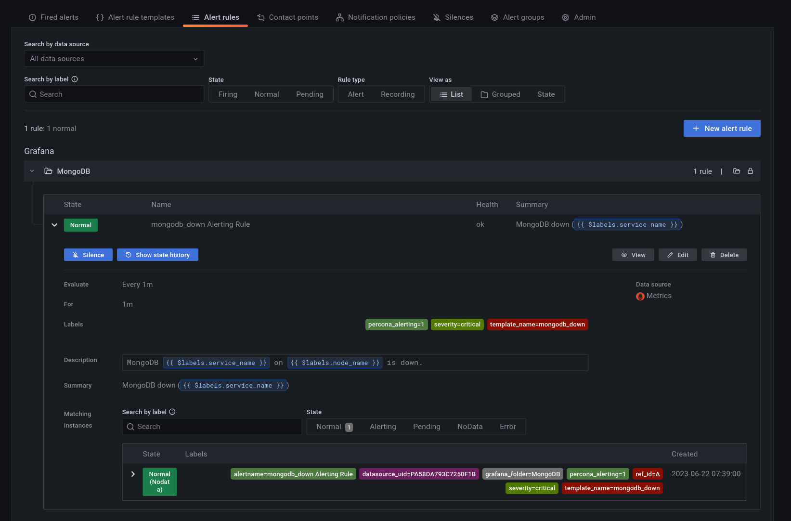
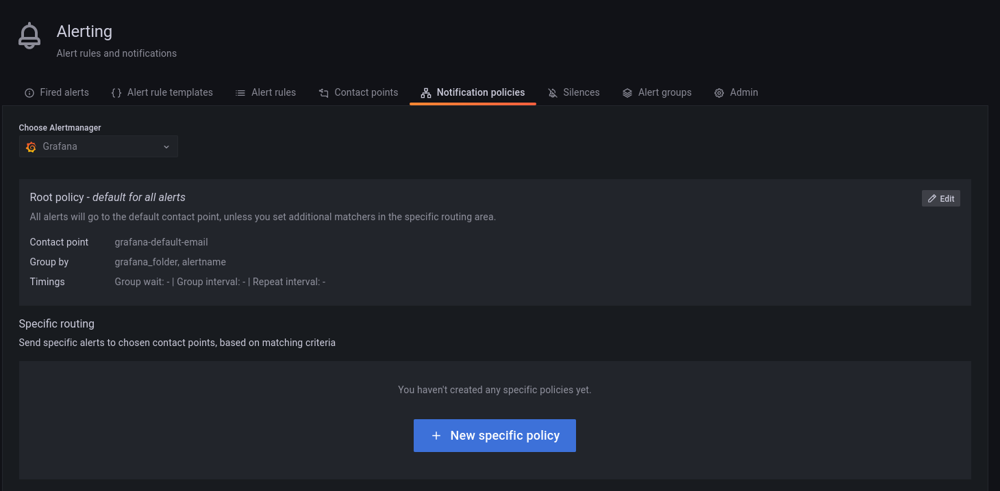

# About Percona Alerting

!!! alert alert-info ""
    Percona Alerting is the new Alerting feature introduced in PMM 2.31. This replaces the Integrated Alerting feature available in previous versions.  

Alerting notifies of important or unusual activity in your database environments so that you can identify and resolve problems quickly. When something needs your attention, Percona Alerting can be configured to automatically send you a notification through your specified contact points.

PMM 2.31 introduced Percona Alerting which replaces Integrated Alerting in previous PMM versions. In addition to full feature parity, Percona Alerting includes additional benefits like Grafana-based alert rules and a unified, easy-to-use alerting command center on the **Alerting** page.

Percona Alerting is enabled by default in the PMM Settings. This feature adds the **Percona templated alerts** option on the **Alerting** page.

## Alert types

Percona Alerting is powered by Grafana infrastructure. It leverages Grafana's advanced alerting capabilities and provides pre-configured Alert Rule Templates that simplify creating powerful alerting rules.

Depending on the datasources that you want to query, and the complexity of your required evaluation criteria, Percona Alerting enables you to create the following types of alerts:

- **Percona templated alerts**: alerts based on a set of Percona-supplied templates with common events and expressions for alerting.
If you need custom expressions on which to base your alert rules, you can also create your own templates. To see the complete list of available templates, see the [PMM Alert Templates topic](../get-started/alert-templates.md)

- **Grafana managed alerts**: alerts that handle complex conditions and can span multiple different data sources like SQL, Prometheus, InfluxDB, etc. These alerts are stored and executed by Grafana.


<!--- we dont use support these for now so commenting them out

- **Mimir or Loki alerts**: alerts that consist of one single query, written in PromQL or LogQL. The alert rules are stored and executed on the Mimir or Loki ruler and are completely decoupled from the PMM and Grafana runtime.
- **Mimir or Loki recording rules**: precompute the result of expensive queries and execute alerts faster.
With Mimir and Loki alert rules, you can run alert expressions closer to your data and at massive scale, managed by Grafana.

-->

The Alerting page contains are split into eight tabs: Fired Alerts, Alert Rules, Alert Rule Templates, Contact Points, Notification Policies, Silences, Alert Groups and Admin.


## Alert rules

Alert rules describe the circumstances under which you want to be alerted. The evaluation criteria that you define determine whether an alert will fire.

An alert rule consists of one or more queries and expressions, a condition, the frequency of evaluation, and the duration over which the condition is met. For example, you might configure an alert to fire and trigger a notification when MongoDB is down.



An alert rule can be in three possible states:

- Normal: Everything is working correctly and the conditions specified in the rule has not been met. This is the default state for newly created rules.
- Pending: The conditions specified in the alert rule has been met, but for a time that is less than the configured duration.
- Firing: Both the conditions and the duration specified in the alert rule have both been met.

It takes at least one evaluation cycle for an alert rule to transition from one state to another (e.g., from `Normal` to `Pending`).

## Alert rules templates

PMM provides a set of alert rule templates with common events and expressions for alerting. These templates can be used as a basis for creating alert rules. 

Percona Monitoring and Management (PMM) offers three categories of alert templates to enhance database performance monitoring:

- Built-in templates, available out-of-the-box with PMM.
- Additional templates available after connecting PMM with Percona Platform. See [Integrate PMM with Percona Platform](../how-to/integrate-platform.md).
- Custom templates created or uploaded on the **Alerting** page > **Alert Templates** tab. You can also store your custom template files in your */srv/alerting/templates* directory and PMM will load them during startup.

### Accessing alert rule templates

To see the full list of the alert templates that PMM offers, see [PMM alert templates](../get-started/alert-templates.md).

You can check the alert templates available for your account under **Alerting > Alert rule templates** tab.

### Create alert rules from alert rule templates

This section focuses on creating an alert rule based on PMM templates. For information on working with the other alert types, check the Grafana documentation on [Grafana Labs](https://grafana.com/docs/grafana/latest/alerting/).

### Provision alert resources

Before creating PMM alert rules, configure the required alert resources:

1. Go to **Configuration > PMM Settings** and ensure that the **Alerting** option is enabled. This is enabled by default starting with PMM 2.31. However, if you have disabled it, the **Alerting** page displays only Grafana-managed alert rules. This means that you will not be able to create alerts based on PMM templates.
2. Go to **Dashboards > Browse** and check the folders available for storing alert rules. If none of the available folders are relevant for your future alert rules, click **New > New Folder** and create a custom one.
3. Go to **Alerting > Alert Rule Templates** and check the default PMM templates. If none of the templates include a relevant expression for the type of alerts that you want to create, click **Add** to create a custom template instead.

### Configure alert templates

Alerts templates are YAML files that provide the source framework for alert rules.
Alert templates contain general template details and an alert expression defined in [MetricsQL](https://docs.victoriametrics.com/MetricsQL.html). This query language is backward compatible with PromQL.

### Create custom templates

If none of the default PMM templates contain a relevant expression for the alert rule that you need, you can create a custom template instead.

You can base multiple alert rules on the same template. For example, you can create a `pmm_node_high_cpu_load` template that can be used as the source for alert rules for production versus staging, warning versus critical, etc.

### Template format

When creating custom templates, make sure to use the required template format below:

- **name** (required): uniquely identifies template. Spaces and special characters are not allowed.
- **version** (required): defines the template format version.
- **summary** (required): a template description.
- **expr** (required): a MetricsQL query string with parameter placeholders.
- **params**: contains parameter definitions required for the query. Each parameter has a name, type, and summary. It also may have a unit, available range, and default value.
    - **name** (required): the name of the parameter. Spaces and special characters are not allowed.
    - **summary** (required): a short description of what this parameter represents.
    - **unit** (optional): PMM currently supports either s (seconds) or % (percentage).
    - **type** (required): PMM currently supports the `float` type. `string`, `bool`, and other types will be available in a future release.
    - **range** (optional): defines the boundaries for the value of a  float parameter
   - **value** (optional): default parameter value. Value strings must not include any of these special characters: `< > ! @ # $ % ^ & * ( ) _ / \ ' + - = (space)`
- **for** (required): specifies the duration of time that the expression must be met before the alert will be fired
- **severity** (required): specifies default alert severity level
 - **labels** (optional): are additional labels to be added to generated alerts

- **annotations** (optional): are additional annotations to be added to generated alerts.

### Template example

```yaml

---
templates:
  - name: pmm_node_high_cpu_load
    version: 1
    summary: Node high CPU load
    expr: |-
      (1 - avg by(node_name) (rate(node_cpu_seconds_total{mode="idle"}[5m])))
      * 100
      > bool [[ .threshold ]]
    params:
      - name: threshold
        summary: A percentage from configured maximum
        unit: "%"
        type: float
        range: [0, 100]
        value: 80
    for: 5m
    severity: warning
    annotations:
      summary: Node high CPU load ({{ $labels.node_name }})
      description: |-
        {{ $labels.node_name }} CPU load is more than [[ .threshold ]]%.

```

### Test alert expressions
If you want to create custom templates, you can test the MetricsQL expressions for your custom template in the **Explore** section of PMM. Here you can also query any PMM internal database.

To test expressions for custom templates:

1. On the side menu in PMM, choose **Explore > Metrics**.
2. Enter your expression in the **Metrics** field and click **Run query**.

For example, to check the CPU usage, Go to **Explore > Metrics** in your PMM dashboard and run the query expression below:
```
(1 - avg by(node_name) (rate(node_cpu_seconds_total{mode="idle"}[5m]))) * 100
```


Note that to paste the query above, **Explore** must be in `Code` mode, and not in `Builder` mode.

### Add an alert rule

After provisioning the resources required for creating Percona templated alerts, you are now ready to create your alert rule:

1. Go to **Alerting > Alert Rules**, and click **New alert rule**.
2. On the **Create alert rule** page, select the **Percona templated alert** option. If you want to learn about creating Grafana alerts instead, check our [Grafana's documentation](https://grafana.com/docs/grafana/latest/alerting/).
3. In the **Template details** section, choose the template on which you want to base the new alert rule. This automatically populates the **Name**, **Duration**, and **Severity** fields with information from the template. You can change these values if you want to override the default specifications in the template.
4. In the **Filters** field, specify if you want the alert rule to apply only to specific services or nodes. For example: `service_name=ps5.7`. When creating alert rule filters, consider the following:

    - Filters use conjunction semantics. This means that if you add more than one filter, PMM will combine their conditions to search for matches: filter 1 AND filter 2 AND filter 3.
    - **Label** must be an exact match. You can find a complete list of labels using the <i class="uil uil-compass"></i> **Explore** menu in PMM.

5. From the **Folder** drop-down menu, select the location where you want to store the rule.
6. Click **Save and Exit** to close the page and go to the **Alert Rules** tab where you can review, edit and silence your new alert.


## Contact points

Contact points specify where Percona Alerting should deliver notifications for alerts. PMM can be configured via a Notification policy to send a notification to specified contact points whenever an alert is fired.

Depending on the severity of an alert, you might want to send different alert notifications to different channels. For example, you can deliver common notifications via a Slack channel, but send an email notification for potentially critical issues.  

Percona Alerting uses email as the default contact point but you can choose from a variety of other contact points, including Slack, Webhooks, PagerDuty, and more.

Before Percona Alerting can send out email notifications via email contact points, you will need to:

1. Configure Email (SMTP) server settings.
2. Configure a contact point to define the email delivery options

Contact points with invalid settings show a **No Attempts** status under <i class="uil uil-bell"></i> **Alerting > Contact points**.

### Configure Email (SMTP) server settings

To use SMTP with a PMM Docker installation:

1. Create an `.env` file and populate it with your SMTP credentials (and other environment variables) as follows:
    ```
    GF_SMTP_ENABLED=true  
    GF_SMTP_HOST=smtp.gmail.com:587
    GF_SMTP_USER=email@domain.com
    GF_SMTP_PASSWORD=<YOUR_SMTP_PASSWORD>
    GF_SMTP_SKIP_VERIFY=false
    GF_SMTP_FROM_ADDRESS=email@domain.com
    GF_SMTP_FROM_NAME=Percona Alerting
    ```
    Below is a summary of each environment variable above:
    - `GF_SMTP_ENABLED`: When true, enables Grafana to send emails.
    - `GF_SMTP_HOST`: Host address of your SMTP server.
    - `GF_SMTP_USER`: Username for SMTP authentication.
    - `GF_SMTP_PASSWORD`: Password for SMTP authentication
    - `GF_SMTP_SKIP_VERIFY`: When true, verifies SSL for the SMTP server.
    - `GF_SMTP_FROM_ADDRESS`: Email address to be used when sending out emails.
    - `GF_SMTP_FROM_NAME`: Name to be used when sending out emails.

    *NB: If you are using your Gmail’s SMTP credentials as shown above, you will have to generate an app password and fill it in as the value of your $GF_SMTP_PASSWORD variable.*

2. Pass in the `.env` file to Docker run using the `--env-file` flag:
    ```
    docker run --env-file=.env -p 443:443 -p 80:80 percona/pmm-server:2
    ```
    This command starts a docker container and will keep running as long as the container is also running. Stopping the command (e.g with Ctrl+C) will stop the container hence, subsequent commands should be run in a new terminal.

### Restore SMTP settings following an upgrade

If you configured PMM to use SMTP settings via environment variables, you do not need to do anything after an upgrade as your settings will be transferred.

### Configure an Email contact point

After configuring the SMTP settings, specify email delivery options for an Email contact point:

1. Go to **Alerting > Contact points**.
2. Click the edit button next to the **grafana-default-email** to update PMM's default Email contact point, or click **New contact point** to create a custom one.
3. Enter a contact point name, and add the email addresses for the recipients of the email notifications.
4. Expand **Optional settings** and fill in any other relevant settings:
    - Enable the **Single email** option to send a single email to the recipients containing alerts that are firing. For example, if an alert fires for three nodes, this would send only one email listing all three alerts.
    - Add an optional message to include with the email notifications.
    - Edit the email subject for the notifications. The default subject line uses the following format [FIRING: *number of alerts firing for the alert rule*](*Name of alert rule and instance*).
5. If you do not want to be notified when an alert resolves, expand **Notification settings**, and tick the **Disable Resolved Message** checkbox.
6. If you want your contact point to notify via multiple channels, for example, both via Email and Teams, click **New contact point type** and fill out additional contact point type details.
7. Click the **Test** button to send a test email and make sure your contact point works as expected.
    
8. Click the **Save contact point** button at the bottom of the page. The contact point is now listed under **Alerting > Contact points**.

#### Create additional contact points

In addition to Email contact points, you can add a variety of other contact points, including Slack, email, webhooks, PagerDuty, and more.

Follow the steps above to create additional contact points. Different contact points require different configuration information. For example, for Slack, PMM requires the recipient information, the API token and the webhook URL, which you can get from your Slack administrator.

### Notification policies

Notification policies determine how notifications (triggered by alerts) are routed to contact points by defining where, when, and how to send notifications.

For example, you might specify a limit for the number of times a notification is sent during a certain period. This helps ensure that you don't spam your Slack channel with too many notifications about the same issue.

#### Root notification policy

Percona Alerting comes pre-configured with a Notification Root Policy, which is the default notification policy. It uses the **grafana-default-email** contact point and is applied to all alerts that don’t have a custom notification policy assigned to them.

#### How matching works

Policies can have one or more child policies. An alert matches if the alert’s labels match all the **Matching Labels** specified on the policy.

Alerts that don't match any specific policies are handled by the root policy. The root policy also handles any alert rules for which the assigned custom notification policy has been deleted, to ensure notifications for existing alerts continue to be delivered.

#### Edit the root notification policy

1. Go to <i class="uil uil-bell"></i> **Alerting > Notification policies** tab.
2. Click **Edit** on the top right of the root policy box.
3. Choose whether to keep the default Email contact point, select a new available contact point or create a new one.
4. In the **Group by** field, specify how alert rules should be processed into notifications. If multiple alerts are matched for this policy, they will be grouped based on the labels you specify, and a notification will be sent per group.
5. Expand the **Timing options** section and specify how notification wait times should be processed. These are short pauses the system can take to efficiently process multiple sets of alerts for notifications:
   - **Group wait**: The default is to wait 30 seconds to buffer alerts of the same group before sending a notification initially.
   - **Group interval**: The default is to wait five minutes before sending a batch of new alerts after the first notification was sent.
   - **Repeat interval**: The default is to wait four hours before resending an alert.
6. Click **Save** to save your changes.

#### Create a new notification policy

To create a new notification policy:

1. Go to <i class="uil uil-bell"></i> **Alerting > Notification policies** tab.


2. Click **New specific policy**.
3. The **Matching labels** section defines the rules for matching alert labels. The matching label is a combination of label name, operator and label value, where the label name is any valid label in your environment. For example:  `node_name`, `cluster`, etc.
A policy will match an alert if the alert’s labels match all the matching labels specified on the policy. If there are no matchers, **the policy will handle all the alert instances**. For example, you could add a **node_name=pmm-server** matcher to send out notifications only for this node.
4. Select an existing contact point for the policy.
5. Enable **Continue matching subsequent sibling nodes** to continue matching subsequent siblings of the policy after an alert matched the parent policy.
This can be useful, for example, when you want to send notifications to a catch-all contact point as well as to one of more specific contact points handled by subsequent policies.
6. Toggle **Override grouping** if you do not want to use root policy grouping.
7. Toggle **Override general timings** to specify how often you want to wait until the initial notification is sent for a new group. When this is disabled, PMM uses root policy group timings instead.
8. Add a mute timing if you want to mute notifications or this policy for a specific, regular interval. For example, you can create a mute to suppress trivial notifications during weekends.  Mute timings are different from silences in the sense that they are recurring, while silences have a fixed start and end time.

!!! caution alert alert-warning "Important"
    Time specified in mute timing must be in UTC and military format i.e. 14:00 not 2:00 PM.

## Silence alerts
Create a silence when you want to suppress/stop alerts and their associated notifications for a very specific amount of time.
Silences default to today’s current date and have a default duration of two hours.

You can also schedule a silence for a future date and time. This is referred to as a `Pending` silence, which can be observed on the Silences page.

During a silence, PMM continues to track metrics but does not trigger alerts or send notifications to any specified contact points. Once the silence expires alerts and notifications will resume.

Silenced alerts are still recorded under **Alerting > Fired Alerts** so that you can review them later. Silenced alerts show up as **Surpressed** and are disabled for as long as it's specified in the **Silence Duration**, or until you remove a silence.

#### Using silences

You can silence an alert from the **Fired alerts** page or from the **Alert rules** page by expanding the Alert Rule and clicking the *Silence* button.


You can also create a silence from the **Silences** page, but here you would also need to define labels that match the alert that you want to silence.

To create a new silence from the **Silences** page:

1. Click the **New Silence** button.
2. Select the start and end date to indicate when the silence should go into effect and expire.
3. Optionally, update the duration to alter the time for the end of silence in the previous step to correspond to the start plus the duration.
4. Enter one or more matching labels by filling out the **Name** and **Value** fields. Matchers determine which rules the silence will apply to. Note that all labels specified here must be matched by an alert for it to be silenced.
5. Enter any additional comments you would like about this silence - by default, the date the silence was created is placed here.
6. Review the affected alert instances that will be silenced.
7. Click **Submit** to create the silence.

For more information on working with silences, see [About alerting silences](https://grafana.com/docs/grafana/latest/alerting/manage-notifications/create-silence/) in the Grafana documentation.

### Alerting compatibility

#### Template compatibility with previous PMM versions

If you have used Integrated Alerting in previous PMM versions, your custom alert rule templates will be automatically migrated to PMM 2.31. After upgrading to this new version, you will find all your alert templates under **Alerting > Alert Templates**.

If you have any templates available in the  ``/srv/ia/templates`` folder, make sure to transfer them to ``/srv/alerting/templates`` as PMM 2.31 and later will look for custom templates in this location.

If you are upgrading from PMM 2.25 and earlier, alert templates will not be automatically migrated. This is because PMM 2.26.0 introduced significant changes to the core structure of rule templates.

In this scenario, you will need to manually recreate any custom rule templates that you want to transfer to PMM 2.26.0 or later.

#### Template compatibility with other alerting tools

If you have existing YAML alert templates that you want to leverage in Percona Alerting:

1. Go to **Alerting > Alert Rule Templates** tab and click **Add** at the top right-hand side of the table.
2. Click **Add** and upload a local .yaml file that contains the definition of one or more alert templates. Alert templates added in bulk will be displayed individually on **Alert rule templates** page.

#### Migrate alert rules

Alert rules created with Integrated Alerting in PMM 2.30 and earlier are not automatically migrated to Percona Alerting.

After upgrading to PMM 2.31, make sure to manually migrate any alert rules that you want to transfer to PMM 2.31 using the [Integrated Alerting Migration Script](https://github.com/percona/pmm/blob/main/ia_migration.py).

##### Script commands

The default command for migrating rules is:
```yaml
python3 ia_migration.py -u admin -p admin
```
To see all the available options, check the scrip help using `ia_migration.py -h`

##### Script prerequisites

- Python version 3.x, which you can download from [Python Downloads centre](https://www.python.org/downloads/).
- [Requests library](https://requests.readthedocs.io/en/latest/user/install/#install), which you can install with the following command: ```pip3 install requests```.

!!! caution alert alert-warning "Important"
    The script sets all migrated alert rules to Active. Make sure to silence any alerts that should not be firing.

For more information about the script and advanced migration options, check out the help information embedded in the script.

### Disable Percona Alerting

If for some reason you want to disable PMM Alert templates and keep only Grafana-managed alerts:

1. Go to **Configuration > PMM Settings**.
2. Disable the **Alerting** option. The **Alerting** page will now display only Grafana-managed alert rules.
