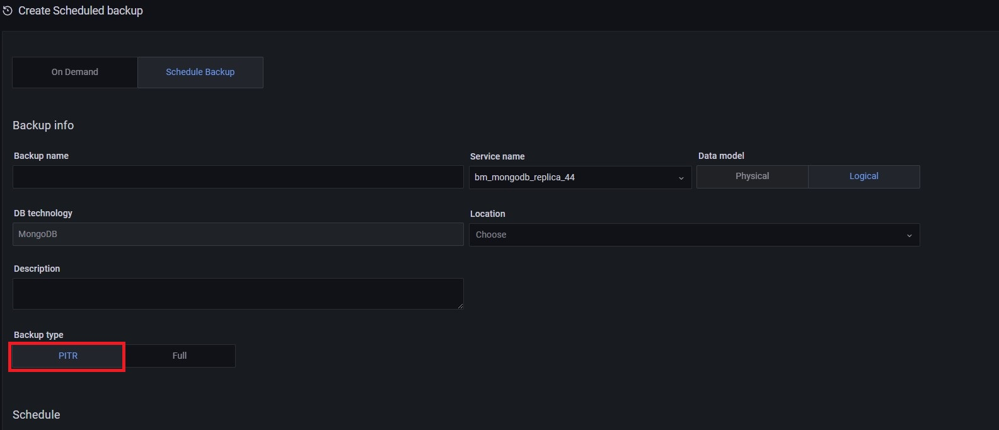
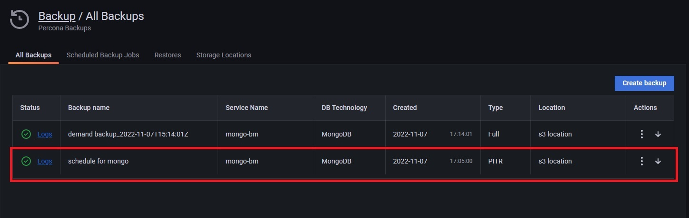
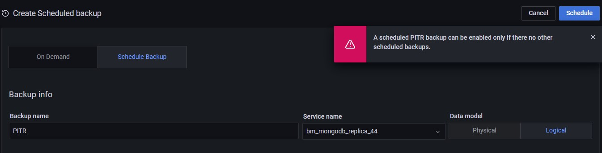

# Create MongoDB PITR backups

Point-in-Time Recovery (PITR) restores databases up to a specific moment in time. PITR includes restoring the data from a backup snapshot and replaying all events that occurred to this data up to a specified moment from [oplog slices](https://docs.percona.com/percona-backup-mongodb/reference/glossary.html#oplog-slice).

Point-in-Time Recovery helps you prevent data loss during a disaster such as crashed database, accidental data deletion or drop of tables, or unwanted update of multiple fields instead of a single one.

## Compatibility with Percona Backup for MongoDB
PMM introduced the option to create PITR Backups for MongoDB in version 2.23, as part of the larger Backup Management feature. This implementation in PMM uses Percona Backup for MongoDB (pbm) behind the scenes.

Percona Backup for MongoDB is a distributed, low-impact solution for achieving consistent backups of MongoDB sharded clusters and replica sets.
Starting with PMM 2.32, restoring PITR backups is available for backups based on pbm ≤ 2.0.1. To restore PITR backups, make sure you have pbm ≥ 2.0.1 installed.

 Percona Backup for MongoDB supports [Percona Server for MongoDB](https://www.percona.com/software/mongodb/percona-server-for-mongodb) and MongoDB Community ≤ 3.6, with [MongoDB Replication](https://docs.mongodb.com/manual/replication/) enabled. For more information, see the [Percona Backup for MongoDB documentation](https://docs.percona.com/percona-backup-mongodb/installation.html).

## How does it work?

When point-in-time recovery (PITR) is enabled, pbm-agent periodically saves consecutive slices of the oplog.

To start saving oplog, PBM requires a backup snapshot. Such snapshots are created when you activate a PITR-scheduled task in PMM.

Since PBM saves oplog slices and streams them into your storage between scheduled task runs, scheduling frequent PITR backups is not necessary.
You can use the available oplog slices in your storage to restore a backup to any moment between snapshots.

Before creating a backup, make sure to check the [MongoDB backup prerequisites](../backup/mongo-prerequisites.md).

1. Go to <i class="uil uil-history"></i> **Backup > All Backups**.
2. Click <i class="uil uil-plus-square"></i> **Create Backup**.
3. Select the **Schedule Backup** option in the **Create Scheduled backup** window.
4. Enter a unique name for this backup.
5. Choose the service to back up from the **Service name** drop-down menu. This automatically populates the **DB Technology** field.
6. Select **Logical** as this is the only data model that currently supports PITR backups.
7. Choose a storage location for the backup. MongoDB supports both Amazon S3-compatible and local storage.
    However, restoring from local storage is not supported yet.
    If no options are available here, see the [Create a storage location](prepare_storage_location.md) topic.
8. Specify the backup type and the schedule for your backup:
    - **Backup Type**: select the  **PITR** option.
    - **Schedule**: configure the frequency and the start time for this backup.  
    !!! caution alert alert-warning "Important"
        Make sure that the schedule you specify here does not create overlapping jobs or overhead on the production environment. Also, check that your specified schedule does not overlap with production hours.
    - **Retention**: this option is not available for PITR backups. Currently, retention policies can only be specified for Snapshot backups stored on Amazon S3-compatible storage.
9. Expand **Advanced Settings** to specify the settings for retrying the backup in case of any issues. You can either let PMM retry the backup again (**Auto**), or do it again yourself (**Manual**).  
    Auto-retry mode enables you to select up to ten retries and an interval of up to eight hours between retries.
10. In the **Folder** field, check the target directory available for the specified service and location. By default, this field comes prefilled with the cluster label to ensure that all the backups for a cluster are stored in the same directory. If the field is not automatically populated, the service you have specified is not member of a cluster and should be re-added using the following set of commands:
   <pre><code>pmm-admin add mongodb \
   --username=pmm_mongodb --password=password \
   query-source=profiler <mark>--cluster=mycluster</mark></code></pre>
    !!! caution alert alert-warning "Important"
        Unless you are using verified custom workflows, make sure to keep the default **Folder** value coming from the cluster name. Editing this field will impact PMM-PBM integration workflows.

11. Click **Schedule** to start creating the backup artifact.
12. Go to the **All Backups** tab, and check the **Status** column. An animated ellipsis indicator {{icon.bouncingellipsis}} shows that a backup is currently being created.

## Failed backup alerts

If you want to be notified of any MongoDB backups that fail, you can create an alert based on the Backup Failed alert template. For information on working with alert templates, see the [Percona Alerting](../get-started/alerting.md) topic.
 
## PITR artifacts

The PITR oplog is available a few minutes (10 by default) after your PITR job has run for the first time. To see the corresponding PITR artifact, check out the list under **Backup > All Backups**.

## PITR and other scheduled backups

Make sure to disable any other scheduled backup jobs before creating a PITR backup. PMM displays an error message if you try to enable PITR while other scheduled backup jobs are active:

This constraint applies at the service level. You can still have PITR enabled for one service while having regular scheduled backup jobs for other services.