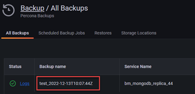

# Restore a MongoDB backup
MongoDB backups can only be restored to the same service they were created from.

To restore a backup:

1. Go to <i class="uil uil-history"></i> **Backup → All backups** and find the backup that you want to restore.
2. Click the arrow in the **Actions** column to check all the information for the backup, then click {{icon.ellipsisv}} **Restore from backup**.
This opens the **Restore from backup** dialog, with the **Same service** option automatically preselected. This is because, currently, MongoDB backups can only be restored to a service with identical properties.
3. If you are restoring a PITR backup, select the point for the date and time that you want to restore the database to.
4. Click **Restore** then go to the **Restores** tab to check the status of the restored backup.

!!! caution alert alert-warning "Important"
    During restoring, PMM disables all the scheduled backup tasks for the current service. Remember to re-enable them manually after the restore.
    
    
## Restore to a new cluster manually

1. Install MongoDB and Percona Backup for MongoDB. Pay attention to the versions. To minimize potential incompatibility, use the same versions that were used for taking backups.
   For instructions, see the [PBM install documentation](https://docs.percona.com/percona-backup-mongodb/installation.html).
2. Configure your environment:
     - to restore to a new environment with the same replica set name, make sure that the replica set name in your new destination cluster use the same name as that in the cluster that was backed up.<br/>
      For more information, see [Restoring a backup into a new-environment](https://docs.percona.com/percona-backup-mongodb/usage/restore.html#restoring-a-backup-into-a-new-environment) in the PBM documentation. <br> 
     - to restore **logical backups** to a new environment that has a different replica set name, configure the name mapping between the source and target environments. <br/>
      For the new environment, you can either set the **PBM_REPLSET_REMAPPING** environment variable for pbm CLI, or use the `--replset-remapping` flag for PBM commands.

        The mapping format is `<rsTarget>=<rsSource>`.

        For example:

        `$ export PBM_REPLSET_REMAPPING="targetRS=sourceRS"`

        OR 

        `$ pbm restore <timestamp> --replset-remapping="targetRS=sourceRS"`

        For more information, see [Restoring into a replica set with a different name](https://docs.percona.com/percona-backup-mongodb/usage/restore.html#restoring-into-a-cluster-replica-set-with-a-different-name) in the PBM documentation.

3. Make sure that Percona Backup for MongoDB configuration in the new environment points to the remote storage defined for the original environment, including the authentication credentials for object stores.

    The easiest way to configure it is to create a config file, called, for example, `pbm_config.yaml`.

    For this, you can either copy the config from the source host or create a new one.

    To redirect the config output from the existing environment, use:
    ```yaml
      pbm config >> pbm_config.yaml
    ```
    then copy the resulting file to the new environment.

    Here's an example of config file content for AWS S3-compatible storage:

    ```yaml
    storage:
      type: s3
      s3:
        region: us-west-2
        bucket: pbm-test-bucket
        prefix: backup_name_from_pmm
        credentials:
          access-key-id: <your-access-key-id-here>
          secret-access-key: <your-secret-key-here> 
    ```
    The prefix name is the artifact name that appears in the **Backup name** column, under <i class="uil uil-history"></i> **Backup > All Backups** page:

       

      To implement the config, use the following command:
        ```yaml
        pbm config --file pbm_config.yaml
        ```

      For more information, see **Restoring a backup into a new-environment** in [the PBM documentation](https://docs.percona.com/percona-backup-mongodb/usage/restore.html#restoring-a-backup-into-a-new-environment).  

4. Run `pbm list` to check if pbm is ready to perform the restore procedure.

5. Once all the backups made from the original environment are available, run the restore command:

     - For snapshot backups:
  
        a) run the following command:
         
          ```code
          pbm list
            Backup snapshots: 2022-11-23T19:40:06Z [restore_to_time: 2021-01-13T15:53:40Z]
          ```
        b) provide the timestamp of the backup to the `pbm` command:

        `pbm restore 2022-11-23T19:40:06Z`

        For more information, see [Restore a backup](https://docs.percona.com/percona-backup-mongodb/usage/restore.html) topic in the PBM documentation.

    - For PITR backups:
        
        a) run the following command:

          ```code
            pbm list
            Backup snapshots:
              2022-11-23T19:40:06Z <logical> [restore_to_time: 2022-11-23T19:40:25Z]
              2022-11-23T19:45:07Z <logical> [restore_to_time: 2022-11-23T19:45:22Z]
            PITR <on>:
              2022-11-23T19:40:26Z - 2022-11-23T19:45:22Z
          ```
    b) provide the timestamp from one of the PITR ranges to the `pbm` command:

          `pbm restore --time="2022-11-23T19:40:26`
        
      For more information, see the [Point-in-time Recovery topic in the PBM documentation](https://docs.percona.com/percona-backup-mongodb/usage/point-in-time-recovery.html).

6. Check the progress of the restore operation, using one of the commands below:

    - For logical restores:
    `pbm describe-restore <restore_name>`

    - For physical restores:
    `pbm describe-restore --config=/path/to/pbm_config.yaml <restore_name>`

    Required arguments:

    - PBM generates the `<restore_name>` information after you start the restoring.
    - The *pbm_config.yaml* file required for physical restores is the PBM config file that you provided for step 3.

!!! caution alert alert-warning "Important"
    Make sure not to run pbm backup from the new environment while the Percona Backup for MongoDB config is pointing to the remote storage location of the original environment.

### Restoring from a sharded cluster 
Sharded cluster backups are supported starting with PMM 2.38 and PMM handles the backup process end-to-end. However, restoring such artifacts is currently possible only via the CLI, using Percona Backup for MongoDB.

For information on restoring sharded backups, check the [PBM documentation](https://docs.percona.com/percona-backup-mongodb/usage/restore.html)