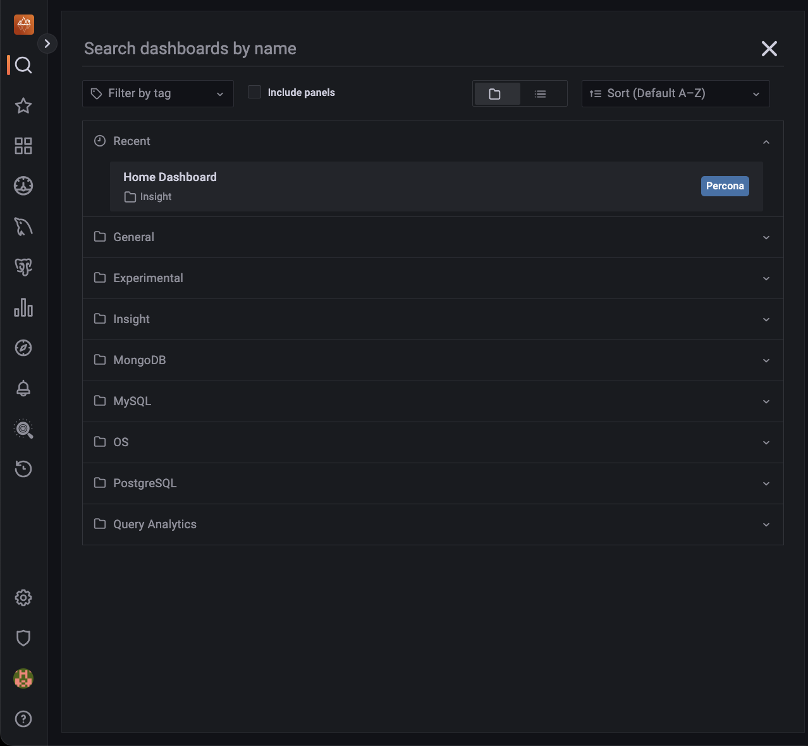
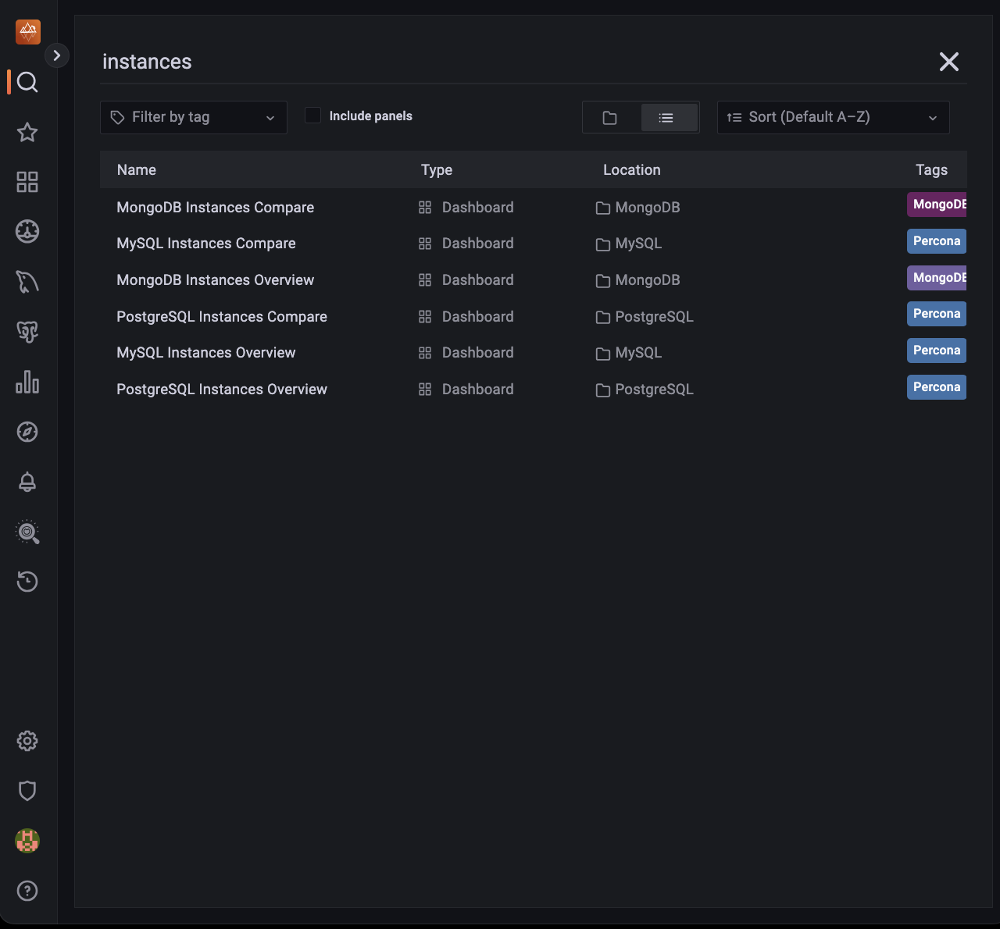
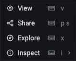

# User Interface

How to log in, how the user interface is laid out, and what the controls do.

PMM's user interface is a browser application based on [Grafana].

## Logging in

1. Start a web browser and in the address bar enter the server name or IP address of the PMM server host.

2. The page loads showing the PMM login screen.

   

3. Enter the username and password given to you by your system administrator. The defaults are:

   - Username: `admin`

   - Password: `admin`

4. Click **Log in**.

5. If this is your first time logging in, you'll be asked to set a new password. (We recommend you do.)

   - Either enter a new password in both fields and click **Submit**, OR

   - click **Skip** to use the default password.

6. The PMM Home dashboard loads.

   

## Dashboards

The interface is a collection of web pages called _dashboards_.

Dashboards are grouped into _folders_. You can customize these, by renaming them or creating new ones.

The area inside dashboards is populated by _panels_. Some are in collapsible panel groups. A panel can show a value, a graph, a chart, or a visual representation of a set.

## Controls

These menus and controls appear on all dashboards:

1. Main menu (also _Grafana menu_, _side menu_).

2. Navigation bar.

3. View controls.

4. View selectors (with dynamic contents).

5. Shortcut menu (with dynamic contents).

(For details see [UI Components](../details/interface.md).)

## Navigation

### Search for a dashboard by name

There are two ways to open the dashboard search page. (Each takes you to the same search screen.)

- Click the <i class="uil uil-search"></i> icon in the main menu.

- Click the dashboard name in the navigation bar (top row, to the right of the <i class="uil uil-apps"></i> icon). (To search within the current folder, click the folder name instead of the dashboard name.)

1. Click **Search dashboards by name** and begin typing any part of the dashboard name (in this example, **Instances**).

   

2. Click one of the search results to go to that dashboard. Change the search text to refine the list.

3. To abandon the search, click the <i class="uil uil-times"></i> icon at the end of the search bar.

### Open a dashboard with the menu

In the [main menu](../details/interface.md#main-menu), the {{icon.dashboards}} **PMM Dashboards** icon reveals a submenu containing links to all PMM dashboards grouped by service type. (This menu will replace the [shortcut menu](../details/interface.md#shortcut-menu) which has links to commonly-used dashboards.)

## Panels

Charts, graphs and set-based panels reveal extra information when the mouse is moved over them.

Some panels have an information icon <i class="fa fa-info"></i> in the top left corner. Mouse over this to reveal panel information.

### Panel menu

At the top of each panel and to the right of the panel name is the _panel menu_.

!!! hint alert alert-success "Tip"
      The menu is hidden until you mouse over it. Look for the <i class="uil uil-angle-down"></i> symbol in the title bar of a panel.

| Item                                      | Description                                                                   |
| ----------------------------------------- | ----------------------------------------------------------------------------- |
| <i class="uil uil-eye"></i> View          | Open the panel in full window mode.                                           |
| <i class="uil uil-share-alt"></i> Share   | [Share the panel's link or image](../how-to/share-dashboard.md). |
| <i class="uil uil-compass"></i> Explore   | Run [PromQL] queries.                                                         |
| <i class="fa fa-info-circle"></i> Inspect | See the panel's data or definition.                                           |
| <i class="uil uil-cube"></i> More         | (Only charts and graphs) Additional options.                                  |

### View

The **View** menu items opens panels in full-window mode. This is useful for graphs with several metrics.

Exit a panel's full window mode by pressing _Escape_ or clicking the left arrow <i class="uil uil-arrow-left"></i> next to the dashboard name.

!!! info alert alert-info "See also"
- [How to render dashboard images](../how-to/render-dashboard-images.md)
- [How to annotate special events](../how-to/annotate.md)

[grafana]: https://grafana.com/docs/grafana/latest/
[promql]: https://prometheus.io/docs/prometheus/latest/querying/basics/

## Timezones

By default, Grafana uses the timezone from your web browser. However, you can change this setting.

### Set user timezone

1. On the left menu, hover over the {{icon.configuration}} **Configuration**, then click **Preferences**.
2. On the Preferences tab, click on **Timezone** and select an option from the drop-down menu.
3. Click **Save**.
