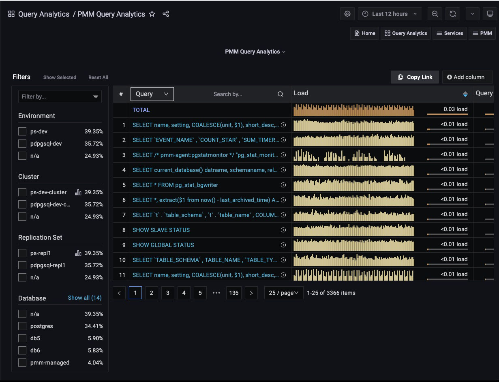
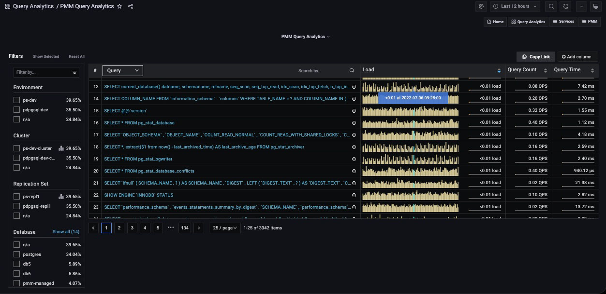
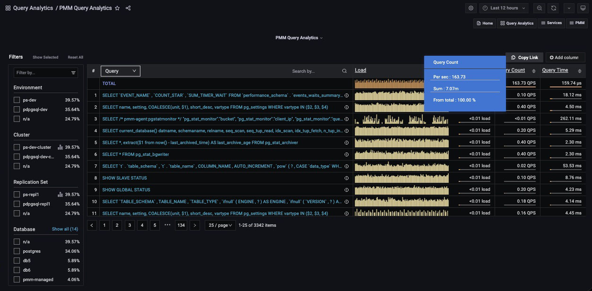
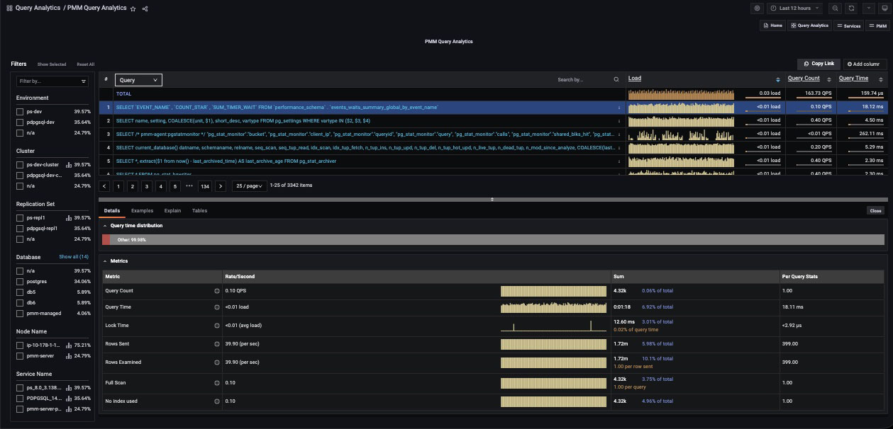
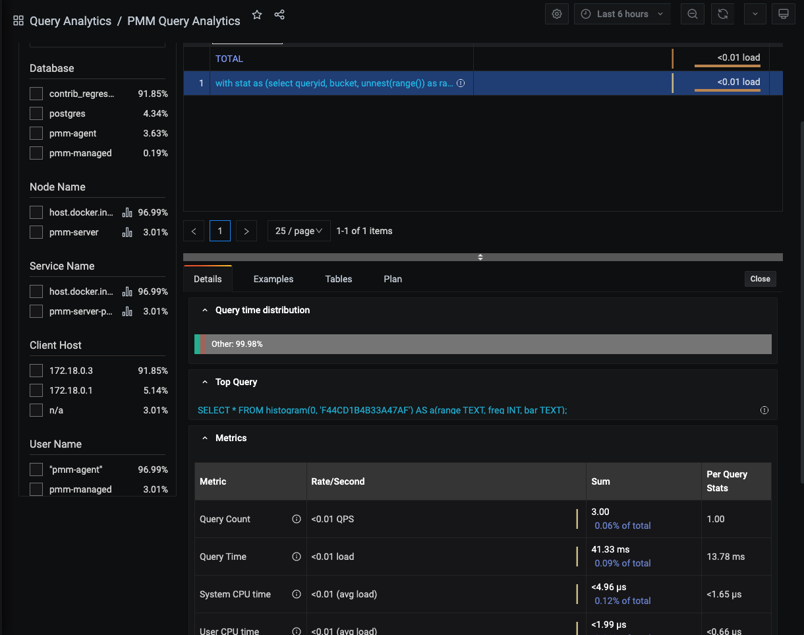
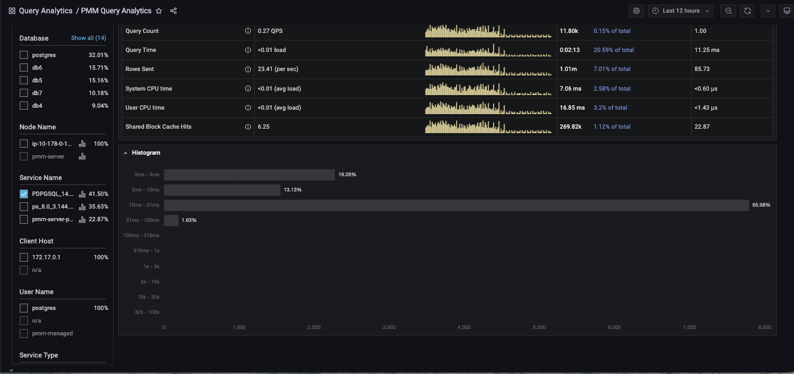
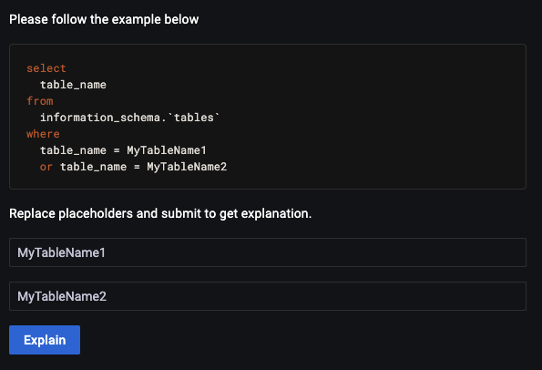
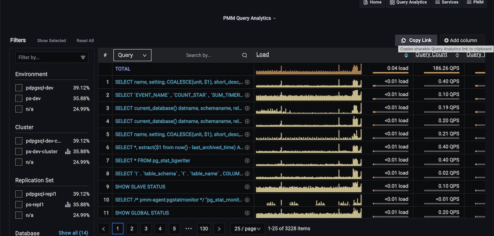

# Query Analytics

The *Query Analytics* dashboard shows how queries are executed and where they spend their time.  It helps you analyze database queries over time, optimize database performance, and find and remedy the source of problems.


Query Analytics supports MySQL, MongoDB and PostgreSQL. The minimum requirements for MySQL are:

- MySQL 5.1 or later (if using the slow query log).
- MySQL 5.6.9 or later (if using Performance Schema).

Query Analytics displays metrics in both visual and numeric form. Performance-related characteristics appear as plotted graphics with summaries.

The dashboard contains three panels:

- the [Filters Panel](#filters-panel);
- the [Overview Panel](#overview-panel);
- the [Details Panel](#details-panel).

!!! note alert alert-primary ""
    Query Analytics data retrieval may experience delays due to network conditions. As a result, a small amount of data (up to 1 hour) will be buffered in the memory and reported when the connection is restored.

## Filters Panel


- The *Filter* panel on the left-hand side of the dashboard lists the filters grouped by category. It also shows the percentage of the main metrics (explained below). If you select a different metric, the percentages on the left panel will change as per this metric. When you select a metric, it reduces the overview list as per the matching filter.
- The first five of each category are shown. If there are more, the list is expanded by clicking *Show all* beside the category name, and collapsed again with *Show top 5*.
- Applying a filter may make other filters inapplicable. These become grayed out and inactive.
- Click the chart symbol <i class="uil uil-graph-bar"></i> to navigate directly to an item's associated dashboard.
- Separately, the global *Time range* setting filters results by time, either your choice of *Absolute time range*, or one of the predefined *Relative time ranges*.


### Custom filter groups

!!! caution alert alert-warning "Important/Caution"
    This feature is still in [Technical Preview](https://docs.percona.com/percona-monitoring-and-management/details/glossary.html#technical-preview) and is subject to change. We recommend that early adopters use this feature for testing purposes only.

Starting with PMM 2.38.0, you can filter queries by custom filter groups based on key=value pairs separated from query comments. By default, this feature is disabled.

#### Supported technologies and agents

- MySQL (`perfschema`, `slowlog`),
- PostgreSQL (`pg_stat_statements`, `pg_stat_monitor`)

**Example**


In the image above we have tagged queries running databases on Windows using the following comment: 

```sh
comment: /* OperationSystem='windows' */. 
```
Queries from the database running on Linux are tagged with:

```sh
/* OperationSystem='linux' */. 
```

All types of comments and multicomments are supported `(/* */, --, # etc)`. 

So the queries are as follows:

```sh
SELECT * /* OperationSystem='windows' */ FROM city;
SELECT city /* OperationSystem='linux' */ FROM world;
```

In the output, you can see another custom group in the `OperationSystem` filter. Use this to easily filter by any custom key or value.

#### Enabling custom filter groups

- *CLI*: While adding a service through CLI use the flag `comments-parsing`. Possible values are `on/off`. 

    Example for adding MySQL with comments parsing on:

    ```sh
    pmm-admin add mysql --username=root --password=root-password --comments-parsing="on"
    ```

- *UI*: While adding a service through the UI you will see new checkbox to `enable/disable` comments parsing for current service.

    

!!! note alert alert-primary "MySQL CLI"
    - If you are using official MySQL CLI to trigger queries, start mysql with `--comments` flag. Otherwise comments will not be parsed.
    - In case of PGSM (`pg_stat_monitor`), set the DB variable `pgsm_extract_comments=yes`
    

## Overview Panel

 The **Overview** panel is located above the dashboard, on the right side of the **Filters** panel.


Each row of the table represents the metrics for a chosen object type, one of:

- Query;
- Service Name;
- Database;
- Schema;
- User Name;
- Client Host.

At the top of the second column is the *dimension* menu. Use this to choose the object type.



On the right side of the dimension column is the *Dimension Search* bar.


Enter a string and press Enter to limit the view to queries containing only the specified keywords.

Delete the search text and press Enter to see the full list again.

### Columns

- The first column is the object’s identifier. For *Query*, it is the query’s [Fingerprint](../details/glossary/#fingerprint).
- The second column is the *Main metric*, containing a reduced graphical representation of the metric over time, called a *sparkline*, and a horizontal meter, filled to reflect a percentage of the total value.
- Additional values are revealed as mouse-over tooltips.

### Tool-tips

- For the *Query* dimension, hovering over the information icon <i class="fa fa-info-circle"></i> reveals the query ID and its example.
- Hovering on a column header reveals an informative tooltip for that column.
- Hovering on the main metric sparkline highlights the data point and a tooltip shows the data value under the cursor.



- Hovering on the main metric meter reveals the percentage of the total, and other details specific to the main metric.

    

- Hovering on column values reveals more details on the value. The contents depends on the type of value.

    

### Adding and removing columns

- Metrics columns are added with the *Add column* button.

    

- When clicked, a text field and a list of available metrics are revealed. Select a metric or enter a search string to reduce the list. Selecting a metric adds it to the panel.
- A metric column is removed by clicking on the column heading and selecting *Remove column*.
- The value plotted in the *main metric* column can be changed by clicking a metric column heading and selecting *Swap with main metric*.

### Sorting

- The entire list is sorted by one of the columns.
- Click either the up or down caret to sort the list by that column’s ascending or descending values.

### Pagination

- The pagination device lets you move forward or backward through pages, jump to a specific page, and choose how many items are listed per page.

    

- Queries are grouped into pages of 25, 50 or 100 items.

## Details Panel

- Selecting an item in the Overview panel opens the *Details panel* with a [Details Tab](#details-tab).
- If the dimension is *Query*, the panel also contains the [Examples Tab](#examples-tab), [Explain Tab](#explain-tab), and [Tables Tab](#tables-tab).

### Details Tab

The *Details* tab contains a *Query time distribution* bar (only for MySQL databases) and a set of *Metrics* in collapsible subpanels.



- The *Query time distribution* bar shows a query’s total time made up of colored segments, each segment representing the proportion of time spent on a named activity.

    - `query_time`: Statement execution time.
    - `lock_time`: Time to acquire locks.
    - `blk_read_time`: Total time the statement spent reading blocks (if `track_io_timing` is enabled, otherwise zero).
    - `blk_write_time`: Total time the statement spent writing blocks (if `track_io_timing` is enabled, otherwise zero).
    - `innodb_io_r_wait`: Time for InnoDB to read the data from storage.
    - `innodb_queue_wait`: Time the query spent either waiting to enter the InnoDB queue, or in it pending execution.
    - `innodb_rec_lock_wait`: Time the query waited for row locks.
    - `other`: Remaining uncategorized query time.

- *Metrics* is a table with headings:

    - *Metric*: The Metric name, with a question-mark tool-tip that reveals a description of the metric on mouse-over;
    - *Rate/Second*: A sparkline chart of real-time values per unit time;
    - *Sum*: A summation of the metric for the selected query, and the percentage of the total;
    - *Per Query Stats*: The value of the metric per query.

- Each row in the table is a metric. The contents depend on the chosen dimension.

- *Metadata* table:

    PMM 2.39.0 now includes a metadata table for QAN to address the issue of identifying problematic queries. This feature allows you to easily identify the services, nodes, and labels associated with your identified queries.
    
    The **Metadata** table shows the following information:

    - *Database*: The database being monitored.
    - *Environment*: Environment being used such as Dev, Staging, Production, etc.
    - *Node Name*: Name or identifier of a node.
    - *Node type*: Type of the node.
    - *User name*: Username of the database being monitored.
    - *Service Name*: The name or identifier of the service.
    - *Service type*: The type of service being monitored. For example, MySQL, PostgreSQL, etc.

    


For PostgreSQL queries (when using `pg_stat_monitor`) the top query will also be shown in the details section if the query was called by an outer query.



Other useful metrics (when using *pg_stat_monitor*) to monitor PostgreSQL Server performance are [Histograms](https://github.com/percona/pg_stat_monitor/blob/master/docs/USER_GUIDE.md#histogram). 
*Histograms* provide more explicit information about number of queries for fingerprint (`queryid`). Ranges are from 0 seconds up to 100 seconds.  

Here is a picture of *histogram* in graph:


### Examples Tab

(For *Query* dimension.)

The *Examples* tab shows an example of the selected query’s fingerprint or table element.


!!! note alert alert-primary ""
    Query example and fingerprint can be truncated to 1024 long to reduce space usage. In this case, the query explains section will not work.

### Explain Tab

(For *Query* dimension.)

The *Explain* tab shows the `explain` output for the selected query, in Classic or JSON formats.

- MySQL: Classic and JSON.
- MongoDB: JSON only.
- PostgreSQL: Supported by pg_stat_monitor (PGSM), not by pg_stat_statements (PGSS).

Starting with PMM 2.33.0, for MySQL, the *Explain* tab is supported without the *Examples* enabled. If a query in the *Explain* tab contains sensitive data, placeholders will replace them.
Before you can run Explain, you must specify the values for these placeholders. This image illustrates the query with placeholders.


Below is an illustration of the same query using values instead of placeholders.



The image shown above illustrates a query with two placeholders. Therefore, you must enter the correct values in both fields. After filling in these values, click *Explain* to get the results like in the previous PMM versions without data leaks.
You will get results like in previous PMM versions. This method of `explain` prevents data leaks.

!!! note alert alert-primary "'Explain' for MongoDB"

    To run the `EXPLAIN` command, you need the same permissions as for executing the original query. For example, if you want to run `EXPLAIN` on an `UPDATE` query, you need to have `update` permissions

    Example: Grant the `explainRole` with update permissions.

    ```
    db.grantPrivilegesToRole( "explainRole", [ { resource: { db: "", collection: "" }, actions: [ "update" ] } ])
    ```


### Tables Tab

(For *Query* dimension.)

The *Tables* tab shows information on the tables and indexes involved in the selected query.


### Plan Tab

(For *Query* dimension.)

The *Plan* tab shows the plan for PostgreSQL queries (only available when using *pg_stat_monitor*).


## Query Analytics (QAN) for PostgreSQL

QAN offers support for two types of query sources: `pg_stat_monitor` (PGSM) and `pg_stat_statements` (PGSS). While PGSS used to be the default query source, recent PMM versions have transitioned to PGSM. 
If PGSM is unavailable on your system, QAN will seamlessly fall back to PGSS and you will be notified of this in pmm-admin.

PMM has integrated support for [pg_stat_monitor](https://docs.percona.com/pg-stat-monitor/index.html) 2.0 (PGSM 2.0) into QAN starting with version 2.36. This robust tool enhances PostgreSQL query performance monitoring by providing access to the latest improvements and fixes included in PGSM2, including:

- Improved internal architecture that results in fewer lock acquisitions and increases performance by approximately 20%.
- Support for PostgreSQL 15 
- Enhanced consistency with `pg_stat_statements` so that the `pg_stat_monitor` view has identical column names, columns, and data types as `pg_stat_statements` for every major version of PostgreSQL from versions 11 to 15.
- A bucket status indication (done vs. current) eliminates the need for the tool to evaluate bucket status and facilitates accurate data display.
- The generation of a unique ID for a query makes it easier to monitor query planning, execution, and performance regardless of version, database, user, or schema.
- Backward compatibility with your historical data (data collected by older PMM and PGSM)
- More detailed histogram ranges
- Security improvements
- Support for all previous PGSM versions

### PostreSQL 9.x

PMM 2.43.0 upgraded the 'pg_query_go' package to version 5. This version helps parse PostgreSQL queries in QAN, provides improved functionality, and enables subsequent upgrades of important dependencies.

However, this new version does not support listing PostgreSQL database tables for versions 9.4, 9.5, and 9.6 in QAN. Since all PostgreSQL 9.x versions have already reached their end-of-life status, we recommend upgrading to a supported version of PostgreSQL.

If you're looking to upgrade, you can easily [install the latest version of Percona Distribution for PostgreSQL](https://docs.percona.com/postgresql/16/installing.html). 


### PostreSQL 15
You will probably need to grant more permissions to the user in PostgreSQL 15. An error message will appear in the `pmm-agent` log if more permissions are required. This behavior pertains to PostgreSQL and not PMM.

You can use this query:
    ```
    CREATE USER pmm WITH SUPERUSER ENCRYPTED PASSWORD 'USERNAME';
    ```
    where `USERNAME` should be replaced by the user.


## Query Analytics for MongoDB

MongoDB is conceptually different from relational database management systems, such as MySQL and MariaDB.

Relational database management systems store data in tables that represent single entities. Complex objects are represented by linking tables.

In contrast, MongoDB uses the concept of a document where all essential information for a complex object is stored in one place.

Query Analytics can monitor MongoDB queries. Although MongoDB is not a relational database management system, you analyze its databases and collections in the same interface using the same tools.

## Sharing a link for Query Analytics

To share a link for Query Analytics, use *Copy Link*. It copies the link to the clipboard with all the relevant information such as selected query, table page, selected filters, details tab, and time range. Thus, when you open the link, it will display the exact information.

!!! caution alert alert-warning ""
  Ensure that you use *Copy Link* to copy the link instead of using the browser address bar or the standard Grafana functionality (to share a dashboard). Otherwise, Query Analytics might not display the exact information that existed while sharing the link.
  By default, Grafana uses a relative time range and not an absolute range, so it will have a different timestamp when this link is opened.



[SLOW_QUERY_LOG]: ../setting-up/client/mysql.md#slow-query-log
[PERFORMANCE_SCHEMA]: ../setting-up/client/mysql.md#performance-schema

## QAN under the hood

To understand how metrics are calculated and to learn more details about QAN, see 

[QAN under the hood](../details/query-analytics.md).
