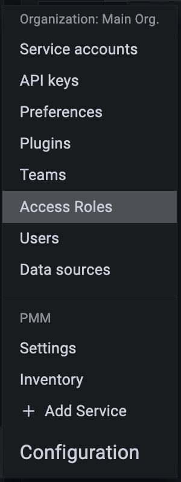

# Create access roles

Roles are a vital part of Access control. Roles provide users with access to specific, role-based metrics.

To create access roles in PMM, do the following:

1. From the *Main* menu, navigate to {{icon.configuration}} *Configuration → Access Roles*. *Access Roles* tab
 opens.

    

2. Click *Create*. Create role page opens.

3. Enter the Role name and Role description.

    

4. Select the following from the drop-downs for metrics access:
    - Label
    - Operator
    - Value of the label.

    If you want to add more than one label for a role, click *+* and select the values from the drop-down.

    For information on how the Prometheus selectors work, see [Prometheus selectors](https://prometheus.io/docs/prometheus/latest/querying/basics/#time-series-selectors).

5. Click *Create* role.

!!! note alert alert-primary "Note"
    To create roles, you must have admin privileges. For more information, see [Manage users](../../how-to/manage-users.md).

