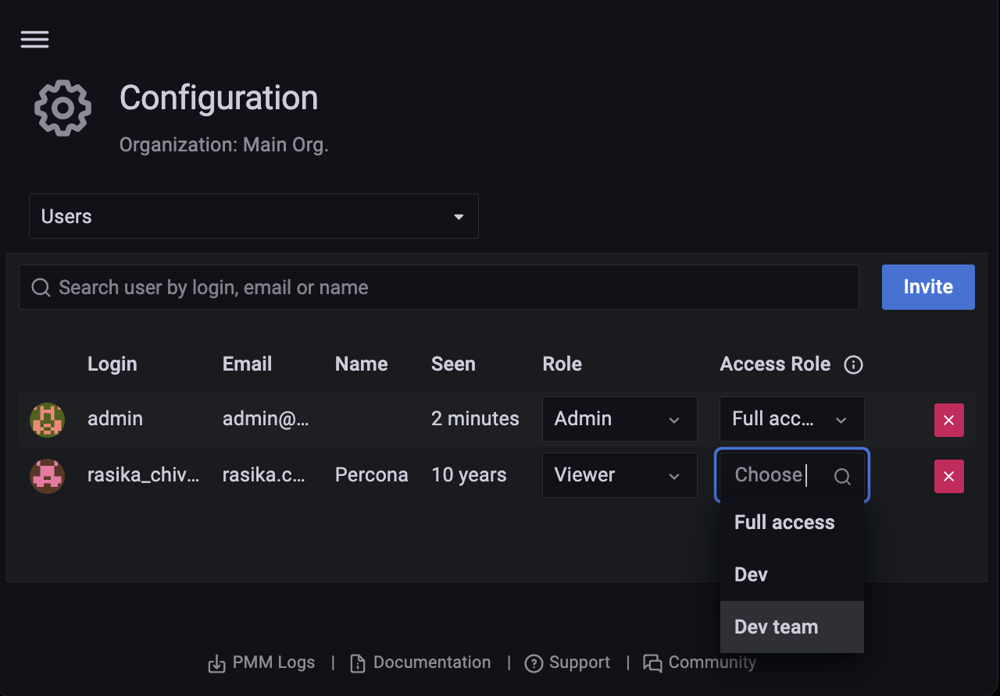

# Assign roles to users

To assign access roles to users, do the following:

1. From the *Main* menu, navigate to {{icon.configuration}} *Configuration → Users*. *Users* tab opens.

    

2. Select the *Access Role* you want to assign to a user from the dropdown. You can assign several roles to a user.

    

