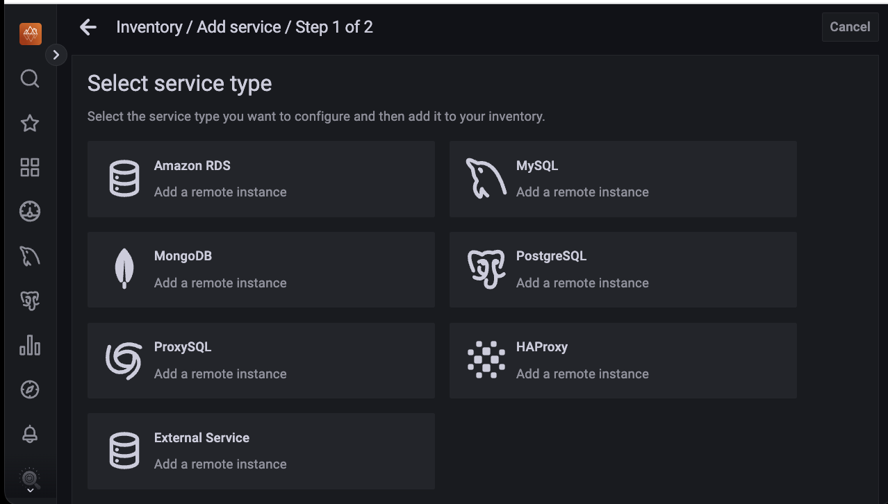
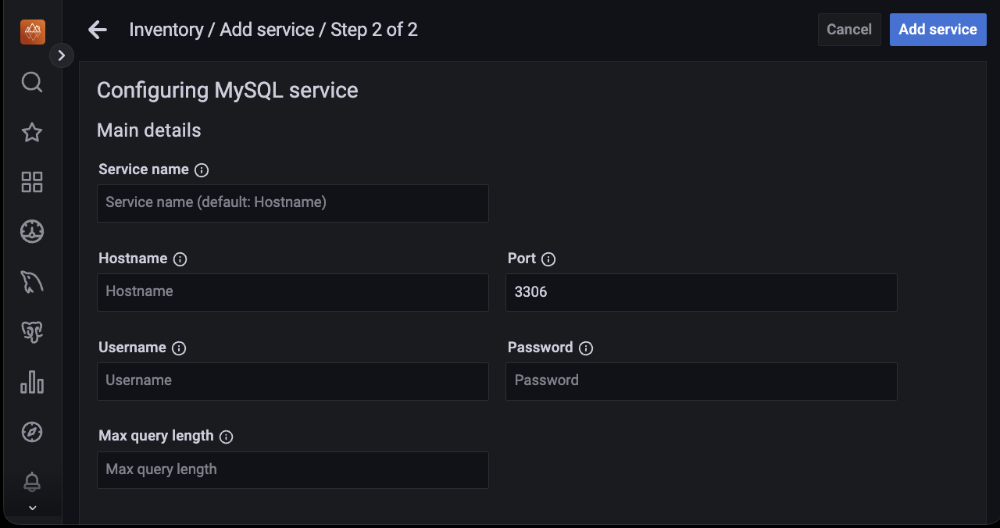
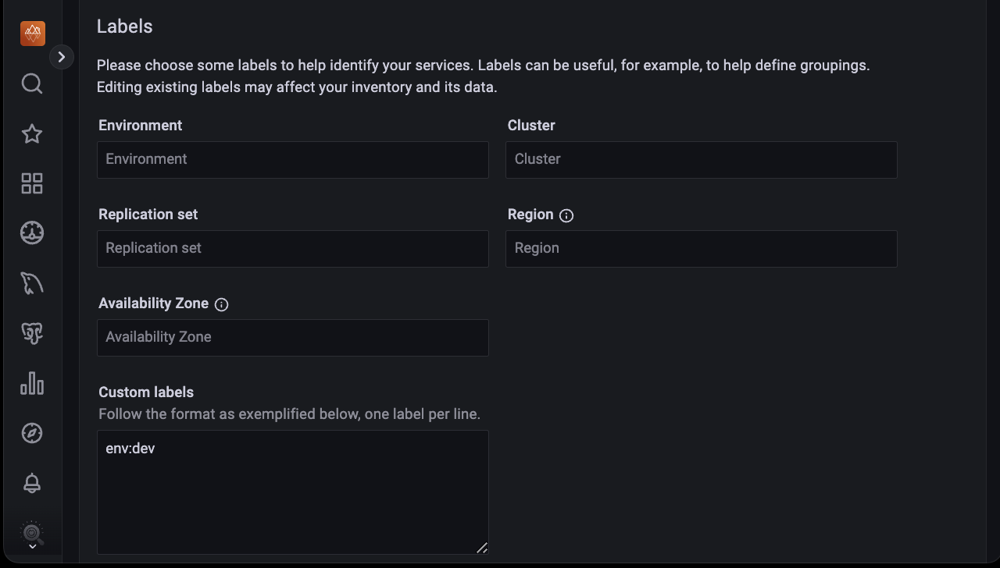

# Labels for access control

Label-based access control in PMM allows you to manage who has access to metrics based on labels. By creating roles, you can specify which data can be queried based on specific label criteria, for instance, allowing the QA team to view data related to test environments. 
 
With Label-based access control, you can associate multiple labels with a role, ensuring only data from series that match your defined labels is returned. 

## Standard vs custom labels

PMM supports standard as well as custom labels. PMM automatically assigns standard labels. You can also set standard labels when an object (Node, Service, or Agent) is created. Custom labels are assigned and updated only by a user.

**Examples**

| **Label Type**| **Object**| **Label name **| **Example** |                                                                                                
|----------|--------|-------|------------------------------|
| **Standard**  | Node   | node_id |/node_id/123|                                          
|          | Service|service_type   |   - mysql, mongodb, postgresql etc.                                     
| **Custom**| Node, Service, Agent| Any string matching regular expression:   [a-zA-Z_][a-zA-Z0-9_]*.   Also, it cannot start with two underscores.| owner="joe"  _rack="12345"|

## Adding labels

In PMM, labels enable you to identify, categorize, and organize your monitored services and resources. Labels also simplify filtering, grouping, and analyzing data. 

While adding a service for monitoring in PMM, you can add custom or standard labels.

**Using PMM UI**

You can set the labels using the User interface as follows:

1. From the *Main* menu, navigate to {{icon.configuration}} *Configuration → Add Service*.

2. Select the service you want to add to PMM for monitoring. The page to add the service opens.

    

3. Enter the details such as **Hostname, Service name, Port, Username, Password, Max query length**.

    

4. (Optional) Enter the **Labels** for the service being monitored.

    

5. (Optional) Check the **Additional Options** that you want to include, such as:

    - **Skip connection check**: Do not check the connection to the database.

    - **Use TLS for database connections**: Enabling TLS (Transport Layer Security) for database connections is an important security measure to protect the confidentiality and integrity of data transmitted between the PMM Server and the monitored database instances.

    - **Skip TLS certificate and hostname validation**: For certain purposes, like debugging and testing, it may be necessary to bypass TLS certificate and hostname validation.

    - **Table statistics limit**: Do not collect table statistics if the number of tables in a database exceeds this limit (defaults to 1000).

    - **Disable comments parsing**: Filter out comments in log files or data streams to isolate valid data.

    - **Use performance schema**: Use Performance Schema instead of Slow Query Log (default) for monitoring and diagnosing performance issues in your database.

You can also edit the labels for a service with the PMM user interface. For details on editing labels for a service, see [Editing labels for a service](../../details/dashboards/dashboard-inventory.md)
 
**Using pmm-admin**

 You can also assign labels using [pmm-admin](../../details/commands/pmm-admin.md).

