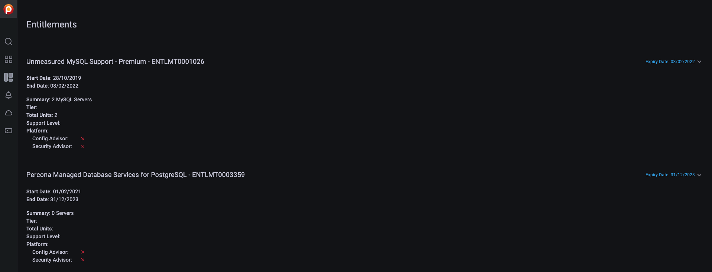

# Check Percona Portal account information

When you connect your PMM instances to Percona Platform, PMM gets access to:

- [More alert templates](../get-started/alert-templates.md)
-  Basic Advisor Checks for additional database checks
-  Standard/Premium Advisor Checks for more advanced database health checks.

Standard/Premium checks are available when you connect to Percona Platform with a customer account.

You can check the list of available Standard/Premium Advisor checks in the [Advisors details](../get-started/advisors-details.md) page.

When you connect with a customer account, PMM  reveals two new tabs on the main menu, where you can check all the information available for your customer accounts:  **Entitlements** and **Support tickets**:

