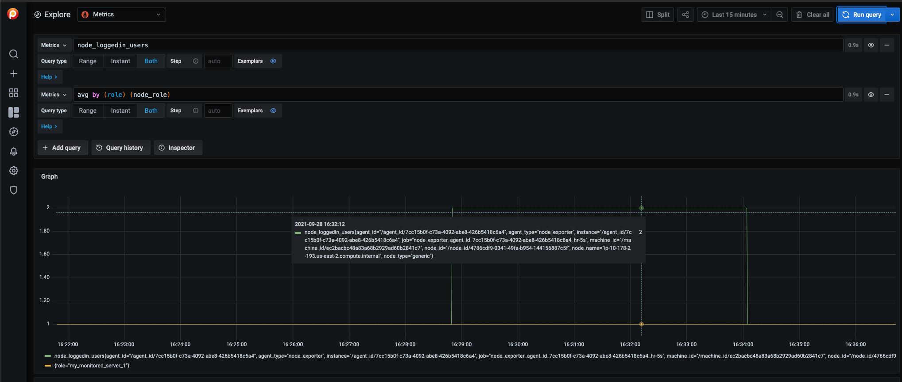

# Extend Metrics

When you need a metric that’s not present in the default list of `node_exporter` metrics you may be able to use the `textfile` collector.
The textfile collector allows exporting of statistics from batch jobs. It can also be used to export static metrics, such as what role a machine has.

## Enable the textfile collector

The collector is enabled by default. The following folders are used for different resolutions:

| Resolution | Folder                                                                    |
|------------|---------------------------------------------------------------------------|
|  High      | `/usr/local/percona/pmm/collectors/textfile-collector/high-resolution`   |
|  Medium    | `/usr/local/percona/pmm/collectors/textfile-collector/medium-resolution` |
|  Low       | `/usr/local/percona/pmm/collectors/textfile-collector/low-resolution`    |


The exporter parses all files in these directories that match the filename wildcard expression `*.prom` using a simple text-based [exposition format](https://prometheus.io/docs/instrumenting/exposition_formats/#text-based-format).
Metrics are stored on the PMM Server-side with additional labels related to this Node.

## Examples of shell commands for custom metrics

To statically set roles for a machine using labels:

```sh
echo 'node_role{role="my_monitored_server_1"} 1' > /usr/local/percona/pmm/collectors/textfile-collector/low-resolution/node_role.prom
```

Here's an example of a `cron` job that automatically pushes logged-in users:

```sh
$ cat /etc/cron.d/loggedin_users
*/1 * * * *     root    /usr/bin/who | /usr/bin/wc -l | sed -ne 's/^/node_loggedin_users /p' > /usr/local/percona/pmm/collectors/textfile-collector/high-resolution/node_users.prom
```



