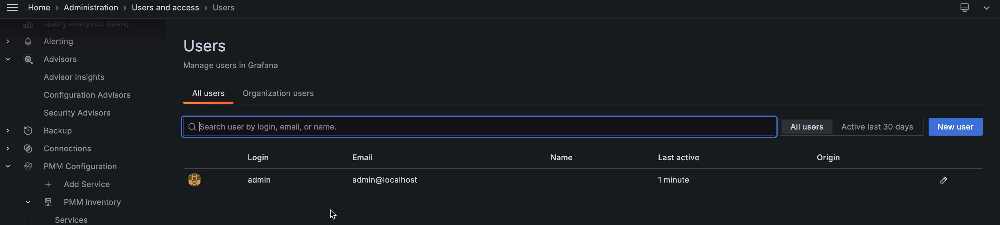
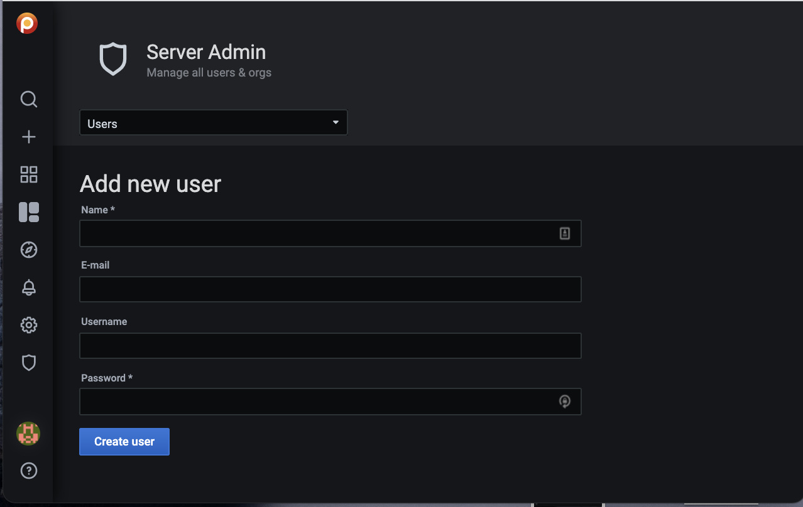
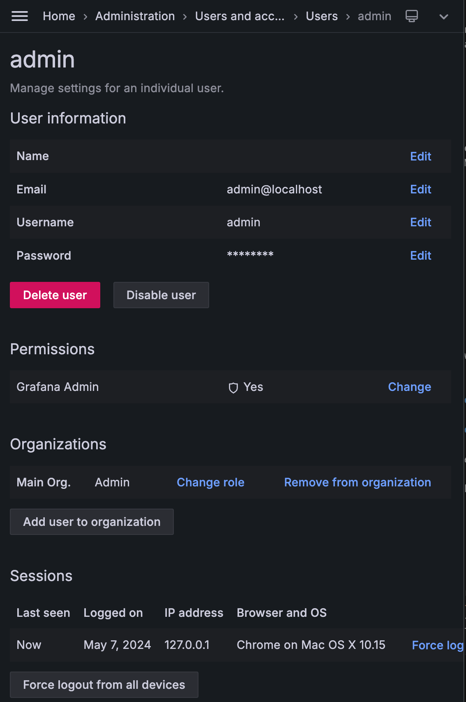

# Manage users

This topic explains user management in PMM.

You can manage users from the [main menu](../details/interface.md#main-menu) by navigating to *Server Admin → Users* page.

## Add users

You can add a user in PMM from *User → New user* tab.

To add a new user in PMM:

1. On the *Users* tab, click *New user*.
2. On the *Add new user* dialog box, enter the following:
    - Name
    - email address or username (if this is an existing grafana user)
    - Username
    - Password

3. Click *create user*.

## Edit users

You can edit users by changing the information or settings for an individual user account.

!!! caution alert alert-warning "Important"
    After changing the default admin password for the PMM Server, register the pmm-agent using the same credentials and add the services again. Otherwise, PMM will cease to monitor the service/nodes.

### Grant or Revoke admin privileges

You can grant or revoke admin access to a user as follows:

1. On the *Users* tab, click the user account you want to edit.

2. To grant or revoke the privileges, click the user. User information dialog box opens.

3. In the *Permissions* section, click *Change* and then select *Yes/No*, depending on whether you want to provide admin access or not.

4. Click *Change*.

!!! caution alert alert-warning "Important"
    After connecting your PMM instance to the Percona Platform, when you log in using your Percona account, you will be granted the *Viewer* access. For *Admin* access, log in to PMM as an admin, and change the permissions for this user.

### Change organization role

You can change the organization role assigned to your user account.

To change the role:

1. On the *Users* tab, click the user for whom you want to change the role.

2. In the *Organisations* section, click *Change role*.

3. Select the role from the drop-down and click *save*.

The following are the privileges for the various roles:

- Admin - Managing data sources, teams, and users within an organization.

- Editor - Creating and editing dashboards.

- Viewer - Viewing dashboards.

For detailed information on the privileges for these roles and the different tasks that they can perform, refer to: [Grafana organization roles](https://grafana.com/docs/grafana/latest/permissions/organization_roles/).

## Delete Users

You can delete a user in PMM as follows:

1. On the *User* tab, click the user you want to delete.

2. Click *Delete user*.

