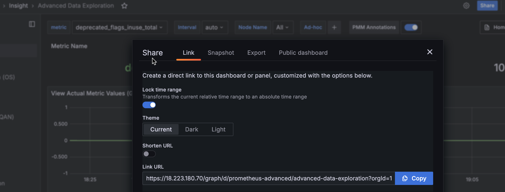

# Share dashboards and panels

When you need to share a dashboard with your team members, you can either send them a direct link to the dashboard, or render and send the dashboard as a .PNG image.

## Share as direct link

1. Go to the dashboard that you want to share.
2. Click at the top of the dashboard to display the panel menu.
3. Select **Share** to reveal the **Share Panel** and either:  

    - copy and send the full URL for the dashboard, OR
    - toggle the **Short URL** option to generate a simple link with a unique identifier

!!! hint alert alert-success "Tip"
       If your current domain is different than the one specified in the Grafana .INI configuration file, PMM will ask you to correct this mismatch before you can generate a short URL:
    
