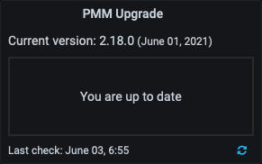

# Upgrade

## Plan the upgrade order

### Upgrade PMM Server first

Make sure to upgrade the PMM Server before you upgrade the PMM Client.
    
Ensure that the PMM Server version is higher than or equal to the PMM Client version. Otherwise, there might be configuration issues, thus leading to failure in the client-server communication as PMM Server might not be able to identify all the parameters in the configuration.

For example, for a PMM Server version 2.25.0, the PMM Client version should be 2.25.0 or 2.24.0. If the PMM Client version is 2.26.0, PMM might not work as expected.

### Staged upgrade approach

When upgrading PMM from older versions (2.30.0 and below), we recommend following a staged approach: first, upgrade to version 2.33.0, and then proceed to the latest version. 

This sequential upgrading process ensures that PMM's internal components are migrated and updated correctly.

## Update the Server

!!! caution alert alert-warning "Known issues for older versions"
    - Upgrading to PMM 2.32.0 from older versions fails. We recommend upgrading directly to 2.33 or the latest version. For more information, see the [troubleshooting topic](../how-to/troubleshoot.md#pmm-server-fails-while-upgrading).

    - PMM versions prior to 2.33.0 may not show the latest versions available with instances created from the AWS marketplace in specific environments, including AWS. For a solution, see the [troubleshooting](../how-to/troubleshoot.md#pmm-server-not-showing-latest-versions-available-with-the-instances-created-from-aws) section.

Client and server components are installed and updated separately.

PMM Server can run natively, as a Docker image, a virtual appliance, or an AWS cloud instance. Each has its own installation and update steps.

The preferred and simplest way to update PMM Server is with the *PMM Upgrade* panel on the Home page.



The panel shows:

- the current server version and release date;
- whether the server is up to date;
- the last time a check was made for updates.

Click the refresh button to manually check for updates. If an update is available, click the Update button to install the indicated version.

!!! seealso alert alert-info "See also"
    [PMM Server Docker upgrade](../setting-up/server/docker.md#upgrade)

## Updating a PMM-Agent

There are two primary methods to update the PMM Agent, depending on your initial installation method:

1. Using your operating system's package manager.
2. Updating from a tarball.

### Package Manager method

The package manager method is generally more convenient and efficient. Percona provides the [percona-release](https://docs.percona.com/percona-software-repositories/installing.html) package, which helps you install Percona software, including the PMM Agent. The PMM Agent is available from the `pmm-client` repository.

To deploy a new version of the Agent via package manager, simply replace the currently installed package with the latest version of the PMM Agent or with a specific version.

#### Install the latest PMM Agent version

Run the commands below to install the latest PMM Agent version via package manager and keep your existing Agent configuration during the update process.

=== "Debian-based"

```sh
percona-release enable pmm2-client
apt update
apt install pmm2-client
```

=== "Red Hat-based"

 ```sh
 percona-release enable pmm2-client
 yum update pmm2-client
 ```

#### Deploy a specific version

To deploy a specific version of the PMM Agent via package manager, check the available versions and then provide the full name of the package. For example:

=== "Red Hat-based"

    ```sh
     yum --showduplicates search pmm2-client
     pmm2-client-2.41.1-6.el9.x86_64 : Percona Monitoring and Management Client (pmm-agent)
     pmm2-client-2.41.2-6.el9.x86_64 : Percona Monitoring and Management Client (pmm-agent)
     pmm2-client-2.42.0-6.el9.x86_64 : Percona Monitoring and Management Client (pmm-agent)

     yum update pmm2-client-2.41.2-6.el9.x86_64
     ```

=== "Debian-based"

    ```sh
    apt-cache madison pmm2-client
    pmm2-client | 2.42.0-6.focal | http://repo.percona.com/pmm2-client/apt focal/main amd64 Packages
    pmm2-client | 2.41.2-6.focal | http://repo.percona.com/pmm2-client/apt focal/main amd64 Packages
    pmm2-client | 2.41.1-6.focal | http://repo.percona.com/pmm2-client/apt focal/main amd64 Packages

    apt install pmm2-client=2.42.0-6.focal
    ```

### Tarball method

If you initially installed the PMM Agent from a tarball, you can update it by replacing the currently installed package with the latest version:

 1. [Download](https://www.percona.com/downloads) `tar.gz` with `pmm2-client`.
 2. Extract the tarball.
 3. Run `./install_tarball` script with the `-u` flag.

!!! caution alert alert-warning "Important"
    The configuration file will be overwritten if you do not provide the `-u` flag while the `pmm-agent` is updated.

## Upgrade from PMM 1

Because of the significant architectural changes between PMM1 and PMM2, there is no direct upgrade path. The approach to making the switch from PMM version 1 to 2 is a gradual transition, outlined [in this blog post](https://www.percona.com/blog/2019/11/27/running-pmm1-and-pmm2-clients-on-the-same-host/).

In short, it involves first standing up a new PMM2 server on a new host and connecting clients to it. As new data is reported to the PMM2 server, old metrics will age with the retention period (30 days, by default), at which point you'll be able to shut down your existing PMM1 server.

Any alerts configured through the Grafana UI will have to be recreated due to the target dashboard id's not matching between PMM1 and PMM2.  In this instance we recommend moving to Alertmanager recipes in PMM2 for alerting which, for the time being, requires a separate Alertmanager instance. We are working on integrating this natively into PMM2 Server and expect to support your existing Alertmanager rules.