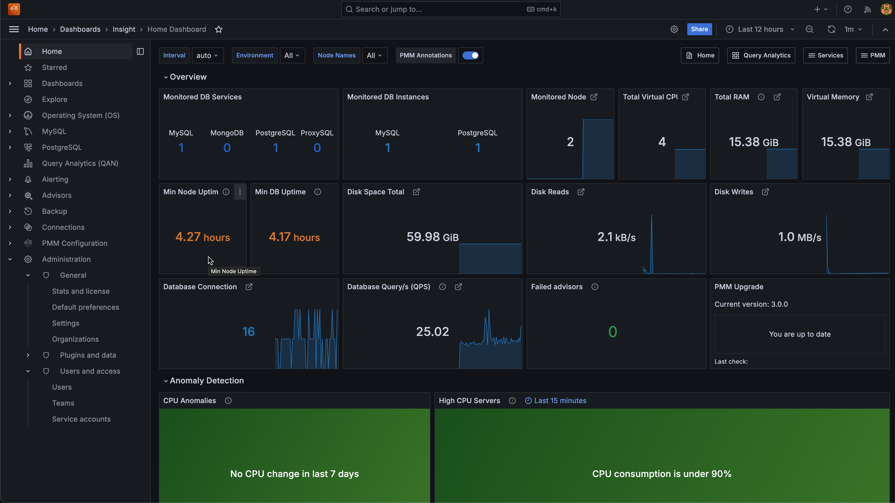

# Welcome

<i info>:material-information: Info:</i> This is the documentation for the latest PMM 2 release. For details, see the [PMM {{release}} release notes](release-notes/{{release}}.md) and the [PMM 2.44.0-1 update](release-notes/2.44.0.1.md).

!!! warning "PMM 2 end of active development" 
    PMM 2 is no longer actively developed. For the latest features, security updates, and improvements, we strongly recommend using [PMM 3](https://docs.percona.com/percona-monitoring-and-management/3/quickstart.html).

Percona Monitoring and Management (PMM) is an open-source database monitoring, management, and observability solution for MySQL, PostgreSQL, and MongoDB.

It allows you to observe the health of your database systems, explore new patterns in their behavior, troubleshoot them and perform database management operations no matter where they are located on-prem or in the cloud.

- PMM **collects** thousands of out-of-the-box performance **metrics** from databases and their hosts.

- The PMM [web UI](get-started/interface.md) **visualizes data** in [dashboards](details/dashboards/).

- Additional features include [advisors for database health assessments](details/develop-checks/index.md).

Here's how the home page looks on our <a href='https://pmmdemo.percona.com/' target='_blank'>free, live demo system</a>.

PMM runs in the cloud, on-prem, or across hybrid platforms. It's supported by our [legendary expertise][percona_services] in open source databases, and by a vibrant developer and user [community].

A minimal PMM set-up comprises one [server](details/architecture.md#pmm-server) and a [client agent](details/architecture.md#pmm-client) on every system you want to monitor.

## Start here

- An [easy install] script, which you download, make executable and run. The script installs Docker and runs PMM Server as a container.

- The [Quickstart install guide](quickstart/index.md) shows how to run PMM Server as a Docker container, and how to install PMM Client on Ubuntu or Red Hat Linux hosts.

- [Setting Up] explains in detail how to set up PMM Server, clients, and how to add services.

## Read more

### Links to popular sections

#### For System Administrators

- [Setting up](https://www.percona.com/doc/percona-monitoring-and-management/2.x/setting-up/index.html)
- [How to configure](https://www.percona.com/doc/percona-monitoring-and-management/2.x/how-to/configure.html)
- [How to upgrade](https://www.percona.com/doc/percona-monitoring-and-management/2.x/how-to/upgrade.html)
- [pmm-admin](https://www.percona.com/doc/percona-monitoring-and-management/2.x/details/commands/pmm-admin.html)
- [Architecture](https://www.percona.com/doc/percona-monitoring-and-management/2.x/details/architecture.html)

#### For Users

- [User interface](https://docs.percona.com/percona-monitoring-and-management/get-started/interface.html)
- [Using Query Analytics](https://docs.percona.com/percona-monitoring-and-management/get-started/query-analytics.html)
- [Using Percona Alerting](https://docs.percona.com/percona-monitoring-and-management/get-started/alerting.html)
- [Dashboards reference](https://www.percona.com/doc/percona-monitoring-and-management/2.x/details/dashboards/index.html)

??? note alert alert-info "Full section map (click to show/hide)"
    

      <!-- Maintained at https://www.figma.com/file/UcK1mgqbZv2SPFa1M5AjsU/pmm-doc-sitemap?node-id=1%3A3 -->
      <svg width="1544" height="980" viewBox="0 0 1544 980" fill="none" xmlns="http://www.w3.org/2000/svg">
        <g clip-path="url(#clip0_1_3)">
        <line x1="727" y1="83" x2="727" y2="222" stroke="#9A1E39" stroke-width="2"/>
        <line x1="1297" y1="149" x2="1297" y2="222" stroke="#9A1E39" stroke-width="2"/>
        <line x1="277" y1="372" x2="359" y2="372" stroke="#9A1E39" stroke-width="2"/>
        <line x1="318" y1="150" x2="1296" y2="150" stroke="#9A1E39" stroke-width="2"/>
        <line x1="319" y1="149" x2="319" y2="373" stroke="#9A1E39" stroke-width="2"/>
        <rect x="1324" y="443" width="168" height="38" rx="9" fill="#B6D7E4" stroke="#9A1E39" stroke-width="2"/>
        <text fill="#001CF5" xml:space="preserve" style="white-space: pre" font-family="Roboto" font-size="18" letter-spacing="0em" text-decoration="underline"><tspan x="1361.62" y="468.152"><a href="https://www.percona.com/doc/percona-monitoring-and-management/2.x/details/commands/">Commands</a></tspan></text>
        <rect x="1324" y="393" width="168" height="38" rx="9" fill="#B6D7E4" stroke="#9A1E39" stroke-width="2"/>
        <text fill="#001CF5" xml:space="preserve" style="white-space: pre" font-family="Roboto" font-size="18" letter-spacing="0em" text-decoration="underline"><tspan x="1359.82" y="418.152"><a href="https://www.percona.com/doc/percona-monitoring-and-management/2.x/details/dashboards/">Dashboards</a></tspan></text>
        <text fill="#001CF5" xml:space="preserve" style="white-space: pre" font-family="Roboto" font-size="18" letter-spacing="0em" text-decoration="underline"><tspan x="1323" y="618.152"><a href="https://www.percona.com/doc/percona-monitoring-and-management/2.x/details/api.html">API</a></tspan></text>
        <text fill="#001CF5" xml:space="preserve" style="white-space: pre" font-family="Roboto" font-size="18" letter-spacing="0em" text-decoration="underline"><tspan x="1432" y="519.152"><a href="https://www.percona.com/doc/percona-monitoring-and-management/2.x/details/commands/pmm-admin.html">pmm-admin</a></tspan></text>
        <text fill="#001CF5" xml:space="preserve" style="white-space: pre" font-family="Roboto" font-size="18" letter-spacing="0em" text-decoration="underline"><tspan x="1432" y="569.152"><a href="https://www.percona.com/doc/percona-monitoring-and-management/2.x/details/commands/pmm-agent.html">pmm-agent</a></tspan></text>
        <text fill="#001CF5" xml:space="preserve" style="white-space: pre" font-family="Roboto" font-size="18" letter-spacing="0em" text-decoration="underline"><tspan x="1323" y="319.152"><a href="https://www.percona.com/doc/percona-monitoring-and-management/2.x/details/architecture.html">Architecture</a></tspan></text>
        <text fill="#001CF5" xml:space="preserve" style="white-space: pre" font-family="Roboto" font-size="18" letter-spacing="0em" text-decoration="underline"><tspan x="1323" y="358.652"><a href="https://www.percona.com/doc/percona-monitoring-and-management/2.x/details/interface.html">User Interface </a></tspan><tspan x="1323" y="379.652"><a href="https://www.percona.com/doc/percona-monitoring-and-management/2.x/details/interface.html">components</a></tspan></text>
        <text fill="#001CF5" xml:space="preserve" style="white-space: pre" font-family="Roboto" font-size="18" letter-spacing="0em" text-decoration="underline"><tspan x="1323" y="668.152"><a href="https://www.percona.com/doc/percona-monitoring-and-management/2.x/details/victoria-metrics.html">VictoriaMetrics</a></tspan></text>
        <text fill="#001CF5" xml:space="preserve" style="white-space: pre" font-family="Roboto" font-size="18" letter-spacing="0em" text-decoration="underline"><tspan x="1323" y="718.152"><a href="https://www.percona.com/doc/percona-monitoring-and-management/2.x/details/glossary.html">Glossary</a></tspan></text>
        <line x1="1418" y1="563" x2="1398" y2="563" stroke="#9A1E39" stroke-width="2"/>
        <line x1="1418" y1="513" x2="1398" y2="513" stroke="#9A1E39" stroke-width="2"/>
        <line x1="1399" y1="481" x2="1399" y2="562" stroke="#9A1E39" stroke-width="2"/>
        <line x1="1312" y1="613" x2="1292" y2="613" stroke="#9A1E39" stroke-width="2"/>
        <line x1="1312" y1="663" x2="1292" y2="663" stroke="#9A1E39" stroke-width="2"/>
        <line x1="1312" y1="713" x2="1292" y2="713" stroke="#9A1E39" stroke-width="2"/>
        <line x1="1312" y1="315" x2="1292" y2="315" stroke="#9A1E39" stroke-width="2"/>
        <line x1="1312" y1="363" x2="1292" y2="363" stroke="#9A1E39" stroke-width="2"/>
        <line x1="1312" y1="413" x2="1292" y2="413" stroke="#9A1E39" stroke-width="2"/>
        <line x1="1312" y1="463" x2="1292" y2="463" stroke="#9A1E39" stroke-width="2"/>
        <line x1="1292" y1="271" x2="1292" y2="714" stroke="#9A1E39" stroke-width="2"/>
        <rect x="1198" y="222" width="188" height="48" rx="9" fill="#B6D7E4" stroke="#9A1E39" stroke-width="2"/>
        <text fill="#001CF5" xml:space="preserve" style="white-space: pre" font-family="Roboto" font-size="18" letter-spacing="0em" text-decoration="underline"><tspan x="1264.46" y="252.152"><a href="https://www.percona.com/doc/percona-monitoring-and-management/2.x/details/">Details</a></tspan></text>
        <text fill="#001CF5" xml:space="preserve" style="white-space: pre" font-family="Roboto" font-size="18" letter-spacing="0em" text-decoration="underline"><tspan x="1039" y="607.652"><a href="https://www.percona.com/doc/percona-monitoring-and-management/2.x/how-to/render-dashboard-images.html">Render dashboard </a></tspan><tspan x="1039" y="628.652"><a href="https://www.percona.com/doc/percona-monitoring-and-management/2.x/how-to/render-dashboard-images.html">images</a></tspan></text>
        <text fill="#001CF5" xml:space="preserve" style="white-space: pre" font-family="Roboto" font-size="18" letter-spacing="0em" text-decoration="underline"><tspan x="1039" y="569.152"><a href="https://www.percona.com/doc/percona-monitoring-and-management/2.x/how-to/annotate.html">Annotate</a></tspan></text>
        <text fill="#001CF5" xml:space="preserve" style="white-space: pre" font-family="Roboto" font-size="18" letter-spacing="0em" text-decoration="underline"><tspan x="1039" y="519.152"><a href="https://www.percona.com/doc/percona-monitoring-and-management/2.x/how-to/optimize.html">Optimize</a></tspan></text>
        <text fill="#001CF5" xml:space="preserve" style="white-space: pre" font-family="Roboto" font-size="18" letter-spacing="0em" text-decoration="underline"><tspan x="1039" y="469.152"><a href="https://www.percona.com/doc/percona-monitoring-and-management/2.x/how-to/secure.html">Secure</a></tspan></text>
        <text fill="#001CF5" xml:space="preserve" style="white-space: pre" font-family="Roboto" font-size="18" letter-spacing="0em" text-decoration="underline"><tspan x="1039" y="419.152"><a href="https://www.percona.com/doc/percona-monitoring-and-management/2.x/how-to/upgrade.html">Upgrade</a></tspan></text>
        <text fill="#001CF5" xml:space="preserve" style="white-space: pre" font-family="Roboto" font-size="18" letter-spacing="0em" text-decoration="underline"><tspan x="1039" y="319.152"><a href="https://www.percona.com/doc/percona-monitoring-and-management/2.x/how-to/configure.html">Configure</a></tspan></text>
        <text fill="#001CF5" xml:space="preserve" style="white-space: pre" font-family="Roboto" font-size="18" letter-spacing="0em" text-decoration="underline"><tspan x="1039" y="369.152"><a href="https://www.percona.com/doc/percona-monitoring-and-management/2.x/how-to/manage-users.html">Manage Users</a></tspan></text>
        <text fill="#001CF5" xml:space="preserve" style="white-space: pre" font-family="Roboto" font-size="18" letter-spacing="0em" text-decoration="underline"><tspan x="1039" y="668.152"><a href="https://www.percona.com/doc/percona-monitoring-and-management/2.x/how-to/extend-metrics.html">Extend metrics</a></tspan></text>
        <text fill="#001CF5" xml:space="preserve" style="white-space: pre" font-family="Roboto" font-size="18" letter-spacing="0em" text-decoration="underline"><tspan x="1039" y="718.152"><a href="https://www.percona.com/doc/percona-monitoring-and-management/2.x/how-to/troubleshoot.html">Troubleshoot</a></tspan></text>
        <line x1="1029" y1="613" x2="1009" y2="613" stroke="#9A1E39" stroke-width="2"/>
        <line x1="1029" y1="663" x2="1009" y2="663" stroke="#9A1E39" stroke-width="2"/>
        <line x1="1029" y1="713" x2="1009" y2="713" stroke="#9A1E39" stroke-width="2"/>
        <line x1="1010" y1="271" x2="1010" y2="714" stroke="#9A1E39" stroke-width="2"/>
        <line x1="1029" y1="315" x2="1009" y2="315" stroke="#9A1E39" stroke-width="2"/>
        <line x1="1029" y1="363" x2="1009" y2="363" stroke="#9A1E39" stroke-width="2"/>
        <line x1="1029" y1="413" x2="1009" y2="413" stroke="#9A1E39" stroke-width="2"/>
        <line x1="1029" y1="463" x2="1009" y2="463" stroke="#9A1E39" stroke-width="2"/>
        <line x1="1029" y1="513" x2="1009" y2="513" stroke="#9A1E39" stroke-width="2"/>
        <line x1="1029" y1="563" x2="1009" y2="563" stroke="#9A1E39" stroke-width="2"/>
        <rect x="915" y="222" width="188" height="48" rx="9" fill="#B6D7E4" stroke="#9A1E39" stroke-width="2"/>
        <text fill="#001CF5" xml:space="preserve" style="white-space: pre" font-family="Roboto" font-size="18" letter-spacing="0em" text-decoration="underline"><tspan x="980.453" y="252.152"><a href="https://www.percona.com/doc/percona-monitoring-and-management/2.x/how-to/">How to</a></tspan></text>
        <text fill="#001CF5" xml:space="preserve" style="white-space: pre" font-family="Roboto" font-size="18" letter-spacing="0em" text-decoration="underline"><tspan x="756" y="568.152"><a href="https://docs.percona.com/percona-monitoring-and-management/get-started/dbaas.html">DBaaS</a></tspan></text>
        <text fill="#001CF5" xml:space="preserve" style="white-space: pre" font-family="Roboto" font-size="18" letter-spacing="0em" text-decoration="underline"><tspan x="756" y="519.152"><a href="https://docs.percona.com/percona-monitoring-and-management/get-started/advisors.html">Advisors</a></tspan></text>
        <text fill="#001CF5" xml:space="preserve" style="white-space: pre" font-family="Roboto" font-size="18" letter-spacing="0em" text-decoration="underline"><tspan x="756" y="469.152"><a href="https://docs.percona.com/percona-monitoring-and-management/get-started/query-analytics.html">Query Analytics</a></tspan></text>
        <text fill="#001CF5" xml:space="preserve" style="white-space: pre" font-family="Roboto" font-size="18" letter-spacing="0em" text-decoration="underline"><tspan x="756" y="419.152"><a href="https://docs.percona.com/percona-monitoring-and-management/get-started/backup/index.html">Backup and Restore</a></tspan></text>
        <text fill="#001CF5" xml:space="preserve" style="white-space: pre" font-family="Roboto" font-size="18" letter-spacing="0em" text-decoration="underline"><tspan x="756" y="369.152"><a href="https://docs.percona.com/percona-monitoring-and-management/get-started/alerting.html">Percona  Alerting</a></tspan></text>
        <text fill="#001CF5" xml:space="preserve" style="white-space: pre" font-family="Roboto" font-size="18" letter-spacing="0em" text-decoration="underline"><tspan x="756" y="319.152"><a href="https://docs.percona.com/percona-monitoring-and-management/get-started/interface.html">User Interface</a></tspan></text>
        <line x1="727" y1="271" x2="727" y2="562" stroke="#9A1E39" stroke-width="2"/>
        <line x1="746" y1="315" x2="726" y2="315" stroke="#9A1E39" stroke-width="2"/>
        <line x1="746" y1="363" x2="726" y2="363" stroke="#9A1E39" stroke-width="2"/>
        <line x1="746" y1="413" x2="726" y2="413" stroke="#9A1E39" stroke-width="2"/>
        <line x1="746" y1="463" x2="726" y2="463" stroke="#9A1E39" stroke-width="2"/>
        <line x1="746" y1="513" x2="726" y2="513" stroke="#9A1E39" stroke-width="2"/>
        <line x1="746" y1="563" x2="726" y2="563" stroke="#9A1E39" stroke-width="2"/>
        <rect x="632" y="222" width="188" height="48" rx="9" fill="#B6D7E4" stroke="#9A1E39" stroke-width="2"/>
        <text fill="#001CF5" xml:space="preserve" style="white-space: pre" font-family="Roboto" font-size="18" letter-spacing="0em" text-decoration="underline"><tspan x="703.298" y="252.152"><a href="https://docs.percona.com/percona-monitoring-and-management/get-started/index.html">Get started</a></tspan></text>
        <text fill="#001CF5" xml:space="preserve" style="white-space: pre" font-family="Roboto" font-size="18" letter-spacing="0em" text-decoration="underline"><tspan x="486" y="443.152"><a href="https://www.percona.com/doc/percona-monitoring-and-management/2.x/setting-up/client/mysql.html">MySQL</a></tspan></text>
        <text fill="#001CF5" xml:space="preserve" style="white-space: pre" font-family="Roboto" font-size="18" letter-spacing="0em" text-decoration="underline"><tspan x="486" y="493.152"><a href="https://www.percona.com/doc/percona-monitoring-and-management/2.x/setting-up/client/mongodb.html">MongoDB</a></tspan></text>
        <text fill="#001CF5" xml:space="preserve" style="white-space: pre" font-family="Roboto" font-size="18" letter-spacing="0em" text-decoration="underline"><tspan x="486" y="543.152"><a href="https://www.percona.com/doc/percona-monitoring-and-management/2.x/setting-up/client/postgresql.html">PostgreSQL</a></tspan></text>
        <text fill="#001CF5" xml:space="preserve" style="white-space: pre" font-family="Roboto" font-size="18" letter-spacing="0em" text-decoration="underline"><tspan x="486" y="593.152"><a href="https://www.percona.com/doc/percona-monitoring-and-management/2.x/setting-up/client/proxysql.html">ProxySQL</a></tspan></text>
        <text fill="#001CF5" xml:space="preserve" style="white-space: pre" font-family="Roboto" font-size="18" letter-spacing="0em" text-decoration="underline"><tspan x="486" y="643.152"><a href="https://www.percona.com/doc/percona-monitoring-and-management/2.x/setting-up/client/aws.html">Amazon RDS</a></tspan></text>
        <text fill="#001CF5" xml:space="preserve" style="white-space: pre" font-family="Roboto" font-size="18" letter-spacing="0em" text-decoration="underline"><tspan x="486" y="693.152"><a href="https://www.percona.com/doc/percona-monitoring-and-management/2.x/setting-up/client/azure.html">Microsoft Azure</a></tspan></text>
        <text fill="#001CF5" xml:space="preserve" style="white-space: pre" font-family="Roboto" font-size="18" letter-spacing="0em" text-decoration="underline"><tspan x="486" y="793.152"><a href="https://www.percona.com/doc/percona-monitoring-and-management/2.x/setting-up/client/linux.html">Linux</a></tspan></text>
        <text fill="#001CF5" xml:space="preserve" style="white-space: pre" font-family="Roboto" font-size="18" letter-spacing="0em" text-decoration="underline"><tspan x="486" y="843.152"><a href="https://www.percona.com/doc/percona-monitoring-and-management/2.x/setting-up/client/external.html">External Services</a></tspan></text>
        <text fill="#001CF5" xml:space="preserve" style="white-space: pre" font-family="Roboto" font-size="18" letter-spacing="0em" text-decoration="underline"><tspan x="486" y="893.152"><a href="https://www.percona.com/doc/percona-monitoring-and-management/2.x/setting-up/client/haproxy.html">HA Proxy</a></tspan></text>
        <text fill="#001CF5" xml:space="preserve" style="white-space: pre" font-family="Roboto" font-size="18" letter-spacing="0em" text-decoration="underline"><tspan x="486" y="943.152"><a href="https://www.percona.com/doc/percona-monitoring-and-management/2.x/setting-up/client/remote.html">Remote Instances</a></tspan></text>
        <text fill="#001CF5" xml:space="preserve" style="white-space: pre" font-family="Roboto" font-size="18" letter-spacing="0em" text-decoration="underline"><tspan x="486" y="743.152"><a href="https://www.percona.com/doc/percona-monitoring-and-management/2.x/setting-up/client/google.html">Google Cloud Platform</a></tspan></text>
        <line x1="477" y1="738" x2="457" y2="738" stroke="#9A1E39" stroke-width="2"/>
        <line x1="477" y1="788" x2="457" y2="788" stroke="#9A1E39" stroke-width="2"/>
        <line x1="477" y1="838" x2="457" y2="838" stroke="#9A1E39" stroke-width="2"/>
        <line x1="477" y1="888" x2="457" y2="888" stroke="#9A1E39" stroke-width="2"/>
        <line x1="477" y1="938" x2="457" y2="938" stroke="#9A1E39" stroke-width="2"/>
        <line x1="458" y1="396" x2="458" y2="939" stroke="#9A1E39" stroke-width="2"/>
        <line x1="477" y1="440" x2="457" y2="440" stroke="#9A1E39" stroke-width="2"/>
        <line x1="477" y1="488" x2="457" y2="488" stroke="#9A1E39" stroke-width="2"/>
        <line x1="477" y1="538" x2="457" y2="538" stroke="#9A1E39" stroke-width="2"/>
        <line x1="477" y1="588" x2="457" y2="588" stroke="#9A1E39" stroke-width="2"/>
        <line x1="477" y1="638" x2="457" y2="638" stroke="#9A1E39" stroke-width="2"/>
        <line x1="477" y1="688" x2="457" y2="688" stroke="#9A1E39" stroke-width="2"/>
        <rect x="359" y="347" width="188" height="48" rx="9" fill="#B6D7E4" stroke="#9A1E39" stroke-width="2"/>
        <text fill="#001CF5" xml:space="preserve" style="white-space: pre" font-family="Roboto" font-size="18" letter-spacing="0em" text-decoration="underline"><tspan x="430.069" y="377.152"><a href="https://www.percona.com/doc/percona-monitoring-and-management/2.x/setting-up/client/">Client</a></tspan></text>
        <rect x="89" y="347" width="188" height="48" rx="9" fill="#B6D7E4" stroke="#9A1E39" stroke-width="2"/>
        <text fill="#001CF5" xml:space="preserve" style="white-space: pre" font-family="Roboto" font-size="18" letter-spacing="0em" text-decoration="underline"><tspan x="157.635" y="377.152"><a href="https://www.percona.com/doc/percona-monitoring-and-management/2.x/setting-up/server/">Server</a></tspan></text>
        <text fill="#001CF5" xml:space="preserve" style="white-space: pre" font-family="Roboto" font-size="18" letter-spacing="0em" text-decoration="underline"><tspan x="82.6934" y="443.152"><a href="https://www.percona.com/doc/percona-monitoring-and-management/2.x/setting-up/server/network.html">Network</a></tspan></text>
        <text fill="#001CF5" xml:space="preserve" style="white-space: pre" font-family="Roboto" font-size="18" letter-spacing="0em" text-decoration="underline"><tspan x="93.9082" y="493.152"><a href="https://www.percona.com/doc/percona-monitoring-and-management/2.x/setting-up/server/docker.html">Docker</a></tspan></text>
        <text fill="#001CF5" xml:space="preserve" style="white-space: pre" font-family="Roboto" font-size="18" letter-spacing="0em" text-decoration="underline"><tspan x="15.7031" y="543.152"><a href="https://www.percona.com/doc/percona-monitoring-and-management/2.x/setting-up/server/virtual-appliance.html">Virtual appliance</a></tspan></text>
        <text fill="#001CF5" xml:space="preserve" style="white-space: pre" font-family="Roboto" font-size="18" letter-spacing="0em" text-decoration="underline"><tspan x="8.51367" y="593.152"><a href="https://www.percona.com/doc/percona-monitoring-and-management/2.x/setting-up/server/aws.html">AWS Marketplace</a></tspan></text>
        <text fill="#001CF5" xml:space="preserve" style="white-space: pre" font-family="Roboto" font-size="18" letter-spacing="0em" text-decoration="underline"><tspan x="9.46289" y="643.152"><a href="https://www.percona.com/doc/percona-monitoring-and-management/2.x/setting-up/server/easy-install.html">Easy-install script</a></tspan></text>
        <text fill="#001CF5" xml:space="preserve" style="white-space: pre" font-family="Roboto" font-size="18" letter-spacing="0em" text-decoration="underline"><tspan x="96.7031" y="693.152"><a href="https://www.percona.com/doc/percona-monitoring-and-management/2.x/setting-up/server/dbaas.html">DBaaS</a></tspan></text>
        <line x1="180" y1="396" x2="180" y2="689" stroke="#9A1E39" stroke-width="2"/>
        <line x1="179" y1="440" x2="159" y2="440" stroke="#9A1E39" stroke-width="2"/>
        <line x1="179" y1="488" x2="159" y2="488" stroke="#9A1E39" stroke-width="2"/>
        <line x1="179" y1="538" x2="159" y2="538" stroke="#9A1E39" stroke-width="2"/>
        <line x1="179" y1="588" x2="159" y2="588" stroke="#9A1E39" stroke-width="2"/>
        <line x1="179" y1="638" x2="159" y2="638" stroke="#9A1E39" stroke-width="2"/>
        <line x1="179" y1="688" x2="159" y2="688" stroke="#9A1E39" stroke-width="2"/>
        <rect x="225" y="222" width="188" height="48" rx="9" fill="#B6D7E4" stroke="#9A1E39" stroke-width="2"/>
        <text fill="#001CF5" xml:space="preserve" style="white-space: pre" font-family="Roboto" font-size="18" letter-spacing="0em" text-decoration="underline"><tspan x="278.526" y="252.152"><a href="https://www.percona.com/doc/percona-monitoring-and-management/2.x/setting-up/">Setting up</a></tspan></text>
        <rect x="632" y="37" width="188" height="48" rx="9" fill="#B6D7E4" stroke="#9A1E39" stroke-width="2"/>
        <text fill="#001CF5" xml:space="preserve" style="white-space: pre" font-family="Roboto" font-size="18" letter-spacing="0em" text-decoration="underline"><tspan x="688.682" y="67.1523"><a href="https://www.percona.com/doc/percona-monitoring-and-management/2.x/index.html">Welcome</a></tspan></text>
        </g>
        <defs>
        <clipPath id="clip0_1_3">
        <rect width="1544" height="980" fill="white"/>
        </clipPath>
        </defs>
      </svg>
    

[percona_services]: https://www.percona.com/services
[community]: https://www.percona.com/forums/questions-discussions/percona-monitoring-and-management
[Technical Preview]: details/glossary.md#technical-preview
[easy install]: setting-up/server/easy-install.md
[Setting Up]: setting-up/index.md
