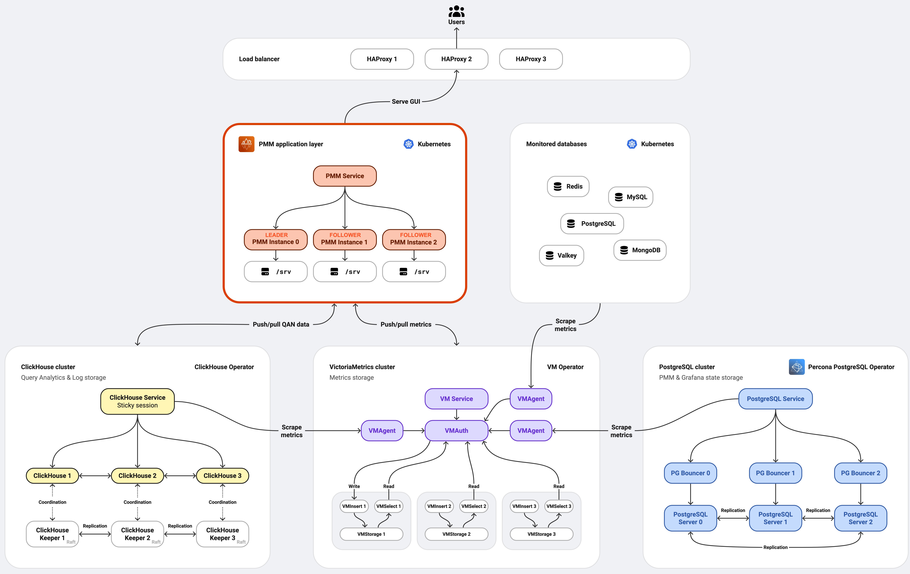

# Understand PMM High Availability Cluster

!!! warning "Technical Preview: Not production-ready"
    This feature is in **Technical Preview** for testing and feedback only. Expect [known issues](../install-pmm/install-HA-clustered.md#known-issues), breaking changes, and incomplete features.
    
    **Test in non-production environments only** and [provide feedback](../install-pmm/install-HA-clustered.md#get-help-and-provide-feedback) to shape the GA release.

!!! danger "VictoriaMetrics limitations"
    This Tech Preview does not support:
    
    - **Prometheus data imports**: Cannot import existing Prometheus files
    - **Metrics downsampling**: No automatic historical data optimization
    
    If your strategy requires these features, evaluate carefully before testing.
 
Standard PMM monitoring goes offline for minutes during server failures. PMM HA Cluster keeps monitoring running by immediately switching to secondary servers when failures occur.

PMM HA Cluster keeps your database monitoring running continuously, even when servers fail or during maintenance windows.

Unlike [Single-Instance deployments](../install-pmm/HA-kubernetes-single-instance.md) where a server failure means minutes of monitoring downtime, PMM HA Cluster immediately fails over to secondary servers, keeping your monitoring online.

Whether a server crashes, you're upgrading software, or scaling your infrastructure, your monitoring stays active with no blind spots or missed incidents.

### Key benefits

- **Continuous monitoring**: Three PMM server replicas ensure monitoring never stops, even during failures
- **Fast automatic failover**: Traffic immediately switches to healthy servers with no data loss
- **Automatic traffic routing**: HAProxy routes traffic to the active leader and handles failover transparently
- **Resilient data storage**: Distributed databases (ClickHouse, VictoriaMetrics, PostgreSQL) eliminate single points of failure
- **Scales with your needs**: Add more capacity as your database infrastructure grows

### Choose your Kubernetes deployment type

| Consideration | Single-instance (GA) | HA Cluster (Tech Preview) |
|--------------|----------------------|-----------------------------|
| **Production status** | ✅ Production-ready | ⚠️ Testing only |
| **Failover time** | 2-5 minutes | Immediate |
| **Setup complexity** | ● Low | ●●● Medium |
| **Resource overhead** | 1x baseline | 3-5x baseline |
| **Setup time** | ~5 minutes | ~20 minutes |
| **PMM instances** | 1 pod | 3 pods with leader election |
| **Automatic failover routing** | No | Yes (HAProxy routes to active leader) |
| **Databases** | Built-in | External clusters |
| **Anti-affinity** | No | Yes (pods distributed across nodes) |

## Before you begin

### Check prerequisites

- **Kubernetes**: 1.32 or higher
- **Helm**: 3.2.0 or higher
- **kubectl**: configured to access your cluster
- **Persistent Volume Provisioner**: available in your cluster

### Check if your platform is supported

!!! info "Tested Platform: Amazon EKS only"
    This Tech Preview is validated exclusively on **Amazon EKS (Kubernetes 1.32+)**. Other platforms (GKE, AKS, on-premise, OpenShift) may work but are untested. VMware Tanzu is not supported.

## Plan your resources

Before installing PMM HA, ensure your Kubernetes cluster has sufficient capacity to run the distributed architecture. This section helps you calculate the resources you'll need based on your monitoring requirements.

### Minimum cluster requirements

At minimum, your cluster needs:

- **CPU**: 12+ cores
- **Memory**: 20-40 GB RAM
- **Storage**: 100+ GB with persistent volume provisioner

This baseline supports monitoring **1-10 database services** with standard retention periods. 

If you're planning a larger deployment, use the sizing guidelines below to calculate your resource needs.

### Sizing guidelines

Use this table to estimate resources based on your monitoring scale:

| Monitored services | PMM replicas | ClickHouse replicas | VictoriaMetrics storage | Total CPU | Total memory | Total storage |
|-------------------|--------------|---------------------|------------------------|-----------|--------------|---------------|
| 1-10 | 3 | 3 | 3 | 12 cores | 20 GB | 100 GB |
| 11-50 | 3 | 3 | 3 | 15 cores | 30 GB | 200 GB |
| 51-100 | 3 | 3 | 5 | 20 cores | 40 GB | 500 GB |
| 100+ | 5 | 5 | 5 | 30+ cores | 60+ GB | 1+ TB |

### Factors affecting resource usage

Your actual resource needs may vary based on:

- number of monitored database instances
- metrics resolution and retention period
- Query Analytics (QAN) volume
- number of concurrent users
- custom dashboards and queries

### Understand how resources are distributed

PMM HA spreads resource consumption across multiple components to ensure high availability. Understanding this breakdown helps you identify which components to scale as your monitoring needs grow, and where bottlenecks might occur.

| Component | CPU | Memory | Storage | Notes |
|-----------|-----|--------|---------|-------|
| **Per PMM Server pod** | 2 cores | 4 GB | Minimal | Stores configuration only |
| **HAProxy (3 replicas)** | 1 core | 2 GB | - | Routing and failover overhead |
| **ClickHouse cluster** | 3-6 cores | 8-12 GB | 50+ GB | Stores QAN data and scales with query volume |
| **VictoriaMetrics cluster** | 2-4 cores | 4-8 GB | 50+ GB | Stores metrics and scales with retention period |
| **PostgreSQL cluster** | 1-2 cores | 2-4 GB | 10 GB | Grafana metadata storage |
| **Kubernetes operators** | 1-2 cores | 2-4 GB | - | Operator management overhead |

## Learn the architecture

The PMM HA architecture diagram below shows how components interact and communicate. 

The architecture consists of:

- three PMM server replicas with automatic leader election
- HAProxy for routing traffic to the active leader and handling failover
- operator-managed database clusters (ClickHouse, VictoriaMetrics, and PostgreSQL) for resilient data storage

### How operators manage databases

PMM HA requires three Kubernetes operators to manage distributed databases:

- VictoriaMetrics Operator: Manages metrics storage
- Altinity ClickHouse Operator: Manages query analytics data
- Percona PostgreSQL Operator: Manages Grafana metadata

These operators handle scaling, failover, and replication automatically. 

When you deploy PMM HA, the operators keep the databases healthy and available, which is how PMM survives node failures and recovers immediately.

You'll need to install these operators before deploying PMM HA.

### Learn high availability mechanisms
PMM HA uses several mechanisms to ensure continuous operation:

- **Leader election**: PMM servers use Raft consensus protocol for leader election (ports 9096, 9097)
- **Automatic failover**: HAProxy detects when the active leader becomes unhealthy and routes traffic to the new leader
- **Pod anti-affinity**: Kubernetes scheduler distributes components across different nodes
- **Health checks**: Comprehensive readiness and liveness probes on all components
- **Rolling updates**: Zero-downtime upgrades with sequential pod updates

### Known issues

- Only databases deployed in the same Kubernetes cluster can be added to monitoring. Remote database monitoring will be added in a future release.
- **[PMM-14665](https://perconadev.atlassian.net/browse/PMM-14665)**: When adding a service, the node list incorrectly includes PostgreSQL database instance nodes alongside PMM HA nodes.
- **[PMM-14678](https://perconadev.atlassian.net/browse/PMM-14678)**: Database dashboards don't display metrics for services added via pmm-admin, though they work correctly for services added through the UI.
- **[PMM-14680](https://perconadev.atlassian.net/browse/PMM-14680)**: PostgreSQL database instance nodes and services display with an incorrect 'pmm-' prefix in their names.
- **[PMM-14734](https://perconadev.atlassian.net/browse/PMM-14734)**: HA cluster status always displays as "Healthy" even when follower or leader pods are deleted or not ready.
- **[PMM-14742](https://perconadev.atlassian.net/browse/PMM-14742)**: The Inventory page shows inconsistent numbers of PostgreSQL services (4-5 instead of the expected 6 services).
- **[PMM-14787](https://perconadev.atlassian.net/browse/PMM-14787)**: Data retention settings are not applied correctly, allowing metrics older than the configured retention period to remain visible.

## Ready to deploy?

Now that you understand how PMM HA Cluster works, you can deploy it on your Kubernetes cluster. 

The installation process uses Helm to set up all three replicas, configure HAProxy load balancing, and deploy the distributed databases automatically.

[Install PMM HA Cluster →](../install-pmm/install-HA-clustered.md){.md-button}
