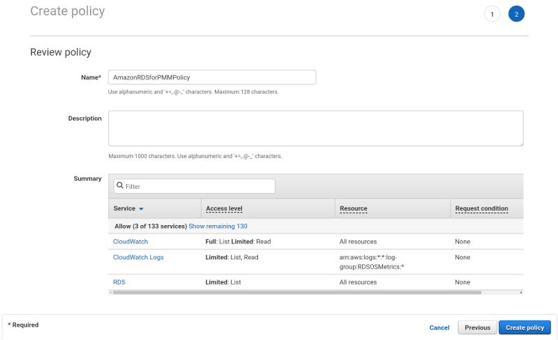
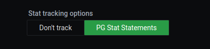

# Connect Amazon RDS instance

## Required settings

It is possible to use PMM for monitoring [Amazon RDS](https://aws.amazon.com/rds/). In this case, the PMM Client is not installed on the host where the database server is deployed. By using the PMM web interface, you connect to the Amazon RDS DB instance. You only need to provide the IAM user access key (or assign an IAM role) and PMM discovers the Amazon RDS DB instances available for monitoring.

First of all, ensure that there is the minimal latency between PMM Server and the Amazon RDS instance.

Network connectivity can become an issue for VictoriaMetrics to scrape metrics with 1 second resolution.  We strongly suggest that you run PMM Server on AWS (Amazon Web Services) in the same availability zone as Amazon RDS instances.

It is crucial that **enhanced monitoring** be enabled for the Amazon RDS DB instances you intend to monitor.

Set the **Enable Enhanced Monitoring** option in the settings of your Amazon RDS DB instance.


## Creating an IAM user with permission to access Amazon RDS DB instances

It is recommended that you use an IAM user account to access Amazon RDS DB instances instead of using your AWS account. This measure improves security as the permissions of an IAM user account can be limited so that this account only grants access to your Amazon RDS DB instances. On the other hand, you use your AWS account to access all AWS services.

The procedure for creating IAM user accounts is well described in the Amazon RDS documentation. This section only goes through the essential steps and points out the steps required for using Amazon RDS with Percona Monitoring and Management.

The first step is to define a policy which will hold all the necessary permissions. Then, you need to associate this policy with the IAM user or group. In this section, we will create a new user for this purpose.

## Creating a policy

A policy defines how AWS services can be accessed. Once defined it can be associated with an existing user or group.
{.power-number}

1. Select the **Policies** option on the navigation panel and click the **Create policy** button.

    

2. On the **Create policy** page, select the JSON tab and replace the existing contents with the following JSON document.

    ??? info "JSON"

        ```json
        { "Version": "2012-10-17",
        "Statement": [{ "Sid": "Stmt1508404837000",
                    "Effect": "Allow",
                    "Action": [ "rds:DescribeDBInstances",
                                "cloudwatch:GetMetricStatistics",
                                "cloudwatch:ListMetrics"],
                                "Resource": ["*"] },
                    { "Sid": "Stmt1508410723001",
                    "Effect": "Allow",
                    "Action": [ "logs:DescribeLogStreams",
                                "logs:GetLogEvents",
                                "logs:FilterLogEvents" ],
                                "Resource": [ "arn:aws:logs:*:*:log-group:RDSOSMetrics:*" ]}
                ]
        }
        ```

3. Click **Review policy** and set a name to your policy, such as `AmazonRDSforPMMPolicy`. Then, click the **Create policy** button.

    

## Creating an IAM user

Policies are attached to existing IAM users or groups. To create a new IAM user, select *Users* on the Identity and Access Management page at AWS. Then click *Add user* and complete the following steps:
{.power-number}

1. On the **Add user** page, set the user name and select the **Programmatic access** option under **Select AWS access type**. Set a custom password and then proceed to permissions by clicking the **Permissions** button.

    

2. On the **Set permissions** page, add the new user to one or more groups if necessary. Then, click *Review*.

3. On the **Add user** page, click **Create user**.

## Creating an access key for an IAM user

To discover an Amazon RDS DB instance in PMM, you either need to use the access key and secret access key of an existing IAM user or an IAM role. To create an access key for use with PMM, open the IAM console and click **Users** on the navigation pane. Then, select your IAM user.

To create the access key, open the **Security credentials** tab and click the **Create access key** button. The system automatically generates a new access key ID and a secret access key that you can provide on the **PMM Add Instance** dashboard to have your Amazon RDS DB instances discovered.

In case, the PMM Server and Amazon RDS DB instance were created by using the same AWS account, you do not need create the access key ID and secret access key manually. PMM retrieves this information automatically and attempts to discover your Amazon RDS DB instances.

## Attaching a policy to an IAM user

The last step before you are ready to create an Amazon RDS DB instance is to attach the policy with the required permissions to the IAM user.

First, make sure that the Identity and Access Management page is open and open *Users*. Then, locate and open the IAM user that you plan to use with Amazon RDS DB instances. Complete the following steps, to apply the policy:
{.power-number}

1. On the **Permissions** tab, click the **Add permissions** button.

2. On the **Add permissions** page, click **Attach existing policies directly**.

3. Using the **Filter**, locate the policy with the required permissions (such as `AmazonRDSforPMMPolicy`).

4. Select a check-box next to the name of the policy and click **Review**.

5. The selected policy appears on the **Permissions summary** page. Click **Add permissions**.

The `AmazonRDSforPMMPolicy` is now added to your IAM user.


## Creating an IAM role

Instead of creating an IAM user you can create an IAM role for a service, to discover Amazon RDS DB instances automatically without the need for access and secret keys. (But this only works if you are running PMM through AWS.)

To create an IAM role open the IAM console and click **Roles** on the navigation pane.
{.power-number}

1. Click the **Create role** button.

2. Select **AWS service** and select **EC2** for the use case.

3. Click the **Next: Permissions** button.

4. Find the policy created previously and select it.

5. Click the **Next: Tags** button.

6. (Optional) Add a metadata tag to the role.

7. Click the **Next: Review** button.

8. Fill the role name and description.

9. Click the **Create role** button

After the role is created EC2 instances running PMM will have permissions to discover RDS DB instances.

!!! note alert alert-primary ""
    It’s also possible to create an IAM role to delegate permissions to an IAM user or to add permissions to a user belonging to another AWS account. See the [official AWS documentation on creating IAM roles](https://docs.aws.amazon.com/IAM/latest/UserGuide/id_roles_create.html).

## Setting up the Amazon RDS DB Instance

Query Analytics requires Configuring Performance Schema as the query source, because the slow query log is stored on the AWS (Amazon Web Services) side, and QAN agent is not able to read it.  Enable the `performance_schema` option under `Parameter Groups` in Amazon RDS.

!!! caution alert alert-warning "Important"
    Enabling Performance Schema on T2 instances is not recommended because it can easily run the T2 instance out of memory.

When adding a monitoring instance for Amazon RDS, specify a unique name to distinguish it from the local instance.  If you do not specify a name, it will use the client’s host name.

Create the `pmm` user with the following privileges on the Amazon RDS instance that you want to monitor:

```sql
CREATE USER 'pmm'@'%' IDENTIFIED BY 'pass';
GRANT SELECT, PROCESS, REPLICATION CLIENT ON *.* TO 'pmm'@'%';
ALTER USER 'pmm'@'%' WITH MAX_USER_CONNECTIONS 10;
GRANT SELECT, UPDATE, DELETE, DROP ON performance_schema.* TO 'pmm'@'%';
```

## Adding an Amazon RDS, Aurora or Remote Instance

!!! caution alert alert-warning "Important"
    It may take longer for PMM to discover Amazon RDS instances in the `creating` state. You must wait a bit longer until PMM discovers these instances.


The preferred method of adding an Amazon RDS database instance to PMM is via the :material-cog: **PMM Configuration > PMM Inventory > Add Instance** menu option.

This method supports Amazon RDS database instances that use Amazon Aurora, MySQL, or MariaDB engines, as well as any remote PostgreSQL, ProxySQL, MySQL and MongoDB instances.

The following steps are needed to add an Amazon RDS database instance to PMM:
{.power-number}

1. In the PMM web interface, go to **PMM Configuration > PMM Inventory > Add Instance > Amazon RDS**.

    

2. Enter the access key ID and the secret access key of your IAM user or leave these fields empty if an IAM role was created.

3. Click the **Discover** button for PMM to retrieve the available Amazon RDS
instances.

    

4. For the instance that you would like to monitor, select the **Start monitoring** button.

5. You will see a new page with the number of fields. The list is divided into the following groups: **Main details**, **RDS database**, **Labels**, and **Additional options**. Some already known data, such as already entered **AWS access key**, are filled in automatically, and some fields are optional.

    

    The **Main details** section allows you to specify the DNS hostname of your instance, the service name to use within PMM, the port your service is listening on, and the database user name and password.

    

    The **Labels** section allows you to specify labels for the environment, the AWS region and availability zone to be used, the Replication set and Cluster names and also it allows you to set the list of custom labels in a key:value format.

    

    The **Additional options** section contains specific flags which allow you to tune the RDS monitoring. They can allow you to skip connection check, to use TLS for the database connection, not to validate the TLS certificate and the hostname, as well as to disable basic and/or enhanced metrics collection for the RDS instance to reduce costs.

    Also this section contains a database-specific flag, which would allow Query Analytics for the selected remote database:

    - when adding some remote MySQL, AWS RDS MySQL or Aurora MySQL instance, you will be able to choose using performance schema for the database monitoring;

    - when adding a PostgreSQL instance, you will be able to activate using `pg_stat_statements` extension;

    - when adding a MongoDB instance, you will be able to choose using Query Analytics MongoDB profiler.

6. Finally press the **Add service** button to start monitoring your instance.

## Adding an Amazon RDS PostgreSQL instance

For PostgreSQL, use the same method described above.
{.power-number}

1. In the PMM web interface, go to **PMM Configuration > PMM Inventory > Add Instance > Amazon RDS**.

    

2. Follow steps 4 to 6 as in the previous section. Fill the form and remember to select `PG Stat Statement` to enable Query Analytics.

    To get queries for Query Analytics, you need to enable `pg_stat_statements` in `postgres` database of your instance by running:

    ```sql
    CREATE EXTENSION pg_stat_statements SCHEMA public;
    ```

    
    