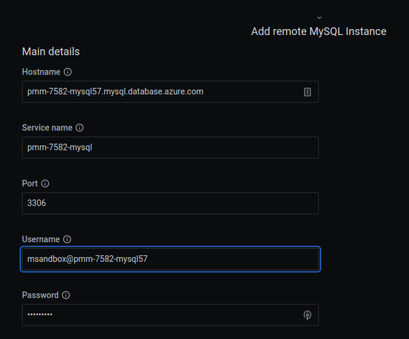
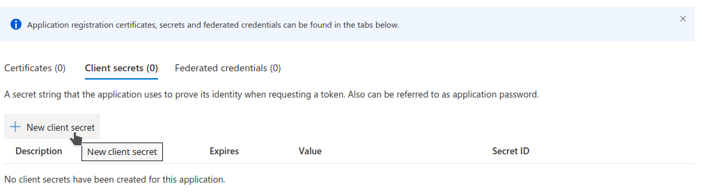
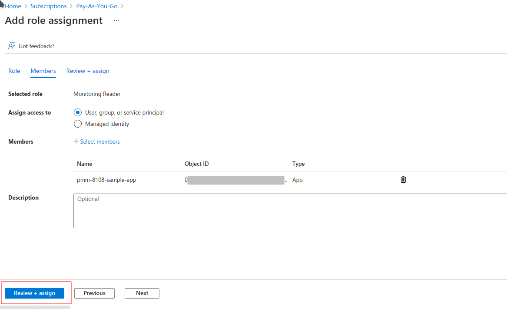

# Connect Azure instance

!!! caution alert alert-warning "Caution"
    Microsoft Azure functionality is currently in [technical preview](../../../reference/glossary.md#technical-preview) and is subject to change.

## Activate Microsoft Azure

The Microsoft Azure feature is turned off by default. To turn it on:
{.power-number}

1. Go to  **PMM Configuration > Settings > Advanced Settings**.

2. Click the <i class="uil uil-toggle-off"></i> toggle in the **Technical preview features** section of the page.

## Required settings

It is possible to use PMM for monitoring [Azure](https://azure.microsoft.com) database instances like other remote instances. In this case, the PMM Client is not installed on the host where the database server is deployed. By using the PMM web interface, you connect to the Azure DB instance. Discovery is not yet implemented in PMM but it is possible to add known instances by providing the connection parameters.

First of all, ensure that there is the minimal latency between PMM Server and the Azure instance.

Second, add a firewall rule to enable access from PMM Client like this:


## Setting up a MySQL instance

Query Analytics requires you to configure *Performance Schema* as the query source, because the slow query log is stored on the Azure side, and QAN agent is not able to read it.  Enable the `performance_schema` option under `Parameter Groups` in Azure MySQL databases.

When adding a monitoring instance for Azure, specify a unique name to distinguish it from the local MySQL instance.  If you do not specify a name, it will use the client’s host name.

Create the `pmm` user with the following privileges on the Azure MySQL database instance that you want to monitor:

```sql
CREATE USER 'pmm'@'%' IDENTIFIED BY 'pass';
GRANT SELECT, PROCESS, REPLICATION CLIENT ON *.* TO 'pmm'@'%';
ALTER USER 'pmm'@'%' WITH MAX_USER_CONNECTIONS 10;
```

## Adding an Azure instance

<!---Follow the instructions for remotes instances explained [here](aws.md), Azure MySQL databases are similar to AWS RDS databases. --->

Example:



and be sure to set *Performance Schema* as the query collection method for Query Analytics.


### MariaDB

MariaDB up to version 10.2 works out of the box but starting with MariaDB 10.3 instrumentation is disabled by default and cannot be enabled since there
is no SUPER role in Azure-MariaDB. So, it is not possible to run the required queries to enable instrumentation. Monitoring will work but Query Analytics
won't receive any query data.

### PostgreSQL

For PostgreSQL follow the same methods used for MySQL and MariaDB and enable `track_io_timing` in the instance configuration to enable Query Analytics.


For Query Analytics, set the server parameter:

```ini
pg_stat_statements.track = all
```

## To discover databases on Azure

You need to get the Client ID, Client Secret, Tenant ID and Subscription ID.

### Get the subscription ID

To get a subscription ID:
{.power-number}

1. Search **Subscriptions**, click on your subscription name


2. Copy the subscription ID


### Create a new application to get the tenant ID, client ID and the client secret

To get the tenant ID, client ID and the client secret:
{.power-number}

1. Search for **Azure Active Directory**


2. Register a new application


3. At this point you can copy the client and tenant IDs.


4. Create an application secret.




5. Copy the **value** of the application secret. Once you leave this page you won't be able to see the secret again and you will have to generate a new
   one.


6. Give API access permissions to your application.

    - Search for **Subscriptions** like in step 1.

    - Select your application and grant **Monitor Reader** permissions. This might require you to have admin permissions in your Azure account.




When you fill in all fields press the *Discover* button and you will see a list of available databases for monitoring.


You can monitor 6 types of databases:

- `Microsoft.DBforMySQL/servers`
- `Microsoft.DBforMySQL/flexibleServers`
- `Microsoft.DBforMariaDB/servers`
- `Microsoft.DBforPostgreSQL/servers`
- `Microsoft.DBforPostgreSQL/flexibleServers`
- `Microsoft.DBforPostgreSQL/serversv2`

You can find more details on how to create DB on Azure at:

- <https://docs.microsoft.com/en-us/azure/postgresql/>
- <https://docs.microsoft.com/en-us/azure/mysql/>

!!! hint alert alert-success "Tip"
    You must set `pg_stat_statements.track = all` in your PostgreSQL Server settings to use PMM Query Analytics. ([Read more.](postgresql.md#pg_stat_statements))


In the list of databases on the Discovery page click **Start Monitoring** to add the selected Azure Database to PMM.

Fill in all required fields and click **Add service**.

PMM can use 3 exporters to collect metrics:

- Azure Metrics Exporter – collect "system" metrics related to DB.

    - `node_cpu_average`
    - `azure_resource_info`
    - `node_filesystem_size_bytes`
    - `azure_memory_percent_average`
    - `azure_storage_percent_average`
    - `azure_storage_used_bytes_average`
    - `node_network_receive_bytes_total`
    - `node_network_transmit_bytes_total`

- `mysql_exporter` or `postgres_exporter` – to collect database related metrics.

- pmm-agent to collect queries related metrics using [`pg_stat_statements`](postgresql.md#pg_stat_statements) for PostgreSQL or Performance Schema for MySQL (MariaDB)

### Adding an Azure Instance on PMM Client side

TLS/SSL is enforced on the server by default. So please download the certificate needed to communicate over SSL with your Azure Database.
It can be done on Networking tab for your Azure Database instance.
{.power-number}

Also enforced TLS/SSL connection option can be disabled on server side.


Command for adding an azure database service for monitoring without TLS/SSL.

```sh
pmm-admin add mysql --username=azureuser --password=secure --host=azuremysql.mysql.database.azure.com --service-name=azure1 --query-source=perfschema
```

Downloaded certificate is named `DigiCertGlobalRootCA.crt.pem`.

An example of the command for adding an Azure database service for monitoring with TLS/SSL would be:

```sh
pmm-admin add mysql --username=azureuser --password=secure --host=azuremysql.mysql.database.azure.com --service-name=azure1 --query-source=perfschema --tls --tls-ca=DigiCertGlobalRootCA.crt.pem --tls-cert=client-cert.pem --tls-key=client-key.pem --tls-skip-verify
```
