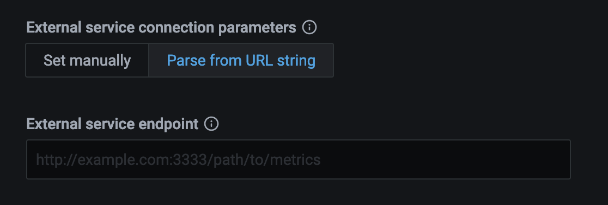

# Connect an external instance to PMM

## Add general external services

You can collect metrics from an external (custom) exporter on a node when:

- there is already a pmm-agent instance running and,
- this node has been [configured](../index.md) using the `pmm-admin config` command.

### Usage

```sh
pmm-admin add external --service-name=<service-name> --listen-port=<listen-port> --metrics-path=<metrics-path> --scheme=<scheme>
```

```sh
pmm-admin add external-serverless --external-name=<external-service-name> --host=<hostname> --listen-port=<listen-port> --metrics-path=<metrics-path> --scheme=<scheme>
```

## TLS certificate verification

When connecting to external services over HTTPS, PMM performs TLS certificate validation by default to ensure secure connections. However, in some scenarios you may need to skip this validation. Use the `--tls-skip-verify` flag when monitoring services with:

- self-signed certificates
- development environments where proper certificates aren't configured
- IP-based endpoints that lack proper certificate Subject Alternative Names (SANs)
- PostgreSQL Operator deployments with HAProxy that use self-signed certificates
- encounter errors like `Connection check failed: Get "https://127.0.0.1:8008/metrics": tls: failed to verify certificate: x509: cannot validate certificate for 127.0.0.1 because it doesn't contain any IP SANs`, you can resolve this by adding the `--tls-skip-verify` flag to your command.


!!! warning "Security warning"
    Using `--skip-tls-verify` disables TLS certificate validation and should only be used in development environments or when connecting to trusted services with certificate issues. This makes connections vulnerable to man-in-the-middle attacks.

##  Examples with TLS skip verification

```sh
# 🆕 External service with TLS verification skipped
pmm-admin add external --listen-port=8008 --scheme=https --tls-skip-verify

# 🆕 External serverless with TLS verification skipped  
pmm-admin add external-serverless --host=example.com --listen-port=9093 --scheme=https --tls-skip-verify

# 🆕 HAProxy with TLS verification skipped (useful for PostgreSQL Operator deployments)
pmm-admin add haproxy --listen-port=8404 --scheme=https --tls-skip-verify
```

## Get data from external exporters

There two ways to get metrics from other exporters:

- `external` will collect metrics from the exporter that is run on the same host as PMM Client's connection to it by a port. (See more details with `pmm-admin add external --help`.)

- `external-serverless` is useful for collecting metrics from cloud services. You need a host and port number to add it to PMM Server. (See more details with `pmm-admin add external-serverless --help`.)

Here are the differences between `external` and `external-serverless` types.

Connection schema of external exporter:


Connection schema of external serverless exporter:


## Add a service not supported by PMM

PMM can collect any metrics in [Open metrics](https://openmetrics.io) or [Prometheus exposition](https://prometheus.io/docs/instrumenting/exposition_formats/) format. You must specify the host and port of these metrics using the `pmm-admin add external` or `pmm-admin add external-serverless` commands.

From this point, PMM will collect and store available metrics.

To browse and visualize collected metrics as a first step, we can look at the Advanced Data Exploration dashboard and select informative services and metrics.


Another way is to create a [new Grafana Dashboard to PMM as needed](https://grafana.com/docs/grafana/latest/best-practices/best-practices-for-creating-dashboards/).

One more way is to search for an already created dashboard at <https://grafana.com/grafana/dashboards> for the added exporter and import it into PMM.

### Third-party exporters

You can find more exporters on the [official Prometheus page](https://prometheus.io/docs/instrumenting/exporters/).

### Custom exporter

You can create a custom external exporter or extend your application to expose metrics in [Prometheus exposition format](https://prometheus.io/docs/instrumenting/exposition_formats/). This gives you complete control over what metrics are collected and how they're exposed. To learn how to build your own exporter, see [Writing Exporter in the Prometheus Docs](https://prometheus.io/docs/instrumenting/writing_exporters).

??? info "Example: Add an HTTP exporter"

    ```sh
    root@mysql1:~# pmm-admin add external --group=processes  --listen-port=9256
    External Service added.
    Service ID  : 6485f4fd-745b-4dfb-8b72-328e300f8b50
    Service name: mysql1-processes
    Group       : processes
    ```

    This command: 
    - adds an exporter running on local port 9256 to the group called `processes`.
    - automatically generates the service name using the host and group names.
    - uses the default scheme (http) and metrics path (/metrics).


??? info "Example: Add an HTTPS exporter (Skip TLS verification)"


    ```sh
    root@mysql1:~# pmm-admin add external --group=processes --listen-port=8008 --scheme=https --tls-skip-verify
    External Service added.
    Service ID  : 7b96c5fe-856c-4efc-9c83-439f411g9c61
    Service name: mysql1-processes
    Group       : processes
    ```

    This command:

    - adds an HTTPS exporter on local port `8008`.
    - uses the `--tls-skip-verify` flag to bypass TLS certificate validation (for development or testing only!)
    - automatically generates the service name using the host and group names.


## Add an external service via UI

To add an external service via PMM UI:
{.power-number}

1. In the PMM web interface, go to **PMM Configuration > PMM Inventory > Add Service > External Service**.

    

2. Fill in the form and set the external service endpoint: 

    -  manually OR:

        

    - by parsing required data from a URL string. In this case you only need to pass a valid URL:

        

3. For HTTPS connections: If your external service uses HTTPS with self-signed certificates or certificates that don't properly validate, check the **Skip TLS certificate and hostname validation** option under **PMM Configuration > PMM Inventory > Services** section.

