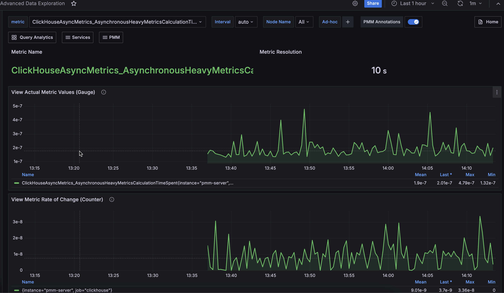

# Connect HAProxy databases to PMM

## Adding HAProxy

You can collect metrics from [HAProxy](https://www.haproxy.com/) on a node when:

- There is already a configured haproxy instance.
{.power-number}

  1. See [How to configure HAProxy](https://www.haproxy.com/blog/haproxy-exposes-a-prometheus-metrics-endpoint).
  2. After HAProxy is running (default address `<http://localhost:8404/metrics>`) you can add it to PMM.
  3. Use the `haproxy` alias to enable HAProxy metrics monitoring.

- There is already a pmm-agent instance running.

- This node has been configured using the `pmm-admin config` command.

## USAGE

```sh
pmm-admin add haproxy --listen-port=8404
```

where `listen-port` is the port number where HAProxy running. (This is the only required flag.)

The output of this command should look as follows:

```txt
HAProxy Service added.
Service ID  : c481183f-70a2-443f-91e5-cae5cecd06a2
Service name: Ubuntu-haproxy
```

Additionally, one positional argument can be appended to the command line flags: a service name to be used by PMM. If not specified, they are substituted automatically as `<node>-haproxy`.

During adding here is connection check (can be skipped by flag `--skip-connection-check`). If HAProxy doesn't run properly on the given port then you will see an error message:

```txt
Connection check failed: Get "http://127.0.0.1:8404/metrics": dial tcp 127.0.0.1:8404: connect: connection refused.
```

Beside positional argument shown above you can specify service name  with the following flags: `--username`, `--password`, `--metrics-path` (path for scraping metrics, default: /metrics) and `--scheme` (http or https). Here are some examples:

```sh
pmm-admin add haproxy --listen-port=8404 --username=pmm --password=pmm new-haproxy
pmm-admin add haproxy --listen-port=8404 --metrics-path=/prom-metrics --scheme=https
```

Here you can check list of all available flags: [pmm-admin](../../../use/commands/pmm-admin.md).

You can also add HAProxy by UI: Select  **PMM Configuration > PMM Inventory > Add Instance**.

HAProxy data is visible in the **Advanced Data Exploration** dashboard:


