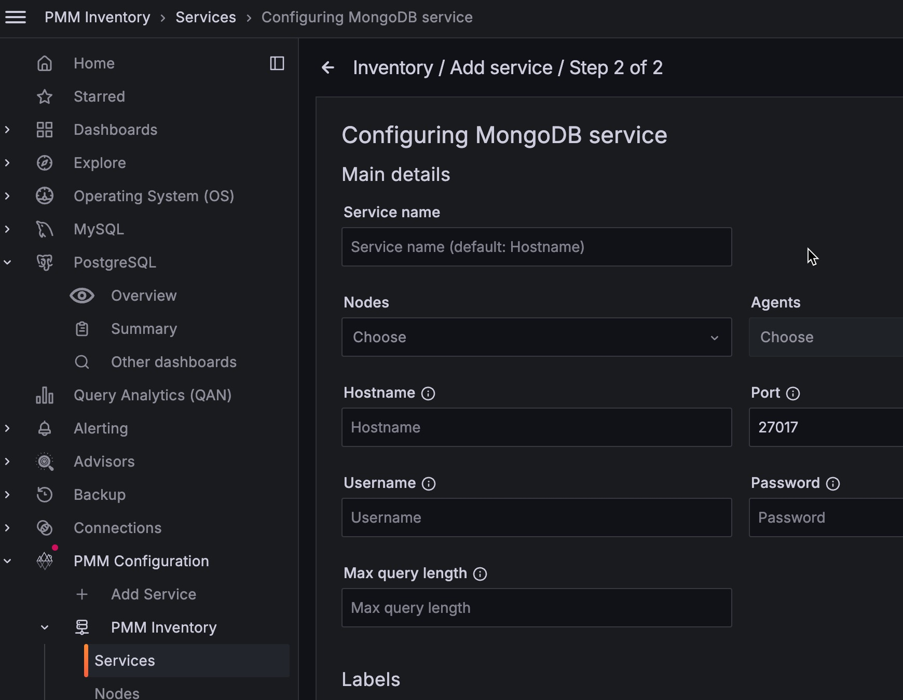

# Connect MongoDB instance

How to set up PMM to monitor a [MongoDB] or [Percona Server for MongoDB] database instance.

## Before you start

Check that:

- [PMM Server is installed](../../install-pmm-server/index.md) and running with a known IP address or hostname accessible from the client node.
- [PMM Client is installed](../../install-pmm-client/index.md) and the [nodes are registered with PMM Server](../../register-client-node/index.md).
- You have superuser (root) access on the client host.
- You have `adminUserAnyDatabase` or superuser role privilege to any database servers that you want to monitor.
- Your MongoDB server is version 4.0 or higher.

## Create PMM account and set permissions

We recommend using a dedicated account to connect PMM Client to the monitored database instance.

Run the example codes below in a `mongo` session to:

-  create custom roles with the privileges required for creating/restoring backups and working with Query Analytics (QAN)
-  create/update a database user with these roles above, plus the built-in  `clusterMonitor` role
  
!!! caution alert alert-warning ""
    Values for username (`user`) and password (`pwd`) are examples. Replace them before using these code snippets.

=== "Create roles with privileges for backups and QAN"
        db.getSiblingDB("admin").createRole({
            role: "explainRole",
            privileges: [{
                resource: {
                    db: "",
                    collection: ""
                    },
                actions: [
                    "listIndexes",
                    "listCollections",
                    "dbStats",
                    "dbHash",
                    "collStats",
                    "find"
                    ]
                }],
            roles:[]
        })

        db.getSiblingDB("admin").createRole({ "role": "pbmAnyAction",
            "privileges": [
            { "resource": { "anyResource": true },
                "actions": [ "anyAction" ]
            }
            ],
            "roles": []
         });

=== "Ceate/update user and assign created roles"
        db.getSiblingDB("admin").createUser({
            user: "pmm",
            pwd: "pmm",
            roles: [
                { role: "explainRole", db: "admin" },
                { role: "clusterMonitor", db: "admin" },
                { role: "read", db: "local" },
                { "db" : "admin", "role" : "readWrite", "collection": "" },
                { "db" : "admin", "role" : "backup" },
                { "db" : "admin", "role" : "clusterMonitor" },
                { "db" : "admin", "role" : "restore" },
                { "db" : "admin", "role" : "pbmAnyAction" }
            ]
        })
        db.getSiblingDB("admin").updateUser("pmm", {
        roles: [
            { role: "explainRole", db: "admin" },
            { role: "clusterMonitor", db: "admin" },
            { role: "read", db: "local" },
            { "db" : "admin", "role" : "readWrite", "collection": "" },
            { "db" : "admin", "role" : "backup" },
            { "db" : "admin", "role" : "clusterMonitor" },
            { "db" : "admin", "role" : "restore" },
            { "db" : "admin", "role" : "pbmAnyAction" }
        ]
        })

### Permissions for advanced metrics

To fetch advanced metrics like usage statistics for collection and indexes, use the following to provide additional privileges to an existing PMM user:

```{.javascript data-prompt=">"}
db.getSiblingDB("admin").updateRole(
  "explainRole",
  {
    privileges: [
      {
        resource: { db: "", collection: "" },
        actions: ["collStats", "dbStats", "indexStats"]
      }
    ]
  }
)
```

## Profiling

To use PMM Query Analytics, you must turn on MongoDB's [profiling feature].

You can set profiling:

- permanently, by editing the MongoDB configuration file  and restarting the database instance (recommended);
- when starting MongoDB, by passing arguments to `mongod` on the command line;
- until the next database instance restart, by running a command in a `mongo` session.

!!! note alert alert-primary ""
    Profiling is turned off by default as it can adversely affect the performance of the database server.

### Set profiling in the configuration file

To set profiling in the configuration file:
{.power-number}

1. Edit the configuration file (usually `/etc/mongod.conf`).

2. Create or add this to the `operationProfiling` section. ([Read more][MONGODB_CONFIG_OP_PROF].)

    ```yml
    operationProfiling:
      mode: all
      slowOpThresholdMs: 200
      rateLimit: 100 # (Only available with Percona Server for MongoDB.)
    ```

    !!! caution alert alert-warning "Important"
        This is a [YAML] file. Indentation matters.

3. Restart the `mongod` service. (Example for `systemd`.)

    ```sh
    systemctl restart mongod
    ```

### Set profiling on the command Line

```sh
mongod --dbpath=DATABASEDIR --profile 2 --slowms 200 --rateLimit 100
```

- `--dbpath`: The path to database files (usually `/var/lib/mongo`).
- `--profile`: The MongoDB profiling level. A value of `2` tells the server to collect profiling data for *all* operations. To lower the load on the server, use a value of `1` to only record slow operations.
- `--slowms`: An operation is classified as *slow* if it runs for longer than this number of milliseconds.
- `--rateLimit`: (Only available with Percona Server for MongoDB.) The sample rate of profiled queries. A value of `100` means sample every 100th fast query. ([Read more][PSMDB_RATELIMIT].)

    !!! caution alert alert-warning "Caution"
        Smaller values improve accuracy but can adversly affect the performance of your server.

### Set profiling in a `mongo` session

In a `mongo` session, the profiler should be enabled **per** database.
For example, to enable the profiler in the `testdb`, run this:

```json
use testdb
db.setProfilingLevel(2, {slowms: 0})
```

!!! note alert alert-primary ""
    If you have already [added a service](#add-service), you should remove it and re-add it after changing the profiling level.

## Add service

When you have configured your database server, you can add a MongoDB service with the user interface or on the command line.

!!! caution alert alert-warning "Important"
    To monitor MongoDB sharded clusters, PMM requires access to all cluster components. Make sure to add all config servers, shards, and mongos. Otherwise, PMM will not be able to correctly collect metrics and populate dashboards.

### With the user interface

To add a service with the UI:
{.power-number}

1. Select **PMM Configuration > Add Service > MongoDB**.

2. Enter or select values for the fields.

3. Click **Add service**.



### On the command line

Use `pmm-admin` to add the database server as a service using one of these example commands.

When successful, PMM Client will print `MongoDB Service added` with the service's ID and name. Use the `--environment` and `-custom-labels` options to set tags for the service to help identify them.

!!! hint alert alert-success "Tips"
    - When adding nodes of a sharded cluster, add each node separately using the `--cluster mycluster` option for the [MongoDB Cluster Summary](../../details/dashboards/dashboard-mongodb-cluster-summary.md) dashboard to populate correctly. Also use the `--replication-set` option to specify a replication set. Example: `--replication-set config` for your config servers; `--replication-set rs1` for your servers in the first replica set, `--replication-set rs2` for your servers in the second replica set, and so on.

### Examples

```sh
pmm-admin add mongodb \
--username=pmm_mongodb --password=password \
--query-source=profiler --cluster=mycluster
```

```sh
pmm-admin add mongodb \
--username=pmm_mongodb --password=password \
mongo 127.0.0.1:27017
```

```sh
pmm-admin add mongodb \
--username=pmm_mongodb --password=password \
--service-name=mymongosvc --host=127.0.0.1 --port=27017
```

#### Connect via UNIX socket

```sh
pmm-admin add mongodb --socket=/tmp/mongodb-27017.sock
```

#### Connecting via SSL/TLS

```sh
pmm-admin add mongodb --tls \
--tls-certificate-key-file=PATHTOCER \
--tls-certificate-key-file-password=IFPASSWORDTOCERTISSET \
--tls-ca-file=PATHTOCACERT
--authentication-mechanism=AUTHENTICATION-MECHANISM
--authentication-database=AUTHENTICATION-DATABASE
```

where:

- `PATHTOCERT`: Path to TLS certificate file.
- `IFPASSWORDTOCERTISSET`: Password for TLS certificate file.
- `PATHTOCACERT`: Path to certificate authority file.
- `AUTHENTICATION-MECHANISM`: Authentication mechanism. Default is empty. Use `MONGODB-X509` for SSL certificates.
- `AUTHENTICATION-DATABASE`: Authentication database. Default is empty. Use `$external` for SSL certificates.

## Check the service

### From the user interface

To check the service from the UI:
{.power-number}

1. Select  **PMM Configuration > Inventory > MongoDB**.

2. Enter or select values for the fields.

3. Click **Add service**.


### On the command line

Look for your service in the output of this command.

```sh
pmm-admin inventory list services --service-type=mongodb
```

### Check data

To check the data:
{.power-number}

1. Open the **MongoDB Instances Overview** dashboard.
2. Set the **Service Name** to the newly-added service.

#### Query Analytics

To see the query analytics for the service:
{.power-number}

1. Open **PMM Query Analytics**.
2. In the **Filters** panel:
    1. Under **Service Name**, select your service.
    2. Under **Service Type** select `mongodb`.

## Remove service

### With the user interface

To remove the service from the UI:
{.power-number}

1. Select **PMM Configuration > Inventory**.
2. In the **Services** tab, verify the **Service name**, **Addresses**, and any other relevant values used when adding the service.
3. In the **Options** column, expand the **Details** section and check that the Agents are using the desired data source.
4. If your MongoDB instance is configured to use TLS, click on the **Use TLS for database connection** check box and fill in TLS certificates and keys.
If you use TLS, the authentication mechanism is automatically set to `MONGODB-X509`.

    

### On the command line

```sh
pmm-admin remove mongodb SERVICE_NAME
```

- `SERVICE_NAME`: The name the service was added as. (Find it with `pmm-admin list`.)

!!! seealso alert alert-info "See also"
    - [`pmm-admin add mongodb`](../../../use/commands/pmm-admin.md#mongodb)
    - [Troubleshooting connection difficulties]

[MongoDB]: https://www.mongodb.com/
[Percona Server for MongoDB]: https://www.percona.com/software/mongodb/percona-server-for-mongodb
[profiling feature]: https://docs.mongodb.com/manual/tutorial/manage-the-database-profiler/
[YAML]: http://yaml.org/spec/
[MONGODB_CONFIG_OP_PROF]: https://docs.mongodb.com/manual/reference/configuration-options/#operationprofiling-options
[PSMDB_RATELIMIT]: https://www.percona.com/doc/percona-server-for-mongodb/LATEST/rate-limit.html#enabling-the-rate-limit
[PMM_ADMIN_MAN_PAGE]: ../../../use/commands/pmm-admin.md#mongodb
[Troubleshooting connection difficulties]: ../../../troubleshoot/config_issues.md#connection-difficulties
