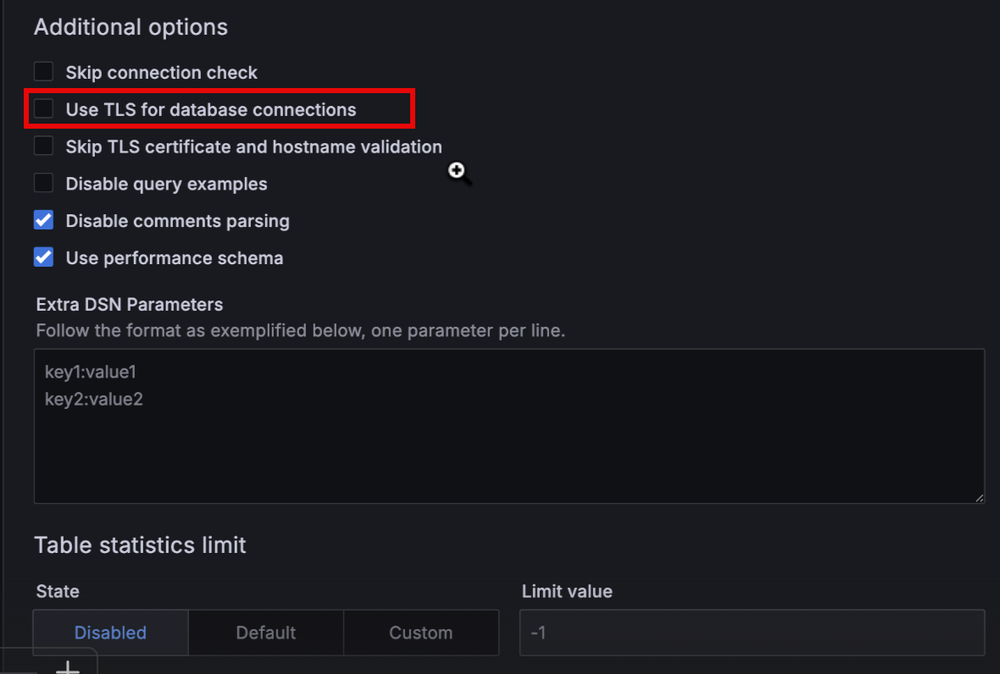

# Connect a self-hosted or an AWS EC2 MySQL database to PMM


PMM Client collects metrics from [MySQL][ORACLE_MYSQL], [Percona Server for MySQL][PERCONA_SERVER_MYSQL], [Percona XtraDB Cluster][PERCONA_XTRADB_CLUSTER], and [MariaDB][MARIADB]. (Amazon RDS is also supported and explained in a [separate section](aws.md).)

??? info "Summary"

    !!! summary alert alert-info ""
        - [Create PMM account and set permissions.](#create-a-database-account-for-pmm)
        - [Choose a data source](#choose-and-configure-a-source):
            - [Slow query log](#slow-query-log), or,
            - [Performance Schema](#performance-schema).
        - Configure:
            - [Query response time](#query-response-time),
            - [Tablestats](#tablestats),
            - [User statistics](#user-statistics).
        - [Add service](#add-service).
        - [Check the service](#check-the-service).

## Before you start

Check that:

- [PMM Server is installed](../../install-pmm-server/index.md) and running with a known IP address accessible from the client node.
- [PMM Client is installed](../../install-pmm-client/index.md) and the [nodes are registered with PMM Server](../../register-client-node/index.md).
- You have superuser (root) access on the client host.

## Create a database account for PMM

For security, connect PMM Client to your database using a dedicated monitoring user with limited permissions. This example creates a pmm user account that has just enough access to collect monitoring data without full administrative privileges.

!!! warning "Password security"
    - Use a strong, unique password for the PMM database user
    - At least 12 characters long
    - Mix of uppercase and lowercase letters
    - Include numbers and special characters
    - Avoid common words or patterns
    - Never use default, test, or example passwords in production


=== "On MySQL 5.7"

    ```sql
    CREATE USER 'pmm'@'127.0.0.1' IDENTIFIED BY '<your_strong_password>' WITH MAX_USER_CONNECTIONS 10;
    GRANT SELECT, PROCESS, REPLICATION CLIENT, RELOAD ON *.* TO 'pmm'@'localhost';
    ```

=== "On MySQL 8.0"

    ```sql
    CREATE USER 'pmm'@'localhost' IDENTIFIED BY '<your_strong_password>' WITH MAX_USER_CONNECTIONS 10;
    GRANT SELECT, PROCESS, REPLICATION CLIENT, RELOAD, BACKUP_ADMIN ON *.* TO 'pmm'@'localhost';
    ```

## Choose and configure a source

Decide which source of metrics to use, and configure your database server for it. The choices are [Slow query log](#slow-query-log) and [Performance Schema](#performance-schema).

While you can use both at the same time we recommend using only one--there is some overlap in the data reported, and each incurs a small performance penalty. The choice depends on the version and variant of your MySQL instance, and how much detail you want to see.

Here are the benefits and drawbacks of *Slow query log* and *Performance Schema* metrics sources.

| | <i class="uil uil-thumbs-up"></i> Benefits | <i class="uil uil-thumbs-down"></i> Drawbacks
|---|---|-------------
| **Slow query log** | 1. More detail.<br>2. Lower resource impact (with query sampling feature in Percona Server for MySQL). | 1. PMM Client must be on same host as database server or have access to slow query log.<br>2. Log files grow and must be actively managed.
| **Performance Schema** | 1. Faster parsing.<br>2. Enabled by default on newer versions of MySQL. | 1. Less detail.

### Data source recommendations

| Database server          | Versions       | Recommended source |
|--------------------------|----------------|--------------------|
| MySQL                    | 5.1-5.5        | Slow query log     |
| MySQL                    | 5.6+           | Performance Schema |
| MariaDB                  | 10.0+          | Performance Schema |
| Percona Server for MySQL | 5.7, 8.0       | Slow query log     |
| Percona XtraDB Cluster   | 5.6, 5.7, 8.0  | Slow query log     |

### Slow query log

This section covers how to configure a MySQL-based database server to use the *slow query log* as a source of metrics.

### Applicable versions

| Server                   | Versions         |
|--------------------------|------------------|
| MySQL                    | 5.1-5.5          |
| MariaDB                  | 10.1.2+          |
| Percona Server for MySQL | 5.7.10+, 8.0.12+ |
| Percona XtraDB Cluster   | 5.6, 5.7, 8.0    |

The *slow query log* records the details of queries that take more than a certain amount of time to complete. With the database server configured to write this information to a file rather than a table, PMM Client parses the file and sends aggregated data to PMM Server via the Query Analytics part of pmm-agent.

### Settings

| Variable                                                        | Value  |Description
|-----------------------------------------------------------------|--------|----------------------------------------------------------
| [`slow_query_log`][sysvar_slow_query_log]                       | ON     | Enables the slow query log.
| [`log_output`][sysvar_log_output]                               |`'FILE'`| Ensures the log is sent to a file. (This is the default on MariaDB.)
| [`long_query_time`][sysvar_long_query_time]                     | 0      | The slow query threshold in seconds. In heavily-loaded applications, many quick queries can affect performance more than a few slow ones. Setting this value to `0` ensures all queries are captured.
| [`log_slow_admin_statements`][sysvar_log_slow_admin_statements] | ON     | Includes the logging of slow administrative statements.
| [`log_slow_slave_statements`][sysvar_log_slow_slave_statements] | ON     | Enables logging for queries that have taken more than `long_query_time` seconds to execute on the replica.

??? info "Examples"

    - Configuration file:

        ```ini
        slow_query_log=ON
        log_output=FILE
        long_query_time=0
        log_slow_admin_statements=ON
        log_slow_slave_statements=ON
        ```

    - Session:

        ```sql
        SET GLOBAL slow_query_log = 1;
        SET GLOBAL log_output = 'FILE';
        SET GLOBAL long_query_time = 0;
        SET GLOBAL log_slow_admin_statements = 1;
        SET GLOBAL log_slow_slave_statements = 1;
        ```

#### Slow query log -- extended

Some MySQL-based database servers support extended slow query log variables.

##### Applicable versions

| Server                   | Versions
|--------------------------|-----------------
| Percona Server for MySQL | 5.7.10+, 8.0.12+
| Percona XtraDB Cluster   | 5.6, 5.7, 8.0
| MariaDB                  | 10.0

##### Settings

| Variable                                                                 | Value | Description
|--------------------------------------------------------------------------|-------|-----------------------------------------------------------------------------------
| [`log_slow_rate_limit`][log_slow_rate_limit]                             | 100   | Defines the rate of queries captured by the *slow query log*. A good rule of thumb is 100 queries logged per second. For example, if your Percona Server instance processes 10,000 queries per second, you should set `log_slow_rate_limit` to `100` and capture every 100th query for the *slow query log*. Depending on the amount of traffic, logging could become aggressive and resource consuming. This variable throttles the level of intensity of the data capture without compromising information.
| [`log_slow_rate_type`][log_slow_rate_type]                               |'query'| Set so that it applies to queries, rather than sessions.
| [`slow_query_log_always_write_time`][slow_query_log_always_write_time]   | 1     | Specifies which queries should ignore sampling. With query sampling this ensures that queries with longer execution time will always be captured by the slow query log, avoiding the possibility that infrequent slow queries might not get captured at all.
| [`log_slow_verbosity`][log_slow_verbosity]                               |'full' | Ensures that all information about each captured query is stored in the slow query log.
| [`slow_query_log_use_global_control`][slow_query_log_use_global_control] |'all'  | Configure the slow query log during runtime and apply these settings to existing connections. (By default, slow query log settings apply only to new sessions.)

??? info "Examples"

    - Configuration file (Percona Server for MySQL, Percona XtraDB Cluster):

        ```sh
        log_slow_rate_limit=100
        log_slow_rate_type='query'
        slow_query_log_always_write_time=1
        log_slow_verbosity='full'
        slow_query_log_use_global_control='all'
        ```

    - Configuration file (MariaDB):

        ```sh
        log_slow_rate_limit=100
        ```

    - Session (Percona Server for MySQL, Percona XtraDB Cluster):

        ```sh
        SET GLOBAL log_slow_rate_limit = 100;
        SET GLOBAL log_slow_rate_type = 'query';
        SET GLOBAL slow_query_log_always_write_time = 1;
        SET GLOBAL log_slow_verbosity = 'full';
        SET GLOBAL slow_query_log_use_global_control = 'all';
        ```

#### Slow query log rotation

Slow query log files can grow quickly and must be managed.

When adding a service with the command line use the  `pmm-admin` option `--size-slow-logs` to set at what size the slow query log file is rotated. (The size is specified as a number with a suffix. See [`pmm-admin add mysql`](../../../use/commands/pmm-admin.md#mysql).)

When the limit is reached, PMM Client will:

- remove the previous `.old` slow log file,
- rename the current file by adding the suffix `.old`,
- execute the MySQL command `FLUSH LOGS`.

Only one `.old` file is kept. Older ones are deleted.

You can manage log rotation yourself, for example, with [`logrotate`][LOGROTATE]. If you do, you can disable PMM Client's log rotation by providing a negative value to `--size-slow-logs` option when adding a service with `pmm-admin add`.

### Performance Schema

This section covers how to configure a MySQL-based database server to use *Performance Schema* as a source of metrics.

#### Applicable versions

| Server                   | Versions
|--------------------------|-----------------------------------------
| Percona Server for MySQL | 5.6, 5.7, 8.0
| Percona XtraDB Cluster   | 5.6, 5.7, 8.0
| MariaDB                  | [10.3+][mariadb_perfschema_instr_table]

PMM's [*MySQL Performance Schema Details* dashboard](../../../use/dashboards/dashboard-mysql-performance-schema-details.md) charts the various [`performance_schema`][performance-schema-startup-configuration] metrics.

To use **Performance Schema**, set these variables:

| Variable                                                                                   | Value              | Description
|--------------------------------------------------------------------------------------------|--------------------|---------------------------------------------------------------------------------
| [`performance_schema`][sysvar_performance_schema]                                          | `ON`               | Enables *Performance Schema* metrics. This is the default in MySQL 5.6.6 and higher.
| [`performance-schema-instrument`][perfschema-instrument]                                   | `'statement/%=ON'` | Configures Performance Schema instruments.
| [`performance-schema-consumer-statements-digest`][perfschema-consumer-statements-digest]   | `ON`               | Configures the `statements-digest` consumer.
| [`innodb_monitor_enable`][sysvar_innodb_monitor_enable]                                    | all                | Enables InnoDB metrics counters.

??? info "Examples"

    - Configuration file:

        ```ini
        performance_schema=ON
        performance-schema-instrument='statement/%=ON'
        performance-schema-consumer-statements-digest=ON
        innodb_monitor_enable=all
        ```

    - Session:

        (`performance_schema` cannot be set in a session and must be set at server start-up.)

        ```sql
        UPDATE performance_schema.setup_consumers
        SET ENABLED = 'YES' WHERE NAME LIKE '%statements%';
        SET GLOBAL innodb_monitor_enable = all;
        ```

#### MariaDB 10.5.7 or lower

There is no **Explain** or **Example** data shown by default in Query Analytics when monitoring MariaDB instances version 10.5.7 or lower. A workaround is to set this variable.

| Variable                                                                  | Value           | Description
|---------------------------------------------------------------------------|-----------------|-----------------------------
| [`performance_schema.setup_instruments`][mariadb_perfschema_instr_table]  | `'statement/%'` | List of instrumented object classes.

- **Session**

    ```sql
    UPDATE performance_schema.setup_instruments SET ENABLED = 'YES', TIMED = 'YES' WHERE NAME LIKE 'statement/%';
    UPDATE performance_schema.setup_consumers SET ENABLED = 'YES' WHERE NAME LIKE '%statements%';
    ```

- **Transactions**

    MariaDB doesn't implement queries history for transactions. All queries executed within a transaction won't have query examples since PMM relies on the `performance_schema.events_statements_history` to grab the query example but that table won't have any query executed as part of a transaction.  

    This behavior is because MariaDB doesn't implement these consumers:

    ```
    events_transactions_current
    events_transactions_history
    events_transactions_history_long
    ```

## Query response time

**Query time distribution** is a chart in the [**Details** tab of Query Analytics](../../../use/qan/panels/details.md#details-tab) showing the proportion of query time spent on various activities. It is enabled with the `query_response_time_stats` variable and associated plugins.

### Applicable versions

| Server                   | Versions
|--------------------------|------------
| Percona Server for MySQL | 5.7 (**not** [Percona Server for MySQL 8.0][PS_FEATURES_REMOVED].)
| MariaDB                  | 10.0.4

Set this variable to see query time distribution charts.

| Variable                                                    | Value | Description
|-------------------------------------------------------------|-------|-----------------------------------------------------------------------------------
| [`query_response_time_stats`][ps_query_response_time_stats] | ON    | Report *query response time distributions*. (Requires plugin installation. See below.)

- Configuration file:

    ```ini
    query_response_time_stats=ON
    ```

You must also install the plugins.

- **Session**
    Before installing the plugins, ensure you have the necessary plugin files and run these commands in your MySQL session:
    {.power-number}

    1. Check that `/usr/lib/mysql/plugin/query_response_time.so` exists.
    2. Install the plugins and activate.

    === "For [MariaDB 10.3][mariadb_query_response_time]"

        ```sql
        INSTALL PLUGIN QUERY_RESPONSE_TIME_AUDIT SONAME 'query_response_time.so';
        INSTALL PLUGIN QUERY_RESPONSE_TIME SONAME 'query_response_time.so';
        SET GLOBAL query_response_time_stats = ON;
        ```

    ===  "For [Percona Server for MySQL 5.7][ps_query_response_time_stats]"

        ```sql
        INSTALL PLUGIN QUERY_RESPONSE_TIME_AUDIT SONAME 'query_response_time.so';
        INSTALL PLUGIN QUERY_RESPONSE_TIME SONAME 'query_response_time.so';
        INSTALL PLUGIN QUERY_RESPONSE_TIME_READ SONAME 'query_response_time.so';
        INSTALL PLUGIN QUERY_RESPONSE_TIME_WRITE SONAME 'query_response_time.so';
        SET GLOBAL query_response_time_stats = ON;
        ```

## Tablestats

Some table metrics are automatically disabled when the number of tables exceeds a default limit of 1000 tables. This prevents PMM Client from affecting the performance of your database server.

The limit can be changed [when adding a service on the command line](#command-line) with the two `pmm-admin` options:

| `pmm-admin` option             | Description
|--------------------------------|--------------------------------------------------------------------------
| `--disable-tablestats`         | Disables tablestats collection when the default limit is reached.
| `--disable-tablestats-limit=N` | Sets the number of tables (`N`) for which tablestats collection is disabled. 0 means no limit. A negative number means tablestats is completely disabled (for any number of tables).

## User statistics

### Applicable versions

User activity, individual table and index access details are shown on the [MySQL User Details][DASH_MYSQLUSERDETAILS] dashboard when the `userstat` variable is set.

| Server                   | Versions
|--------------------------|---------------
| Percona Server for MySQL | 5.6, 5.7, 8.0
| Percona XtraDB Cluster   | 5.6, 5.7, 8.0
| MariaDB                  | 5.2.0+

??? info "Examples"

    - Configuration file.

        ```ini
        userstat=ON
        ```

    - Session.

        ```sql
        SET GLOBAL userstat = ON;
        ```

## Add service

There are two ways to install  PMM Client  for monitoring your MySQL database:
{.power-number}

1. [Local installation](#Install-PMM-Client locally): Installs PMM Client directly on the database node, collecting both database and OS/host metrics. This option enables more effective comparison and problem identification.
2. [Remote instance](#Install-PMM-Client-as-a-remote-instance): Use when local installation isn't possible. This method doesn't provide OS/Node metrics in PMM.


### Install PMM Client locally

Add the MySQL server as a service using one of the following example commands. 
Upon successful addition, PMM Client will display "MySQL Service added" along with the service's ID and name. 
{.power-number}

1. Select **PMM Configuration > PMM Inventory > Add Service > MySQL**.

2. Enter or select values for the fields.

3. Click **Add service**.

    

If your MySQL instance is configured to use TLS, click on the **Use TLS for database connections*** check box and fill in your TLS certificates and key:


### On the command line

Add the database server as a service using one of these example commands. If successful, PMM Client will print `MySQL Service added` with the service's ID and name. Use the `--environment` and `-custom-labels` options to set tags for the service to help identify them.

??? info "Examples"

#### TLS connection

```sh 
pmm-admin add mysql --environment=test --custom-labels='source=slowlog'  --username=root --password=password --query-source=slowlog MySQLSlowLog localhost:3306
```

### Install PMM Client as a remote instance
If you need to monitor a MySQL instance from a different server where PMM Client is installed, follow these steps in the PMM web interface:
{.power-number}

1. Select <i class="uil uil-cog"></i> ** PMM Configuration > PMM Inventory > {{icon.addinstance}} Add Service**.

2. Choose **MySQL > Add a remote instance**.

3. Complete the required fields.

4. Click **Add service**.

    

#### For MySQL instances using TLS

If your MySQL instance is configured to use TLS: 
{.power-number}

1. Click on the **Use TLS for database connections** check box.
2. Fill in your TLS certificates and key.

    

## Check the service

### PMM user interface

To check the service with the UI:
{.power-number}

1. Select **PMM Configuration > PMM Inventory**.
2. In the **Services** tab, verify the **Service name**, **Addresses**, and any other relevant information in the form.
3. In the **Options** column, expand the **Details** section and check that the Agents are using the desired data source.

### Command line

Look for your service in the output of this command.

```sh
pmm-admin inventory list services --service-type=mysql
```

### Check data

To check the data:
{.power-number}

1. Open the **MySQL Instance Summary** dashboard.
2. Set the **Service Name** to the newly-added service.

#### Percona Server for MySQL, MariaDB

If query response time plugin was installed, check for data in the *MySQL Query Response Time Details* dashboard or select a query in *PMM Query Analytics* to see the *Query time distribution* bar.

#### Percona XtraDB Cluster

Open the [*PXC/Galera Cluster Summary* dashboard][DASH_PXCGALERACLUSTER].

??? info "See also"

    !!! seealso alert alert-info ""
        - [Percona Server for MySQL -- Slow Query Log Extended][ps_slow_query_ext]
        - [Percona Server for MySQL -- User Statistics][ps_userstats]
        - [MariaDB -- Slow Query Log Overview][mariadb_slow_query_log]
        - [MariaDB -- Slow Query Log Extended Statistics][mariadb_slow_query_ext]
        - [MariaDB -- User Statistics][mariadb_userstats]
        - [Percona Blog -- PERFORMANCE_SCHEMA vs Slow Query Log][BLOG_PS_VS_SLOW]
        - [Percona Blog -- MySQL's INNODB_METRICS table][BLOG_INNODB_METRICS]
        - [Percona Blog -- Rotating MySQL Slow Logs Safely][BLOG_LOG_ROTATION]
        - [Percona Blog -- Impact of logging on MySQL's performance][BLOG_LOGGING]
        - [Percona Blog -- Running Custom MySQL Queries in Percona Monitoring and Management][BLOG_CUSTOM_QUERIES_MYSQL]

[DASH_MYSQLUSERDETAILS]: ../../../reference/dashboards/dashboard-mysql-user-details.md
[DASH_PXCGALERACLUSTER]: ../../../reference/dashboards/dashboard-pxc-galera-cluster-summary.md
[LOGROTATE]: https://linux.die.net/man/8/logrotate
[PERCONA_SERVER_MYSQL]: https://www.percona.com/software/mysql-database/percona-server
[PERCONA_XTRADB_CLUSTER]: https://www.percona.com/software/mysql-database/percona-xtradb-cluster
[ORACLE_MYSQL]: https://www.mysql.com/
[MARIADB]: https://mariadb.org/
[BLOG_CUSTOM_QUERIES_MYSQL]: https://www.percona.com/blog/2020/06/10/running-custom-queries-in-percona-monitoring-and-management/
[BLOG_INNODB_METRICS]: https://www.percona.com/blog/2014/11/18/mysqls-innodb_metrics-table-how-much-is-the-overhead/
[BLOG_LOGGING]: https://www.percona.com/blog/2009/02/10/impact-of-logging-on-mysql%E2%80%99s-performance/
[BLOG_LOG_ROTATION]: https://www.percona.com/blog/2013/04/18/rotating-mysql-slow-logs-safely/
[BLOG_PS_VS_SLOW]: https://www.percona.com/blog/2014/02/11/performance_schema-vs-slow-query-log/
[PS_FEATURES_REMOVED]: https://www.percona.com/doc/percona-server/LATEST/changed_in_version.html
[ps_slow_query_ext]: https://docs.percona.com/percona-server/latest/slow-extended.html
[ps_query_response_time_stats]: https://www.percona.com/doc/percona-server/5.7/diagnostics/response_time_distribution.html#usage
[ps_userstats]: https://docs.percona.com/percona-server/latest/user-stats.html
[mariadb_slow_query_log]: https://mariadb.com/kb/en/slow-query-log-overview/
[mariadb_slow_query_ext]: https://mariadb.com/kb/en/slow-query-log-extended-statistics/
[mariadb_query_response_time]: https://mariadb.com/kb/en/query-response-time-plugin/
[mariadb_perfschema_instr_table]: https://mariadb.com/kb/en/performance-schema-setup_instruments-table/
[mariadb_userstats]: https://mariadb.com/kb/en/user-statistics/
[log_slow_rate_limit]: https://www.percona.com/doc/percona-server/LATEST/slow-extended.html?h=log_slow_rate_limit#log_slow_rate_limit
[log_slow_rate_type]: https://docs.percona.com/percona-server/latest/slow-extended.html?h=log_slow_rate_limit#log_slow_rate_limit
[log_slow_verbosity]: https://docs.percona.com/percona-server/latest/slow-extended.html?h=log_slow_rate_limit#log_slow_verbosity
[slow_query_log_always_write_time]: https://docs.percona.com/percona-server/latest/slow-extended.html?h=log_slow_rate_limit#slow_query_log_always_write_time
[slow_query_log_use_global_control]: https://docs.percona.com/percona-server/latest/slow-extended.html?h=log_slow_rate_limit#slow_query_log_use_global_control
[sysvar_innodb_monitor_enable]: https://dev.mysql.com/doc/refman/5.7/en/innodb-parameters.html#sysvar_innodb_monitor_enable
[sysvar_log_output]: https://dev.mysql.com/doc/refman/8.0/en/server-system-variables.html#sysvar_log_output
[sysvar_log_slow_admin_statements]: https://dev.mysql.com/doc/refman/8.0/en/server-system-variables.html#sysvar_log_slow_admin_statements
[sysvar_log_slow_slave_statements]: https://dev.mysql.com/doc/refman/8.0/en/replication-options-replica.html#sysvar_log_slow_slave_statements
[sysvar_long_query_time]: https://dev.mysql.com/doc/refman/8.0/en/server-system-variables.html#sysvar_long_query_time
[sysvar_slow_query_log]: https://dev.mysql.com/doc/refman/8.0/en/server-system-variables.html#sysvar_slow_query_log
[sysvar_performance_schema]: https://dev.mysql.com/doc/refman/5.7/en/performance-schema-system-variables.html#sysvar_performance_schema
[performance-schema-statement-tables]: https://dev.mysql.com/doc/refman/5.7/en/performance-schema-statement-tables.html
[performance-schema-startup-configuration]: https://dev.mysql.com/doc/refman/5.7/en/performance-schema-startup-configuration.html
[perfschema-instrument]: https://dev.mysql.com/doc/refman/5.7/en/performance-schema-options.html#option_mysqld_performance-schema-instrument
[perfschema-consumer-statements-digest]: https://dev.mysql.com/doc/refman/5.7/en/performance-schema-options.html#option_mysqld_performance-schema-consumer-statements-digest
